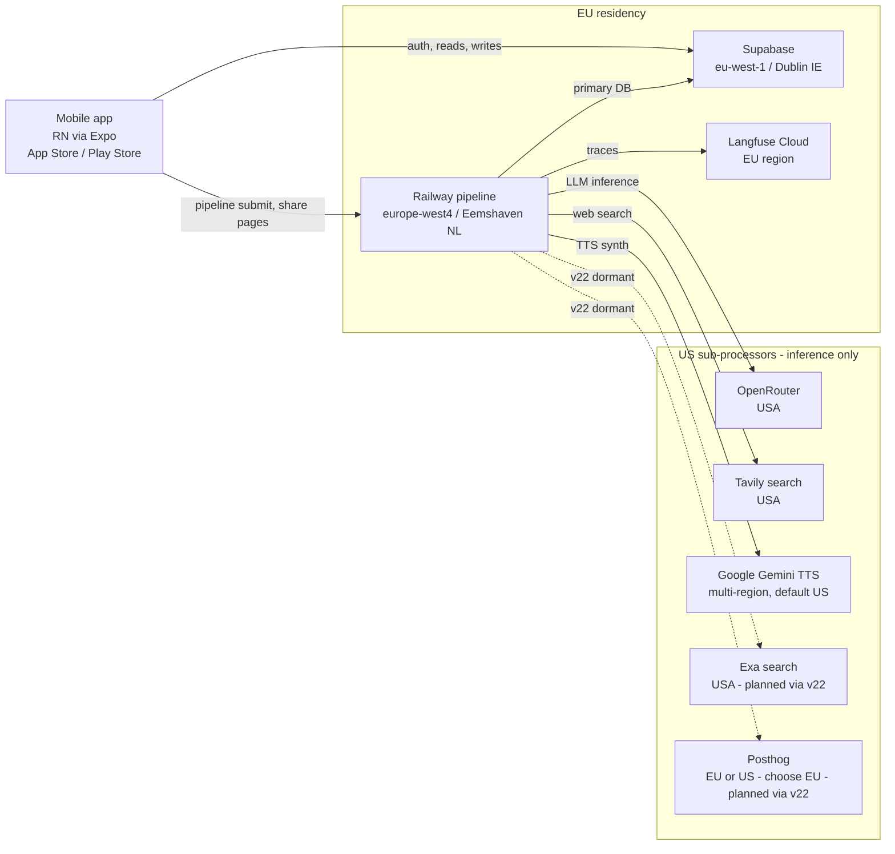

# GDPR Readiness

Status of personal-data handling, infrastructure regions, and outstanding compliance work. Captures decisions made in the 2026-05-18 session including the move of all primary infrastructure into the EU.

## Infrastructure footprint

**Primary user data lives in EU.** All persistent personal data — auth, podcasts, research contexts, share tokens, chapter transcripts, audio storage — is in Supabase Dublin. The pipeline that processes it is in Railway Eemshaven. End-to-end EU-resident for storage and primary compute.

**Sub-processor inference is US-based.** OpenRouter (LLM calls), Tavily (search), Gemini (TTS), and the planned v22 additions Exa + Posthog mostly route through US infrastructure. Personal data crosses the Atlantic on every job. This requires legal framing (DPF / SCCs) but is unavoidable until EU-resident alternatives exist for these services.

## Personal data we collect

| Category | Field | Storage | Notes |
|---|---|---|---|
| Identity | email, OAuth subject (Apple / Google) | Supabase auth schema | required for account |
| Content | podcast topic, clarifying answers | Supabase `podcasts` | user-generated, potentially sensitive depending on topic |
| Derived | research document, chapter transcripts | Supabase `research_contexts`, `podcasts` | LLM output keyed to user |
| Engagement | share tokens, hasUsedExpand flag | Supabase `podcasts` | minimal |
| Operational | Langfuse traces | Langfuse EU | full input/output of every LLM call, including topic text |
| Telemetry (planned v22) | Posthog events | Posthog EU (choose this) | research.subagent.fetch, gate decisions, no PII in payloads if we keep it strict |

We **do not** collect: voice biometrics, payment data (RevenueCat handles it server-side, we just get receipts), location, contacts.

## Sub-processor matrix

| Sub-processor | Country | Sees what | Legal basis for transfer | DPA status |
|---|---|---|---|---|
| Supabase | Ireland (EU) | All user data | Intra-EU, no transfer | ✅ standard Supabase DPA covers |
| Railway | Netherlands (EU, since 2026-05-18) | Pipeline state, all input/output | Intra-EU, no transfer | ⚠️ verify Railway DPA signed |
| OpenRouter | USA | Research briefs, generated content, podcast topics | EU-US DPF or SCCs | ❌ verify status |
| Tavily | USA | Subagent search queries (derived from topic) | EU-US DPF or SCCs | ❌ verify status |
| Google (Gemini) | USA | Final script text | EU-US DPF (Google is DPF-certified) + SCCs | ⚠️ Google Cloud DPA likely already in place via Gemini API ToS, confirm |
| Langfuse | Germany (EU) | Full traces of all LLM I/O | Intra-EU, no transfer | ⚠️ verify Langfuse DPA signed |
| ElevenLabs | USA (currently — deep-dive duration fetch only) | Minor — duration queries | DPF or SCCs | ❌ verify status |
| Exa (planned v22) | USA | Subagent search queries on depth pipeline | DPF or SCCs | ❌ to do before enabling v22 |
| Posthog (planned v22) | EU or US (their choice — pick EU) | Pipeline telemetry events | Intra-EU if we choose EU host | ❌ to do before enabling v22 |
| RevenueCat | USA | Subscription receipts | DPF or SCCs | ❌ verify status |
| Expo (push notifications) | USA | Push tokens, notification payloads | DPF or SCCs | ❌ verify status |

## Decisions made in this session

1. **Move Railway to `europe-west4` (Eemshaven, NL)** — done 2026-05-18. Pipeline no longer in US.
2. **Supabase stays in `eu-west-1` (Dublin)** — already there, confirmed via `inet_server_addr()` returning AWS IPv6 in Dublin range.
3. **v22 research pipeline is shipped but feature-flagged off** (`RESEARCH_V12_ASYMMETRIC` unset). Will not enable until Exa DPA and Posthog setup are signed off.
4. **Posthog choice: EU region when we sign up.** Posthog offers EU-hosted plans on free tier. Take that, not US.
5. **All inference sub-processors stay US-based.** No EU-resident equivalents for OpenRouter, Tavily, Gemini, Exa at the quality we need. We handle this via DPAs + SCCs.

## Action items

### Blocking before v22 goes live in production

- [ ] **Sign Exa DPA** with SCCs before enabling `RESEARCH_V12_ASYMMETRIC=1`. Exa is a new sub-processor.
- [ ] **Sign up for Posthog EU**, generate API key, add to Railway env as `POSTHOG_API_KEY`. Do not use US Posthog cloud.
- [ ] **Add cookie/consent banner** to `share.katavoapp.com` if we'll be loading any client-side analytics or cookies on the share page. Posthog can be configured to require consent before firing.
- [ ] **Update privacy policy** with: Exa as new sub-processor, Posthog as new sub-processor, Railway's region change (EU now).

### Verify before any production traffic

- [ ] Pull current DPAs for: Supabase, Railway, OpenRouter, Tavily, Google (Gemini), Langfuse, ElevenLabs, RevenueCat, Expo. Confirm all are signed by us and either include SCCs (US ones) or note intra-EU storage (EU ones).
- [ ] Privacy policy lives at a known URL (e.g., `katavoapp.com/privacy`) and links to it from app + share page.
- [ ] Privacy policy lists every sub-processor with country and purpose.
- [ ] Terms of Service include explicit mention of LLM processing of user-submitted content.

### Right-to-erasure flow

- [ ] User-initiated "delete my account" path exists in the app.
- [ ] On delete, propagate to:
  - Supabase (cascade delete of user row → podcasts, research_contexts, share_tokens, etc.)
  - Supabase Storage (audio files for that user's podcasts)
  - Langfuse — call their data deletion API for that user's traces, or set retention to short window
  - Posthog (once added) — call deletion API for distinctId
  - RevenueCat — call their deletion endpoint
  - Expo — invalidate push token
- [ ] Document the deletion flow in a runbook for support requests where the user can't self-serve.

### Data subject access requests (DSAR)

- [ ] Export endpoint or admin process that returns all of a user's data as JSON. Supabase RLS-aware queries are the foundation.
- [ ] Public email address for privacy requests (`privacy@katavoapp.com` or similar).
- [ ] SLA: respond within 30 days (GDPR Article 12(3)).

### Special categories (extra care)

- [ ] Audit whether any topic / content collection paths could end up storing special-category data (health info, political opinions, religious beliefs, sexual orientation). Add a content policy and a moderation pass if needed.
- [ ] If we ever add voice cloning / voice samples → that becomes biometric data → DPIA required, explicit consent, separate storage.

### Operational

- [ ] Quarterly review of sub-processor list. Anyone new gets a DPA before they touch data.
- [ ] When Langfuse traces hit 90 days, ensure retention policy is short enough we're not hoarding user content indefinitely.
- [ ] Backup / replica regions for Supabase — verify they're EU-only. Worth confirming Supabase doesn't replicate cross-region by default on the Free or Pro plan.

## User agreement (Privacy Policy / ToS) — required disclosures

The privacy policy should plainly state:

1. **What we collect** — itemise the "Personal data we collect" table above in user-readable language.
2. **Why we collect it** — legitimate interest in delivering the service, contract performance, etc.
3. **Where data lives** — "Your account data and podcast content are stored in the EU (Ireland and the Netherlands). To generate podcasts, we transfer parts of this data to AI inference providers in the United States (listed below) under EU-US Data Privacy Framework or Standard Contractual Clauses."
4. **Sub-processor list** — full table with names, countries, and what each one sees. Update whenever it changes.
5. **Retention** — how long we keep data after account deletion. Default should be "we delete on request within 30 days, except where law requires longer retention."
6. **Your rights** — access, rectification, erasure, portability, restriction, objection. Email address for requests.
7. **Cookies & local storage** — what we use and consent flow.
8. **Children** — minimum age (16 in most EU member states; we should pick a number and stick to it).
9. **Changes to the policy** — how we notify users of material changes.

The ToS should additionally cover:
- User content licensing — we get a license to process the topic / answers solely to deliver the service. No broader rights.
- AI-generated content disclosure — the script and audio are LLM-generated; we don't guarantee factual accuracy. The disclaimer flag on low-credibility runs reinforces this.
- Acceptable use — no submitting illegal content, no submitting other people's personal data without consent, etc.

## Status snapshot — 2026-05-18

- ✅ Railway moved to EU (europe-west4)
- ✅ Supabase in EU (eu-west-1, confirmed)
- ✅ Langfuse already EU (verify it's the EU plan, not US)
- ⏳ v22 research pipeline shipped behind feature flag — needs Exa + Posthog setup before enabling
- ❌ Privacy policy + ToS sub-processor list — needs writing / updating
- ❌ DSAR / erasure flow — needs implementation
- ❌ Cookie consent on share page — needs adding
