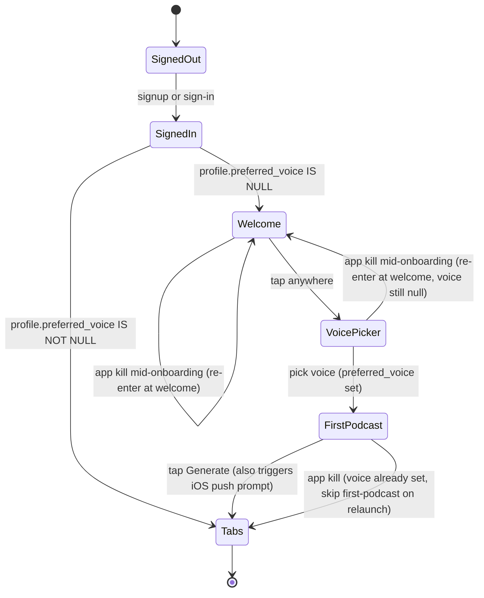

# Onboarding + voice selection — design spec

**Date:** 2026-05-01
**Status:** Draft
**Author:** Isuru + Claude
**Ships as:** v9 (one PR, single release)

## Why this exists

After v8 we have a globally-configured TTS voice (`ballad`) hardcoded in `pipeline/src/podcast_pipeline/config.ts`. Two problems with that:

1. Every user sounds the same. Voice is identity for a podcast app — letting the user pick their narrator is the kind of small choice that makes the app feel personal.
2. We have no onboarding flow at all today. After signup, users land directly in the empty Library tab with no context about what the app does or where to start. First-run conversion suffers.

This spec rolls both into one feature: a 3-screen onboarding that establishes the brand, lets the user pick a voice, and gets them to their first generated podcast — landing them in tabs with credits debited and a podcast already cooking.

While we're in there, we bump the free-tier monthly allowance from 1 podcast to 2. Doubles free value, one-line migration.

## Final UX flow

Three visible screens. Push permission asks contextually after first generation, not in onboarding.



### Screen 1 — Welcome

One sentence. One CTA: tap anywhere to advance. No decisions to make. Sets the brand vibe before we ask the user to pick anything.

Copy: *"Pick a topic. Get a 10-minute podcast. No scripts, no editing."*

### Screen 2 — Voice picker (the centerpiece)

Four voices: Coral, Sage, Ash, Ballad. Each shows a name, a one-line descriptor, and a play button. Tap a card → bundled mp3 plays a 5-second self-introducing sample where the voice describes its own character. Tap "Continue" → writes `profiles.preferred_voice` and advances.

No skip. Voice is required — it's the reason the onboarding exists.

Sample scripts (one per voice, used to bake the bundled mp3s):

- **Coral**: "I'm Coral. Warm, natural, easy to listen to. Like the friend who explains things over coffee without making you feel small."
- **Sage**: "I'm Sage. Thoughtful, contemplative. I take my time on the parts that matter."
- **Ash**: "I'm Ash. Calm, steady, low-key. I won't oversell anything to you."
- **Ballad**: "I'm Ballad. Expressive, a little theatrical. Good for stories that have shape."

Copy is final-ish — refinable before we render the mp3s.

### Screen 3 — First podcast

Topic input pre-filled with a curated suggestion picked at random from a list of ~10 demo topics (espresso machines, sourdough, mechanical watches, the 1973 oil crisis, etc.). User edits or accepts, taps Generate. Same backend flow as the regular Generate tab — clarifying questions next, then submit-podcast, deducts credit.

After Generate, the success alert says:

> **Researching now**
> This usually takes about 15 minutes. We'll send you a notification when your podcast is ready.

When that alert is dismissed, the iOS native push permission dialog fires. Best-practice timing — the user just read "we'll notify you" and is now agreeing to exactly that.

User lands in tabs with a podcast in `queued` state.

### Re-entry behavior

The onboarding gate is `profiles.preferred_voice IS NOT NULL`. No granular step counter:

- Kill app on Welcome or Voice → next launch starts at Welcome (voice still null).
- Kill app on First Podcast → next launch lands in tabs (voice already set; the first-podcast screen is opportunistic, not a gate).

### Edit voice later

Account tab gets a new "Voice" row → opens a settings screen using the same `<VoicePicker>` component. Picking a different voice updates `profiles.preferred_voice`. Copy on the screen explicitly says:

> Future podcasts only — existing podcasts keep their original voice.

## Data model

Two migrations.

### `00012_voice_selection.sql`

```sql
ALTER TABLE public.profiles
  ADD COLUMN preferred_voice text;

COMMENT ON COLUMN public.profiles.preferred_voice IS
  'Voice ID (coral|sage|ash|ballad) the user picked during onboarding. ' ||
  'NULL means onboarding has not been completed.';

ALTER TABLE public.podcasts
  ADD COLUMN voice text;

COMMENT ON COLUMN public.podcasts.voice IS
  'Voice this podcast was rendered with. Snapshot from profiles.preferred_voice ' ||
  'at submit-podcast time. NULL on legacy rows = pipeline default (TTS_VOICE).';
```

No `CHECK` constraint or enum. Voice IDs come from OpenAI's TTS API, which controls the source of truth. Mobile only ever sends one of the 4 we curate; if anything wrong slipped through, the OpenAI call fails loudly and the existing failure trigger refunds the credit.

Both new fields nullable. Existing podcasts keep `voice = NULL`, which audioProducer treats as "use the configured default." No retro-render of past audio.

### `00013_free_tier_credit_bump.sql`

```sql
CREATE OR REPLACE FUNCTION public.handle_new_user()
RETURNS trigger AS $$
BEGIN
  INSERT INTO public.profiles (id, display_name)
  VALUES (NEW.id, COALESCE(NEW.raw_user_meta_data->>'full_name', NEW.email));

  INSERT INTO public.subscriptions (user_id, tier, status, credits_per_month, credits_remaining)
  VALUES (NEW.id, 'free', 'active', 2, 2);

  RETURN NEW;
END;
$$ LANGUAGE plpgsql SECURITY DEFINER SET search_path = public, pg_temp;

UPDATE public.subscriptions
SET credits_per_month = 2,
    credits_remaining = LEAST(2, credits_remaining + 1)
WHERE tier = 'free' AND status = 'active';
```

Backfill rule: anyone currently at 1 (full unused monthly allotment) goes to 2. Anyone at 0 stays at 0 — they used the old allotment, they get the new one at next renewal. Conservative; avoids handing out free credits to users who already burned their old one this month.

Pair this migration with a code edit:

- `pipeline/src/routes/revenuecatWebhook.ts` — `EXPIRATION` case currently sets free tier to `credits_per_month: 1, credits_remaining: 1`. Bump both to 2.

### Realtime publication

Add `profiles` to the `supabase_realtime` publication so the mobile `useProfile` hook gets cross-device sync (e.g., user changes voice on iPad, iPhone updates).

```sql
ALTER PUBLICATION supabase_realtime ADD TABLE public.profiles;
```

Bundle this into `00012_voice_selection.sql` since it's part of the same feature.

## Server changes

Three small edits in `pipeline/`. The TTS provider already accepts a voice override — `OpenAITTS.synthesize(text, voiceName?)` exists today (`pipeline/src/podcast_pipeline/providers/ttsOpenai.ts:11`). This is thread-the-state work, not a refactor.

### `pipeline/src/podcast_pipeline/state.ts`

Add `voice` to `PipelineState`:

```ts
voice: Annotation<string | null>,

// In makeInitialState defaults:
voice: null,
```

### `pipeline/src/routes/submitPodcast.ts`

Three small additions inside the route handler:

```ts
// 1. Pull the user's preferred voice
const { data: profile } = await serviceClient
  .from("profiles")
  .select("preferred_voice")
  .eq("id", user.id)
  .single();
const voice = profile?.preferred_voice ?? null;

// 2. Snapshot into the podcast row at insert
const { data: podcast, error: insertError } = await serviceClient
  .from("podcasts")
  .insert({
    user_id: user.id,
    topic,
    clarifying_answers: clarifyingAnswers || [],
    status: "queued",
    has_ads: hasAds,
    voice,
  })
  .select()
  .single();

// 3. Pass voice into the pipeline input
jobManager.enqueue(podcast.id, {
  podcastId: podcast.id,
  userId: user.id,
  topic,
  clarifyingAnswers: clarifyingAnswers || [],
  hasAds,
  trustedSourceUrls,
  tier: subscription.tier,
  voice,
});
```

### `pipeline/src/podcast_pipeline/nodes/audioProducer.ts`

One signature change on `stitchAudio` to accept the voice, and one TTS call site change:

```ts
// stitchAudio signature: (segments, tts, voice?: string | null)
const audioBytes = await tts.synthesize(segment.content, voice ?? undefined);
```

`OpenAITTS.synthesize` already falls back to `TTS_VOICE` when `voiceName` is `undefined`, so null/missing means "use the configured default" — correct behavior for legacy podcasts and any in-flight rows during the migration window.

## Mobile architecture

### File map

```
mobile/
  app/
    _layout.tsx                        modify  — root auth/onboarding redirect
    (onboarding)/                      new dir
      _layout.tsx                      new     — onboarding stack (no tab bar)
      welcome.tsx                      new     — screen 1
      voice.tsx                        new     — screen 2
      first-podcast.tsx                new     — screen 3
    (tabs)/
      account.tsx                      modify  — new "Voice" row
      generate.tsx                     modify  — updated post-Generate alert copy
    voice-settings.tsx                 new     — Account → Voice picker

  src/
    components/
      VoicePicker.tsx                  new     — shared (onboarding screen 2 + voice-settings)
    hooks/
      useProfile.ts                    new     — selects + caches profile, exposes preferredVoice
    lib/
      voiceSamples.ts                  new     — voice metadata + sample mp3 require()s
      podcastPlaceholders.ts           new     — curated rotation list
  assets/
    voice-samples/
      coral.mp3                        new     — built by pipeline/scripts/build-voice-samples.ts
      sage.mp3                         new
      ash.mp3                          new
      ballad.mp3                       new
```

### Routing decision tree (root `_layout.tsx`)

```ts
const { user, loading: authLoading } = useAuth();
const { profile, loading: profileLoading } = useProfile();

if (authLoading || (user && profileLoading)) return <LoadingOverlay />;
if (!user) return <Redirect href="/(auth)/sign-in" />;
if (!profile?.preferredVoice) return <Redirect href="/(onboarding)/welcome" />;
return <Slot />;
```

The `(authLoading || (user && profileLoading))` guard avoids a wrong-screen flash where the user briefly sees onboarding before the profile resolves and confirms voice is already set.

### `<VoicePicker>` component

Single reusable component, two consumers (onboarding + settings):

```tsx
interface VoicePickerProps {
  initialValue?: string;
  onSelect: (voice: string) => void | Promise<void>;
  ctaLabel?: string;       // "Continue" on onboarding, "Save" on settings
  helperText?: string;     // "Future podcasts only..." on settings, undefined on onboarding
}
```

Each card: name + one-line descriptor + play button. Tap card → `expo-av` plays bundled sample. Tap CTA → calls `onSelect`.

Voice metadata in `lib/voiceSamples.ts`:

```ts
export const VOICES = [
  {
    id: "coral",
    name: "Coral",
    descriptor: "Warm, natural, easy to listen to.",
    sample: require("../../assets/voice-samples/coral.mp3"),
  },
  { id: "sage",   name: "Sage",   descriptor: "Thoughtful, contemplative.",       sample: require("../../assets/voice-samples/sage.mp3") },
  { id: "ash",    name: "Ash",    descriptor: "Calm, steady, low-key.",            sample: require("../../assets/voice-samples/ash.mp3") },
  { id: "ballad", name: "Ballad", descriptor: "Expressive, a little theatrical.",  sample: require("../../assets/voice-samples/ballad.mp3") },
] as const;
```

### Voice samples — how they're built

New utility: `pipeline/scripts/build-voice-samples.ts`. Renders the 4 self-introducing scripts through `gpt-4o-mini-tts` using the current `TTS_VOICE_INSTRUCTIONS`, writes mp3s to `mobile/assets/voice-samples/`. Run on demand (when scripts or instructions change), output committed. ~$0.05 per run, ~200 KB added to the app bundle.

The script's header documents: re-run when `TTS_VOICE_INSTRUCTIONS` or the sample copy changes.

### `useProfile` hook

Mirrors `useSubscription` — selects from `public.profiles WHERE id = user.id`, exposes `preferredVoice`, has a `setPreferredVoice(voice)` setter that PATCHes via Supabase, optimistically updates local state, subscribes to Realtime for cross-device sync.

### Generate flow copy update

Both `mobile/app/(tabs)/generate.tsx` and `mobile/app/(onboarding)/first-podcast.tsx` show the same alert after a successful submit:

```tsx
Alert.alert(
  "Researching now",
  "This usually takes about 15 minutes. We'll send you a notification when your podcast is ready.",
  [{ text: "OK", onPress: () => { /* navigate to library or tabs */ } }],
);
```

After this alert is dismissed, request push permission via `expo-notifications` if not yet granted. Idempotent — does nothing if already granted/denied.

### Placeholder topic rotation

`lib/podcastPlaceholders.ts`:

```ts
export const ONBOARDING_PLACEHOLDERS = [
  "the rise of espresso machines in early 20th century Italy",
  "why sourdough starters work",
  "the design history of the Sony Walkman",
  "the 1973 oil crisis",
  "how mechanical watches keep time",
  "why Wikipedia works",
  "the science behind dreaming",
  "how money laundering schemes get caught",
  "why some languages have grammatical gender",
  "the history of canned food",
];

export function pickOnboardingPlaceholder(): string {
  return ONBOARDING_PLACEHOLDERS[Math.floor(Math.random() * ONBOARDING_PLACEHOLDERS.length)];
}
```

Hand-picked. Random per onboarding session. Same list for every user.

## What's not in scope

Captured here so they don't get re-litigated:

- **Per-podcast voice override on Generate.** Global setting only. If we ship custom instructions later, that's where this could ride along.
- **Custom instructions / per-podcast tone.** Real future feature, lives in Settings or Generate when it ships. Not in onboarding.
- **Topic interests as a discoverable input.** Dropped from onboarding. If we want category preferences for Discover/recommendations later, that's a separate feature with its own data model.
- **Voice tier gating.** All voices for all tiers. If we ever monetize voices, it's a Settings paywall change, not an onboarding change.
- **Voice cloning / custom voice.** Out of MVP.
- **Two-host conversation mode.** Already parked in v8. Same answer here — separate spec when prioritized.

## Acceptance criteria

| Behavior | Test |
|----------|------|
| New signup → onboarding | Sign up a fresh user; should land on `/(onboarding)/welcome`, not `/(tabs)`. |
| Voice picker plays samples | Tap each voice card → bundled audio plays. Different voices = audibly different. |
| Voice picked + saved | After picking voice, `profiles.preferred_voice` is populated. |
| Onboarding gate | After voice picked + first podcast submitted, kill app, reopen → land in tabs (not onboarding). |
| Re-entry | Kill app on welcome or voice screen → relaunch, back at welcome. Kill on first podcast → relaunch, in tabs. |
| Voice flows to audio | Generate any podcast → resulting `podcasts.voice` matches user's preferred. Audio sounds like that voice. |
| Account → Voice edit | Change voice from Account → Voice → all *future* podcasts use new voice; existing podcasts unchanged. Copy says "Future podcasts only." |
| Push permission timing | First generation success alert dismissed → iOS native push prompt fires. No prompt during onboarding. |
| Free tier bumped | New free signup gets 2 credits. Existing free user with 1 remaining gets bumped to 2. User at 0 stays at 0. |
| Generation copy | Post-Generate alert says "Researching now — about 15 minutes. We'll notify you." |

## Rollout

Single PR / single release. No phased rollout.

1. **DB migrations land first** — `00012_voice_selection.sql` + `00013_free_tier_credit_bump.sql`. Applied via Supabase MCP. Backfill runs as part of `00013`.
2. **Pipeline deploy** (Railway). Server reads `preferred_voice` from profile, snapshots into `podcasts.voice`, audioProducer threads it to TTS. Existing podcasts continue to render with the configured default — no regression.
3. **Voice samples built**. Run `pipeline/scripts/build-voice-samples.ts` to render the 4 self-introducing mp3s. Commit them.
4. **Mobile dev client reload** picks up the new screens and assets via Metro.
5. **Existing user (Isuru)** on next app open: `preferred_voice` is NULL → routed through onboarding once, picks a voice, lands back in tabs.

## Risk + mitigation

| Risk | Mitigation |
|------|------------|
| `expo-av` not actually linked → audio playback fails on dev client | Verify with `npx expo install expo-av` before shipping. If a new native module is needed, take the EAS build hit once. |
| Voice samples desync from `TTS_VOICE_INSTRUCTIONS` | `pipeline/scripts/build-voice-samples.ts` reads the same constant. Document "re-run when instructions change" in the script header. |
| Backfill UPDATE on `subscriptions` fires Realtime events for every free-tier user | At ~1 user it's irrelevant. At scale we'd batch. Not a blocker. |
| Onboarding gate trips on a transient profile load failure → wrong-screen flash | `useProfile` distinguishes "loading" from "loaded but null." Only redirect on the loaded state. |
| Adding `profiles` to Realtime publication leaks columns | RLS is already enforced on `profiles` (users only see their own row). Realtime respects RLS, so the publication is safe. |
