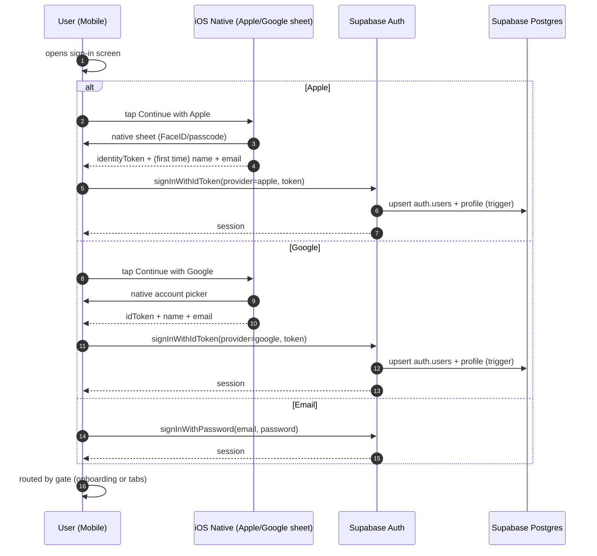

# Social login (Apple + Google) — design spec

**Date:** 2026-05-03
**Status:** Draft
**Author:** Isuru + Claude
**Ships as:** v10 (one PR, single release)

## Why this exists

The app currently only supports email + password. That's friction for new users (who have to think up a password they'll forget) and friction for App Store review (Apple expects a Sign in with Apple option whenever any other social login is offered, which we'll need eventually anyway).

Adding Apple + Google native sign-in:
- removes a multi-step signup for ~95% of iOS users (one tap with FaceID or the Google account picker)
- gives us App Store compliance preemptively for any future provider additions
- keeps email + password as a fallback for admin-provisioned accounts and dev testing

## Final UX

Three options on both sign-in and sign-up screens, in order of expected usage:



### Sign-in screen layout

```
              KATAVO
   Your curiosity, voiced.

   [   Continue with Apple    ]   ← black, official AppleAuthenticationButton
   [   Continue with Google   ]   ← Google branding pill, custom

   ──────── or with email ────────

   Email     [_________________]
   Password  [_________________]

   [          Sign in          ]

   Don't have an account? Sign up
```

Sign-up screen has identical structure; the bottom button reads "Create account" and the link points to Sign in. With social, the very first tap on Apple/Google IS the sign-up — no separate flow.

### Apple-specific behavior

- First sign-in returns `email` + `fullName`; subsequent taps return only the user identifier (Apple's privacy model).
- We capture name + email on first tap, persist `display_name` to `profiles`, never overwrite later.
- "Hide my email" → Apple gives us a relay (`xyz@privaterelay.appleid.com`). We accept it.

### Google-specific behavior

- Native bottom sheet shows the user's Google accounts already on the device.
- Returns `idToken` we exchange via `supabase.auth.signInWithIdToken({ provider: 'google', token })`.
- `user.name` available on every sign-in; we still only set `display_name` if currently null.

### Auto-linking

Existing email/password user with `foo@gmail.com` later taps Continue with Google → Supabase merges identities into the same `auth.users` row → both sign-in paths work going forward. Requires the "Allow same email for multiple identities" flag in Supabase Auth.

### Sign-out

Unchanged. `supabase.auth.signOut()` clears the session regardless of which provider authenticated.

## Stack + third-party setup

### Native packages

- `expo-apple-authentication` — Expo Modules wrapper for `AuthenticationServices`.
- `@react-native-google-signin/google-signin` — battle-tested native Google sign-in.

Both are native modules. **One EAS dev rebuild** before testing on-device.

### Apple Developer portal

1. Enable **Sign in with Apple** capability for App ID `co.katavo.app` (Identifiers → tap bundle → Sign in with Apple → Save).
2. Create a **Sign in with Apple Key** (Keys → +, tick Sign in with Apple, configure → download the `.p8` ONCE — not redownloadable).
3. Note the **Team ID** (top-right of dev portal) and the **Key ID** (shown after key creation).

### Google Cloud Console

4. Create an OAuth 2.0 Client ID, type **iOS**, bundle ID `co.katavo.app`. Note the iOS Client ID (`....apps.googleusercontent.com`). It also gives a **reversed client ID** for URL schemes (`com.googleusercontent.apps....`).
5. Create a second OAuth 2.0 Client ID, type **Web application**. Note the **Web Client ID**. (Used as the audience for ID tokens — Supabase verifies tokens against it. We never use a web flow; this is a Google requirement.)

### Supabase Auth dashboard

`https://supabase.com/dashboard/project/rkupotxkyeficaanxzrp/auth/providers`

6. **Apple provider** → enable. Paste Team ID, Key ID, Service ID = `co.katavo.app`, contents of the `.p8`. Save.
7. **Google provider** → enable. Paste Web Client ID as both "Client ID" and "Authorized client IDs". No client secret (not needed for native flow).
8. **Allow same email for multiple identities** → enable. Auto-linking gate.

## Code changes

### `mobile/package.json`

Pinned to current SDK 55-compatible majors (verified against expo install matrix). The implementer should run `expo install` rather than hand-editing — those commands resolve the exact compatible patch versions automatically:

```bash
node node_modules/expo/bin/cli install expo-apple-authentication
node node_modules/expo/bin/cli install @react-native-google-signin/google-signin
```

Expected resolved versions: `expo-apple-authentication ^7.x`, `@react-native-google-signin/google-signin ^14.x`. If `expo install` produces different majors, surface it before continuing — Google's idToken field shape can change between majors.

### `mobile/app.json` (additions, applied as edits to existing structure)

Three additions to the existing `app.json`. The implementer reads the current file and applies these as targeted edits — there is no full-file replacement.

1. Add `"usesAppleSignIn": true` to `expo.ios`.
2. Append a `CFBundleURLTypes` entry to `expo.ios.infoPlist` with the Google reversed client ID:

```jsonc
"CFBundleURLTypes": [
  {
    "CFBundleURLSchemes": [
      "com.googleusercontent.apps.<YOUR-IOS-CLIENT-ID>"
    ]
  }
]
```

3. Append two plugin entries to the existing `expo.plugins` array (which today contains `expo-router`, `@livekit/react-native-expo-plugin`, `@config-plugins/react-native-webrtc`, `expo-audio`):

```jsonc
"expo-apple-authentication",
"@react-native-google-signin/google-signin"
```

Final plugins order: `expo-router`, `@livekit/react-native-expo-plugin`, `@config-plugins/react-native-webrtc`, `expo-audio`, `expo-apple-authentication`, `@react-native-google-signin/google-signin`.

### `mobile/.env` (additions)

```
EXPO_PUBLIC_GOOGLE_IOS_CLIENT_ID=...apps.googleusercontent.com
EXPO_PUBLIC_GOOGLE_WEB_CLIENT_ID=...apps.googleusercontent.com
```

(Apple needs no public client ID — derived from bundle ID, signed by Supabase server-side using the .p8.)

### `mobile/src/lib/auth-providers.ts` (new)

Wraps both native sign-in calls. Returns the user's first-sign-in display name so the auth hook can persist it.

```ts
import * as AppleAuthentication from "expo-apple-authentication";
import {
  GoogleSignin,
  statusCodes,
} from "@react-native-google-signin/google-signin";
import { supabase } from "./supabase";

let googleConfigured = false;

function ensureGoogleConfigured(): void {
  if (googleConfigured) return;
  GoogleSignin.configure({
    iosClientId: process.env.EXPO_PUBLIC_GOOGLE_IOS_CLIENT_ID!,
    webClientId: process.env.EXPO_PUBLIC_GOOGLE_WEB_CLIENT_ID!,
    scopes: ["profile", "email"],
  });
  googleConfigured = true;
}

export async function signInWithApple(): Promise<{ displayName?: string }> {
  const credential = await AppleAuthentication.signInAsync({
    requestedScopes: [
      AppleAuthentication.AppleAuthenticationScope.FULL_NAME,
      AppleAuthentication.AppleAuthenticationScope.EMAIL,
    ],
  });
  if (!credential.identityToken) {
    throw new Error("Apple sign-in returned no identity token");
  }
  const { error } = await supabase.auth.signInWithIdToken({
    provider: "apple",
    token: credential.identityToken,
  });
  if (error) throw error;
  const fullName = credential.fullName;
  const displayName = [fullName?.givenName, fullName?.familyName]
    .filter(Boolean)
    .join(" ")
    .trim();
  return { displayName: displayName || undefined };
}

export async function signInWithGoogle(): Promise<{ displayName?: string }> {
  ensureGoogleConfigured();
  // hasPlayServices() is a no-op on iOS but generates a benign log line.
  // We keep the call for cross-platform correctness if Android ships later.
  await GoogleSignin.hasPlayServices();
  const userInfo = await GoogleSignin.signIn();
  // v14 uses userInfo.data.idToken; older majors used userInfo.idToken.
  // Fallback covers both — confirm shape during implementation.
  const idToken = userInfo.data?.idToken ?? (userInfo as { idToken?: string }).idToken;
  if (!idToken) {
    throw new Error("Google sign-in returned no ID token");
  }
  const { error } = await supabase.auth.signInWithIdToken({
    provider: "google",
    token: idToken,
  });
  if (error) throw error;
  return { displayName: userInfo.user?.name ?? undefined };
}

export { statusCodes as googleStatusCodes };
```

### `mobile/src/hooks/useAuth.tsx` (additions)

Three things change here, all in the same file:

1. **`AuthContextType` interface** — add the two new action signatures:

```ts
interface AuthContextType {
  // ...existing fields...
  signInWithApple: () => Promise<void>;
  signInWithGoogle: () => Promise<void>;
}
```

2. **AuthProvider body** — define the two callbacks:

```ts
const signInWithApple = useCallback(async () => {
  const { displayName } = await signInWithAppleNative();
  if (displayName) await persistDisplayNameIfMissing(displayName);
}, []);

const signInWithGoogle = useCallback(async () => {
  const { displayName } = await signInWithGoogleNative();
  if (displayName) await persistDisplayNameIfMissing(displayName);
}, []);

async function persistDisplayNameIfMissing(name: string): Promise<void> {
  const { data: { user } } = await supabase.auth.getUser();
  if (!user) return;
  const { data: row } = await supabase
    .from("profiles")
    .select("display_name")
    .eq("id", user.id)
    .single();
  if (!row?.display_name) {
    await supabase
      .from("profiles")
      .update({ display_name: name })
      .eq("id", user.id);
  }
}
```

3. **`AuthContext.Provider` value prop** — pass them through:

```tsx
<AuthContext.Provider
  value={{
    session,
    user,
    loading,
    signIn,
    signUp,
    signOut,
    signInWithApple,
    signInWithGoogle,
  }}
>
```

### `mobile/app/(auth)/sign-in.tsx` and `mobile/app/(auth)/sign-up.tsx`

Apple uses the official `<AppleAuthenticationButton />` (HIG-compliant, auto-styles for light/dark). Google uses a small new component matching the project's pill styling.

```tsx
<AppleAuthentication.AppleAuthenticationButton
  buttonType={AppleAuthentication.AppleAuthenticationButtonType.SIGN_IN}
  buttonStyle={AppleAuthentication.AppleAuthenticationButtonStyle.BLACK}
  cornerRadius={28}
  style={{ height: 56, width: "100%", opacity: submitting ? 0.5 : 1 }}
  onPress={handleApple}        // see Loading + error handling section
/>

<GoogleButton onPress={handleGoogle} disabled={submitting !== null} />

<Divider label="or with email" />

<EmailPasswordForm ... existing ... />
```

(`handleApple` and `handleGoogle` are the wrappers defined in the **Loading + error handling** section below — they manage the `submitting` state and silence cancellation errors.)

`<GoogleButton />` is a new component: 56pt tall, rounded pill, white background with hairline border, Google "G" SVG mark + "Continue with Google" label.

### Loading + error handling

While a native sheet is open, no app-level loading state is needed — the OS sheet itself is the user feedback. Once the sheet dismisses and `signInWithIdToken` is in-flight (network round-trip to Supabase, typically 200-500 ms), the sign-in screen stays as-is — no full-screen `<LoadingOverlay>`. The buttons should disable themselves to prevent a double-tap during this window:

```tsx
const [submitting, setSubmitting] = useState<"apple" | "google" | null>(null);

const handleApple = async () => {
  setSubmitting("apple");
  try {
    await signInWithApple();
  } catch (e: any) {
    if (!isCancellationError(e)) setError(e.message);
  } finally {
    setSubmitting(null);
  }
};
```

Cancellation is silent — Apple throws with `code === "ERR_REQUEST_CANCELED"`, Google throws with `code === googleStatusCodes.SIGN_IN_CANCELLED`. The `isCancellationError(e)` helper checks both. All other errors surface inline via the existing `setError` pattern.

### Sign-up screen layout caveat

`sign-up.tsx` has two render states today: the form (default) and a "Check your email" confirmation after a successful email sign-up. Social buttons only appear on the form state. The confirmation state is unchanged — social sign-up doesn't need email confirmation since the OAuth handshake already verifies the email.

## Out of scope

- **Account linking from Account settings post-signin.** Today: same-email auto-links at sign-in (Q3-A). Tomorrow: a user might want to add Google to an existing account they've never signed into with Google. That's a separate feature with UI in Account → Connected accounts.
- **Additional providers** (GitHub, Microsoft, Facebook). Apple + Google covers ~95% of iOS users.
- **Avatar capture.** Both providers return a profile picture URL. Capture later when we add a profile screen.
- **Web sign-in.** App is iOS-only. If we ship web later, it needs its own redirect-flow setup.
- **Magic-link / passwordless email.** Email/password stays as-is.
- **Password reset UI.** Supabase supports it; we don't expose UI today and aren't adding it here.

## Acceptance criteria

| Behavior | Test |
|----------|------|
| Apple button shows | Sign-in screen renders the official `<AppleAuthenticationButton />` above the email form. |
| Apple sign-in succeeds | Tap Apple → native sheet with FaceID → land in `/(tabs)` (or `/(onboarding)` if voice not set). `auth.users` row created. |
| Apple captures name first time | After first Apple sign-in, `profiles.display_name` is populated. Subsequent sign-ins do not overwrite. |
| Google button shows | Sign-in screen renders the Google-branded pill button matching the project styling. |
| Google sign-in succeeds | Tap Google → native account picker → success → `/(tabs)` or onboarding. `auth.users` row created. |
| Google captures name | `profiles.display_name` populated from Google's `user.name` when previously null. |
| Email still works | Existing email/password form unchanged in behavior. |
| Auto-linking | **Pre-condition: "Allow same email for multiple identities" must be enabled in Supabase Auth dashboard (step 8 of Setup).** Sign up with `foo@gmail.com` via email/password. Sign out. Tap Continue with Google with the same Gmail. Lands in same `user.id`, single profiles row. If the flag is off, this test will fail with `User already registered` — re-check the dashboard. |
| Cancellation is silent | User cancels Apple or Google sheet → no error toast, returns to sign-in. |
| Sign-out works for all three | After signing in via any provider, Account → Sign out clears the session. |

## Rollout

Single PR. No phased rollout.

1. **You configure dashboards** — Apple Developer (capability + .p8 key), Google Cloud Console (two client IDs), Supabase Auth (paste credentials + flip same-email flag). ~20 min.
2. **Code lands** — packages installed, app.json updated, auth-providers.ts + sign-in/up updates committed.
3. **EAS dev build** — ~15 min cloud, new native modules require it.
4. **Install new dev client** on iPhone, walk through each provider.
5. **Test acceptance** — see table above.

## Risk + mitigation

| Risk | Mitigation |
|------|------------|
| App Store rejection if Apple button isn't compliant | Use the official `<AppleAuthenticationButton />` component — handles HIG automatically. |
| Google iOS bundle id mismatch | Triple-check the iOS Client ID in Google Cloud Console matches `co.katavo.app`. Mismatch returns a generic native error. |
| Web Client ID misconfigured on Supabase | Tokens fail validation. Symptom: `signInWithIdToken` returns 400. Fix: re-paste in dashboard. |
| Apple .p8 key only downloadable once | Save the file securely the moment it downloads. If lost, generate a new key. |
| Auto-linking surprises a user | Auto-link only fires when emails match exactly. Documented behavior; no destructive merge of data (single user record either way). |
| Native modules pin canary peer-dep mismatch | `legacy-peer-deps=true` in `mobile/.npmrc` already handles this for the canary SDK 55. |
