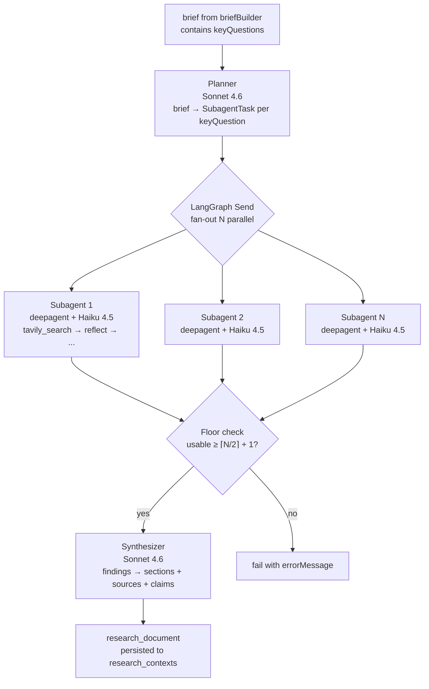
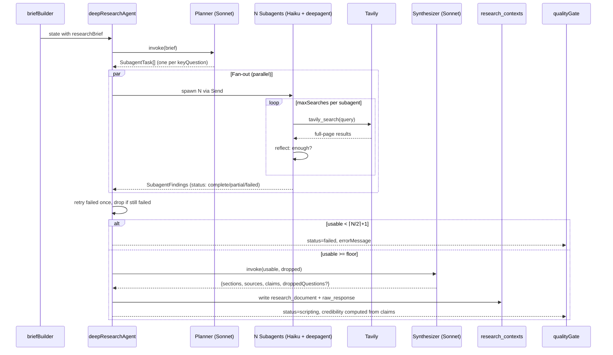

# Deep Research Agent — Design Spec

**Date:** 2026-05-06
**Status:** Draft
**Author:** Isuru + Claude

---

## TL;DR

Replace the OpenAI `o4-mini-deep-research` API call in our pipeline with a self-hosted research agent built on LangGraph + deepagents + Tavily, routed through OpenRouter. The trigger is hitting OpenAI's per-minute rate limits on the deep-research model, but the deeper case is sustainability: vendor optionality, cost ~10x lower per podcast, granular tier control, and structurally enforced citations. Hard cutover, single PR, no feature flag.

## Goals

- Eliminate OpenAI deep-research as a single rate-limit chokepoint.
- Match or exceed today's research quality on credibility, citation density, source authority.
- Reduce per-podcast research cost (currently ~$1.88) without compromising quality.
- Give us model swap-ability via OpenRouter for ongoing eval.

## Non-goals

- Reintroducing trusted sources (deferred — clean tool layer leaves the door open).
- Per-tier model differentiation (free + plus + pro use the same models; differentiation is search budget).
- Rewriting `scriptWriter` to consume `claims[]` (additive output, opportunistic upgrade later).
- Eval harness as a hard prerequisite — we ship behind smoke tests; build phase, no production users.

---

## Architecture

The new node `deepResearchAgent` replaces `deepResearch` in the pipeline graph. Internally it's a subgraph: planner → fan-out subagents → synthesizer.



**Layer responsibilities:**

| Layer | Implementation | Job |
|---|---|---|
| Outer subgraph | Raw LangGraph (`StateGraph`, `Send`) | Orchestrate fan-out, enforce floor, retry failed subagents, route to synthesizer or fail |
| Planner | Single Sonnet 4.6 call with structured output | Decompose brief → `SubagentTask[]` (one per keyQuestion) |
| Subagent (×N) | `createDeepAgent` from deepagentsjs, Haiku 4.5 + Tavily tool | Search-reflect-search loop, output structured findings |
| Synthesizer | Single Sonnet 4.6 call with structured output | Merge findings → `{sections, sources, claims}` matching today's persistence shape |

**Why hybrid (raw LangGraph orchestration + deepagent subagents):** Static fan-out (N = `keyQuestions.length`) doesn't fit deepagents' dynamic spawning model — we'd be expressing deterministic requirements through a non-deterministic abstraction. But deepagents has tuned prompts and patterns for the search-reflect-search loop that we'd be reinventing if we built subagents on raw `createReactAgent`. We borrow framework value where their tuning matters most, keep raw control where our requirements (M/N floor, retry-once, dropped-question reporting) need it.

**Position in the pipeline graph:** unchanged. `routeAfterDeepResearch` (`graph.ts:29`) keeps working — if the subgraph sets `status: "failed"`, route to END.

---

## Components

### Planner

**Input:** `state.researchBrief` (JSON string from `briefBuilder` with `scope`, `angle`, `depth`, `keyQuestions[]`).

**Output:** `SubagentTask[]`, exactly one per `keyQuestion`:

```typescript
interface SubagentTask {
  id: string;              // stable ID for tracing
  question: string;        // keyQuestion verbatim
  context: string;         // scope + angle + depth, repeated for subagent
  searchHints: string[];   // 2-3 suggested starting search queries
}
```

**Model:** `RESEARCH_REASONING_MODEL` (default `anthropic/claude-sonnet-4.6`) via OpenRouter, structured output via LangChain's `withStructuredOutput()`.

**Prompt sketch:**

> You are decomposing a research brief into focused subtasks. Given the brief's `keyQuestions`, produce one `SubagentTask` per question — no merging. For each: restate the question, repeat the brief context (scope, angle, depth) the subagent will need, and suggest 2-3 starting search queries. Don't research yourself; this is decomposition only.

**Why structured output:** the planner's job is decomposition, not creativity. JSON schema guarantees `tasks.length === keyQuestions.length` without prompt gymnastics.

### Subagent

**Input:** `SubagentTask` + tier budget `{ maxSearches, maxReflections }`.

**Output:** structured findings:

```typescript
interface SubagentFindings {
  taskId: string;
  question: string;
  findings: Array<{
    claim: string;            // factual statement
    sourceUrls: string[];     // URLs supporting this claim
    sourceTitles: string[];   // parallel array, matching titles
  }>;
  status: "complete" | "partial" | "failed";
  notes?: string;             // for partial: gaps; for failed: why
}
```

**Status semantics:**

| Status | When | `findings` | Orchestrator action |
|---|---|---|---|
| `complete` | Subagent answered the question with cited findings | populated | include in synthesizer input |
| `partial` | Found some but not all aspects (e.g., 2 of 3 angles came up empty) | populated, possibly thin | include; `notes` flows into synthesizer prompt as gap signal |
| `failed` | Tavily returned 0 results, model couldn't extract any cited claims, or budget exhausted with no findings | empty | retry once; if retry also fails or throws, drop |

**Model:** `RESEARCH_SUBAGENT_MODEL` (default `anthropic/claude-haiku-4.5`).

**Built via:** `createDeepAgent` from `deepagentsjs`. Tools: just `tavily_search` (wrapped with budget enforcement, see Search Tool). System prompt borrows deepagents' research-agent prompt, modified to:
- Emit our `SubagentFindings` schema.
- Respect `maxSearches`/`maxReflections` budget (soft prompt guidance + hard tool-layer enforcement).
- Cite every factual claim with at least one source URL drawn from search results.

**Loop shape (handled internally by deepagent):**

```
think about the question → tavily_search(query)
→ reflect: did this answer the question? what's missing?
→ if reflection_count < maxReflections AND search_count < maxSearches: search again
→ else: emit SubagentFindings
```

### Synthesizer

**Input:** `SubagentFindings[]` (only `complete` + `partial`, after floor check) and `droppedQuestions: string[]` (the failed ones, for transparency).

**Output:** matches today's `research_document` shape with additive `claims`:

```typescript
{
  sections: [{ title: string, content: string }],   // prose with [N] citation markers
  sources: [{ url: string, title: string }],        // deduped across all subagents
  claims: [{ text: string, sourceIndexes: number[] }],  // every claim, sourceIndexes into sources
  droppedQuestions?: string[]                       // keyQuestions where subagent failed
}
```

**Model:** `RESEARCH_REASONING_MODEL` (Sonnet 4.6).

**Job:**

1. Dedup sources across subagents (URL-keyed). **Ordering is deterministic: first-appearance order, where iteration is over `tasks[]` in planner order, then `findings[]` in subagent order, then `sourceUrls[]` in finding order.** This makes `sourceIndexes` stable across runs for the same input + makes test assertions on indexes deterministic.
2. Re-index `sourceUrls` from each subagent's findings into the deduped `sources` array.
3. Group claims into 4-6 sections — one section per major topic angle. Sections are NOT 1:1 with `keyQuestions`; related questions may belong in one section.
4. Write each section's `content` as cited prose, weaving claims with `[N]` markers. Output is what `scriptWriter` consumes today.
5. If any subagent was dropped, include the question(s) in `droppedQuestions`. Synthesizer prose acknowledges the gap, doesn't hallucinate around it.

### Search tool — `tavily_search`

Custom wrapper around the Tavily SDK with per-subagent budget enforcement:

```typescript
async function makeTavilyTool({ taskId, maxSearches }) {
  let searchCount = 0;
  return tool(
    async ({ query }: { query: string }) => {
      if (++searchCount > maxSearches) {
        return { error: "search_budget_exceeded", remaining: 0 };
      }
      try {
        const results = await tavily.search(query, {
          search_depth: "advanced",
          include_raw_content: true,    // full-page content, not snippets
          max_results: 5,
        });
        return {
          query,
          results: results.results.map(r => ({
            url: r.url,
            title: r.title,
            content: r.raw_content ?? r.content,
          })),
          searchesRemaining: maxSearches - searchCount,
        };
      } catch (err) {
        // Counted toward budget already — return error object so deepagent
        // can decide to try a different query rather than crash the loop.
        return { error: "tavily_error", message: err.message, searchesRemaining: maxSearches - searchCount };
      }
    },
    { name: "tavily_search", description: "Search the web for primary sources." }
  );
}
```

One tool instance per subagent — closure captures `searchCount` so budget is per-subagent, not pipeline-wide.

---

## Configuration

### Models — env-var defaults, runtime overrides

```typescript
// pipeline/src/podcast_pipeline/config.ts
export const RESEARCH_MODELS = {
  reasoning: process.env.RESEARCH_REASONING_MODEL ?? "anthropic/claude-sonnet-4.6",
  subagent:  process.env.RESEARCH_SUBAGENT_MODEL  ?? "anthropic/claude-haiku-4.5",
} as const;

// pipeline/src/podcast_pipeline/providers/openrouter.ts
export function makeOpenRouterModel(modelName: string, opts: { temperature: number }) {
  return new ChatOpenAI({
    modelName,
    apiKey: process.env.OPENROUTER_API_KEY,
    configuration: { baseURL: "https://openrouter.ai/api/v1" },
    temperature: opts.temperature,
  });
}
```

**Per-call-site temperatures.** Different roles need different determinism:

| Role | Temperature | Why |
|---|---|---|
| Planner | 0.0 | Decomposition is deterministic; same brief should produce same tasks |
| Synthesizer | 0.1 | Mostly deterministic JSON merging; tiny temperature for prose flow in `sections.content` |
| Subagent | 0.4 | Search-loop benefits from query variability; reflection benefits from non-deterministic gap assessment |

These are exported from `config.ts` as `RESEARCH_TEMPERATURES` so eval scripts can override via `configurable.temperature.<role>` if we want to tune.

```typescript
export const RESEARCH_TEMPERATURES = { planner: 0.0, synthesizer: 0.1, subagent: 0.4 } as const;
```

**Two layers of override:**

1. **Env vars (process default).** Set in `.env` or Railway. Restart applies.
2. **`configurable` (per-invocation).** Pass at invoke time:

```typescript
await graph.invoke(state, {
  configurable: { reasoningModel: "openai/gpt-4o", subagentModel: "google/gemini-2.5-flash" },
  callbacks: [getLangfuseCallbackHandler()],
});
```

The `configurable` path is for future eval scripts that test multiple combos in one process. Production runs use the env-var defaults. Langfuse traces auto-tag with the configurable values.

### Tier-driven search budget

```typescript
// pipeline/src/podcast_pipeline/config.ts
export const RESEARCH_BUDGETS: Record<string, { maxSearches: number; maxReflections: number }> = {
  free: { maxSearches: 2, maxReflections: 1 },
  plus: { maxSearches: 3, maxReflections: 2 },
  pro:  { maxSearches: 5, maxReflections: 2 },
};
```

N (number of subagents) = `briefKeyQuestions.length` — same for everyone. Quality differentiation by depth, not by angle coverage.

---

## Data flow & persistence

### Pipeline state

The outer `PipelineState` (`state.ts`) needs **zero new fields**. Subgraph-internal data (`subagentTasks`, `subagentResults`, `usableResults`, `droppedQuestions`) lives only inside the new node.

| Field | Before | After |
|---|---|---|
| `researchBrief` | Input from briefBuilder | Same |
| `researchDocument` | `{sections, sources}` | `{sections, sources, claims, droppedQuestions?}` — additive |
| `sources` | Top-level convenience copy | Same |
| `rawResearchResponse` | Full o4-mini API response | Subagent findings array (see below) |
| `credibilityScore` | `min(1, sourceCount/keyQuestionsCount)` | Claim-citation density (see below) |
| `credibilityReport` | Source count message | Same shape, claim-based |
| `researchIterations` | qualityGate retry counter | Unchanged |
| `status` | `researching` → `scripting`/`failed` | Unchanged transitions |

### Status transitions (unchanged)

```
queued → researching         (set by briefBuilder.persistStatus, mobile sees this)
researching → scripting      (set by synthesizer on success)
researching → failed         (set by orchestrator if floor not met)
```

### Persistence — `research_contexts` JSONB columns

**No schema migration.** Both columns are `jsonb`, typed `Record<string, unknown>`.

**`research_document`:**

```json
{
  "sections": [
    { "title": "The patent that started it all", "content": "Bezzera filed his patent in 1901 [1]. The first commercial machine — branded Tipo Gigante [2] — appeared..." }
  ],
  "sources": [
    { "url": "https://...", "title": "..." }
  ],
  "claims": [
    { "text": "Bezzera filed his patent in 1901", "sourceIndexes": [0, 2] }
  ],
  "droppedQuestions": []
}
```

**`raw_response`** (forward-looking column for the future deep-dive feature; **no current consumers**):

> The column was added in migration `00008_research_raw_response.sql` to "stash the full OpenAI Deep Research response" for future deep-dive use. It is **only written** today (by `metadataWriter.ts:103` from `state.rawResearchResponse`) — no code reads it. Verified by `grep -rn "raw_response" pipeline/src/routes/ mobile/src/` returning only writer paths and the type declaration. This means the new shape is a forward-looking redefinition, not a breaking change. The column comment in the migration should be updated to reflect the new shape during the cutover.

```json
{
  "tasks": [
    { "id": "task_0", "question": "...", "context": "...", "searchHints": [...] }
  ],
  "subagentFindings": [
    {
      "taskId": "task_0",
      "question": "...",
      "findings": [{ "claim": "...", "sourceUrls": [...], "sourceTitles": [...] }],
      "status": "complete",
      "notes": null
    }
  ],
  "model": {
    "reasoning": "anthropic/claude-sonnet-4.6",
    "subagent": "anthropic/claude-haiku-4.5"
  }
}
```

Persisting model strings alongside findings means we can filter Langfuse and historical rows by model when correlating quality with model choice.

### Mobile types

`mobile/src/types/database.ts` types `research_document` and `raw_response` as `Json` — no type change. Deep-dive feature opportunistically reads `claims` later.

### End-to-end sequence



### Credibility scoring

```typescript
const totalClaims = claims.length;
const citedClaims = claims.filter(c => c.sourceIndexes.length > 0).length;
const sourceDiversity = new Set(claims.flatMap(c => c.sourceIndexes)).size / Math.max(1, sources.length);
const score = totalClaims === 0
  ? 0
  : (citedClaims / totalClaims) * 0.7 + sourceDiversity * 0.3;
```

70/30: most weight on per-claim citation, secondary credit for source diversity (penalizes citing the same source for everything). `qualityGate` reads `credibilityScore` and decides retry-or-disclaim same as today (`CREDIBILITY_THRESHOLD = 0.7` in `config.ts`).

**`MIN_SOURCES_THRESHOLD` is removed from `qualityGate`.** Today the gate has two checks: minimum source count (3) and credibility threshold (0.7). The new credibility formula already accounts for source diversity, so a hard source-count floor is redundant and pessimistically rejects valid research where 2 highly-cited sources cover 8 claims. Migration step: delete the `sources.length < MIN_SOURCES_THRESHOLD` check in `qualityGate.ts:40-44` and remove the constant from `config.ts`. Credibility-only check remains.

**`hasNoResearchMaterial` is left as-is but becomes dead in the new path.** The helper at `qualityGate.ts:19-27` returns true when both `sources.length === 0` and `sections.length === 0`. Under the new agent, that state can't reach `qualityGate` — if every subagent fails (floor not met) the agent returns `status: "failed"` directly and `routeAfterDeepResearch` short-circuits to END. So the disclaimer-vs-fail branch on line 71 of `qualityGate.ts` only fires for the "thin but real" research case. We're not removing the helper — it's safe and keeps the disclaimer-on-thin-research behavior — just noting it's a no-op for the no-material case under the new pipeline.

---

## Failure handling

### Failure surface

| Layer | Failure mode | Detection | Handling |
|---|---|---|---|
| Planner | LLM error, JSON parse fail, fewer tasks than keyQuestions | structured-output validation | hard fail, status → failed |
| Subagent (per-instance) | Throw OR `status: "failed"` | try/catch + status check | retry once, then drop |
| Subagent (collective) | usable < ⌈N/2⌉ + 1 | floor check after fan-out | hard fail with `errorMessage` |
| Tavily | Network error, rate-limit, 5xx | thrown from tool wrapper | bubbles up; subagent counts it as a used search and continues |
| Synthesizer | LLM error, JSON parse fail | structured-output validation | retry once with same input; if still fails → hard fail with raw findings preserved |
| Wallclock | Subagent > 90s OR overall > 4 min | `Promise.race` with timer | timeouts → failed (drop+retry) or hard fail (4-min cap) |

### Per-subagent retry

```typescript
async function runSubagent(task: SubagentTask, opts: SubagentBudget): Promise<SubagentFindings> {
  for (let attempt = 1; attempt <= 2; attempt++) {
    try {
      const result = await Promise.race([
        invokeSubagent(task, opts),
        timeoutAfter(90_000, "subagent_wallclock_exceeded"),
      ]);
      if (result.status !== "failed") return result;
      if (attempt === 2) return result;
    } catch (err) {
      if (attempt === 2) {
        return {
          taskId: task.id,
          question: task.question,
          findings: [],
          status: "failed",
          notes: `Subagent threw on retry: ${err.message}`,
        };
      }
    }
  }
  // unreachable
}
```

Two attempts max. Failure returns a typed `failed` record (never throws upward), so the orchestrator's collation logic always sees a complete `SubagentFindings[]`.

### Orchestrator floor + qualityGate integration

**Floor formula:** `floor = Math.ceil(N / 2) + 1` — supermajority. Concrete values:

| N (subagents) | Floor (must succeed) |
|---|---|
| 2 | 2 |
| 3 | 3 |
| 4 | 3 |
| 5 | 4 |

This is intentionally stricter than simple majority. Sparse research is a worse user experience than failing-with-refund.

**Assumed N range: 3-5.** `briefBuilder` produces 3-5 keyQuestions per the existing `BRIEF_BUILDER_PROMPT` in `config.ts`. N=1 would degenerate (`floor=2` would always fail) but isn't a real scenario; if a future brief produces N<3, treat it as a planning failure and hard-fail before fan-out.

```typescript
const results = await Promise.all(tasks.map(t => runSubagent(t, budget)));
const usable = results.filter(r => r.status !== "failed");
const dropped = results.filter(r => r.status === "failed").map(r => r.question);

const floor = Math.ceil(tasks.length / 2) + 1;
if (usable.length < floor) {
  return {
    status: "failed",
    errorMessage: `Research insufficient: ${dropped.length} of ${tasks.length} angles failed`,
    rawResearchResponse: { tasks, subagentFindings: results, model: { reasoning: RESEARCH_MODELS.reasoning, subagent: RESEARCH_MODELS.subagent } },
  };
}

const synthesis = await synthesize(usable, dropped);
return {
  researchDocument: synthesis,
  sources: synthesis.sources,
  rawResearchResponse: { tasks, subagentFindings: results, model: { reasoning: RESEARCH_MODELS.reasoning, subagent: RESEARCH_MODELS.subagent } },
  credibilityScore,
  credibilityReport,
  status: "scripting",
};
```

The `status: "failed"` path is the same one o4-mini-deep-research uses today — `routeAfterDeepResearch` routes to END, `runPipeline` calls `handlePipelineFailure`, the DB trigger refunds the credit, the user gets the existing failure notification. Zero changes downstream.

### Two-layer retry stack

1. **Per-subagent retry** (inside the new node): one retry per failed subagent before drop.
2. **Pipeline-level retry** (`qualityGate`, unchanged): up to 2 retries of the entire research phase if credibility is low.

`qualityGate` reads `state.researchIterations` and `state.credibilityReport` and the new agent honors them. **The retry signal is read by the planner only** (not by subagents — subagents are stateless re-runs). When `state.researchIterations > 0`, the planner prompt receives:

> Previous research had these gaps: {state.credibilityReport}. The dropped angles were: {state.researchDocument.droppedQuestions joined}. Focus on filling them — adjust your search hints accordingly.

`droppedQuestions` lives inside `researchDocument` (the persisted output), not on top-level `PipelineState`. The planner reads `state.researchDocument?.droppedQuestions ?? []` — empty on first iteration since `researchDocument` is `{}` initially.

The planner can then produce different `searchHints` per task than on the first attempt. Subagents see the new tasks and run fresh.

**State cleanup on retry success.** The new agent's return value sets `errorMessage: null` on the success path so a previous failed-iteration's message doesn't leak into the final state. `credibilityReport` is overwritten on every iteration. `researchIterations` is incremented by `qualityGate` (unchanged behavior).

Combined worst case: 3 attempts × 2 subagent retries each = up to 6 subagent invocations per failed angle. Bounded by per-subagent wallclock (90s) and pipeline wallclock (4 min).

### Wallclock budgets

| Scope | Budget | At limit |
|---|---|---|
| Per Tavily search | 30s (Tavily SDK default) | Search returns error; subagent counts it as a used search |
| Per subagent | 90s | `Promise.race` returns timeout; treated as failed |
| Per qualityGate iteration (planner + N subagents + synthesizer) | 4 min | Pipeline wallclock; hard fail |
| Per pipeline (all retries) | unchanged at `runPipeline` level | unchanged |

### What we don't need anymore

- Rate-limit retry budget (`MAX_RATE_LIMIT_RETRIES`, `RETRY_TOTAL_BUDGET_MS`). OpenRouter has no equivalent single chokepoint.
- Polling timeout (`DEEP_RESEARCH_TIMEOUT = 15 min`). No background jobs; everything is direct request-response.
- `parseRateLimitWaitMs`. OpenRouter surfaces 429s as standard errors; LangChain's built-in retry handles them.

### Logging

```typescript
// Planner failure
console.error("[deepResearchAgent.planner] failed:", { brief, error });

// Subagent dropped
console.warn("[deepResearchAgent.subagent] dropped after retry:", { taskId, question, notes });

// Floor not met
console.error("[deepResearchAgent.floor] insufficient subagents:", { dropped, required: floor });

// Synthesizer retry
console.warn("[deepResearchAgent.synthesizer] retrying after failure:", { error });
```

Langfuse auto-captures every LLM call (planner, each subagent, synthesizer) with model strings tagged from `configurable`.

---

## Migration

### Hard cutover

Single PR. Sequence:

1. Add deps + env vars.
2. Build new `deepResearchAgent.ts` + supporting files.
3. Replace `deepResearch` with `deepResearchAgent` in `graph.ts`. Specifically:
   - `addNode("deepResearch", ...)` → `addNode("deepResearchAgent", ...)`
   - `addEdge("briefBuilder", "deepResearch")` → `addEdge("briefBuilder", "deepResearchAgent")`
   - `addConditionalEdges("deepResearch", routeAfterDeepResearch)` → `addConditionalEdges("deepResearchAgent", routeAfterDeepResearch)`
   - `routeAfterQualityGate` returns the retry target string `"deepResearch"` at `graph.ts:42` — update to `"deepResearchAgent"` so qualityGate's retry loop points at the new node.
   - Update `nodes/index.ts` barrel export from `deepResearch` to `deepResearchAgent`.
   - Delete `deepResearch.ts` and its test.
4. Update `config.ts` — remove o4-mini constants (`DEEP_RESEARCH_PROMPT`, `DEEP_RESEARCH_POLL_INTERVAL`, `DEEP_RESEARCH_TIMEOUT`, `MAX_TOOL_CALLS`). Add `RESEARCH_MODELS`, `RESEARCH_BUDGETS`.
5. Update `state.ts` — no field changes.
6. Local smoke test on 2-3 representative topics.
7. Push to Railway.

**Rollback path:** revert the PR, redeploy. The old o4-mini API is still live; revert + redeploy works as a hard rollback if we ship a regression. Acceptable for build phase.

### Dependencies

```json
{
  "deepagents": "^<latest>",
  "@tavily/core": "^<latest>"
}
```

`@langchain/langgraph`, `@langchain/openai`, `langfuse`, `@langfuse/langchain` already installed. No native modules, no Docker changes.

### Environment variables

**New (Railway + local):**

```
OPENROUTER_API_KEY=sk-or-v1-...
TAVILY_API_KEY=tvly-...
RESEARCH_REASONING_MODEL=anthropic/claude-sonnet-4.6
RESEARCH_SUBAGENT_MODEL=anthropic/claude-haiku-4.5
```

**Unchanged:** `OPENAI_API_KEY` stays — briefBuilder, scriptWriter, and TTS still use it directly.

### File changes

**Added:**

```
pipeline/src/podcast_pipeline/
├── nodes/deepResearchAgent.ts      # outer subgraph, replaces deepResearch
├── nodes/research/
│   ├── planner.ts                  # decompose brief → SubagentTask[]
│   ├── subagent.ts                 # createDeepAgent wrapper, runSubagent with retry
│   ├── synthesizer.ts              # findings → research_document
│   └── prompts.ts                  # planner/subagent/synthesizer prompts
├── providers/openrouter.ts         # makeOpenRouterModel factory
└── tools/tavilySearch.ts           # custom tool with budget enforcement
```

**Modified:**

- `nodes/index.ts` — re-export the new agent
- `graph.ts` — wire `deepResearchAgent` in place of `deepResearch`
- `config.ts` — replace o4-mini constants with `RESEARCH_MODELS`, `RESEARCH_BUDGETS`
- Tests — replace `deepResearch.test.ts` with `deepResearchAgent.test.ts`

**Deleted:**

- `nodes/deepResearch.ts`
- `tests/deepResearch.test.ts`

### Tests

Following TDD:

| Test | Covers |
|---|---|
| Planner returns `keyQuestions.length` tasks | Structured output discipline |
| Subagent emits valid `SubagentFindings` schema | Tool-use loop produces structured findings |
| Subagent respects `maxSearches` budget | Tool wrapper budget enforcement |
| Subagent retries once on failure | Per-subagent retry with mocked failure |
| Floor enforcement: < ⌈N/2⌉+1 succeeded → status: failed | Orchestrator floor logic |
| Synthesizer dedupes sources across subagents | Source dedup |
| Credibility score formula | New citedClaims/totalClaims math |
| Full integration: brief → research_document with claims | End-to-end happy path with mocked Tavily + LLMs |

LLMs and Tavily mocked in unit tests. One **gated live** integration test (matching the existing `RUN_FULL_PIPELINE` pattern) hits real Tavily + OpenRouter, costs ~$0.20/run, runs on demand.

### Smoke test before merge

Three topics, run locally with real OpenRouter + Tavily, eyeball the output:

| Topic | Why |
|---|---|
| "history of espresso machines" | Existing baseline — we have an o4-mini run to compare |
| "current state of fusion energy 2026" | Recency-sensitive; tests Tavily freshness |
| "what is mitochondrial DNA" | Niche/technical; tests citation discipline on dense factual content |

For each: read sections + claims, click through 3-5 cited claims to sources. Look for: hallucinated facts, missing citations on factual claims, paraphrasing without attribution. Fix prompts before deploy if any fail.

### Cost expectations

Per-podcast estimate at Sonnet+Haiku, N=4 subagents:

| Component | Tokens (in / out) | Cost |
|---|---|---|
| Planner (Sonnet) | 1.5k / 0.5k | ~$0.012 |
| Subagent ×4 (Haiku, 3-5 turns each) | 6k / 1.5k each | ~$0.026 total |
| Tavily searches (12-15 across all subagents) | n/a | ~$0.07 |
| Synthesizer (Sonnet) | 8k / 3k | ~$0.069 |
| **Total per podcast** | | **~$0.18** |

vs. **$1.88 today** with o4-mini-deep-research. ~10x cost reduction at parity.

**Worst case with retries (pro tier, all subagents fail twice + qualityGate fails twice + each synthesizer call retries once):**
- 3 qualityGate iterations × (1 planner + 4 subagents × 2 retries × 5 searches each + 2 synthesizer attempts)
- = 3 × (planner + 8 × subagent_invocations + 40 Tavily + 2 synthesizer)
- ≈ $0.04 planner + $0.16 subagents + $0.84 Tavily + $0.42 synthesizer
- = **~$1.46 worst case** for a podcast that ultimately fails or barely scrapes through.
- A failed run refunds the credit via the existing DB trigger, so the worst case is bounded by our cost, not the user's.

If quality regresses, swap reasoning model to GPT-4o or Sonnet 4.6 with thinking mode — cost climbs to ~$0.40, still 4x cheaper than today.

---

## Acceptance criteria

| Behavior | Test |
|---|---|
| Planner produces one task per keyQuestion | Unit test asserting tasks.length === keyQuestions.length |
| Subagent emits findings matching schema | Unit test with mocked Tavily, validates structured output |
| Subagent retries once on first failure | Mock first call to fail, second to succeed; assert retry happened |
| Subagent respects maxSearches | Mock Tavily; assert tool returns budget_exceeded after Nth call |
| Floor enforcement | Mock 3 of 4 subagents to fail; assert status: failed with errorMessage |
| Source dedup | Two subagents return overlapping URLs; assert deduped sources array |
| Credibility score on full data | totalClaims=10, citedClaims=10, sourceDiversity=1 → score=1.0 |
| Credibility score on uncited claims | totalClaims=10, citedClaims=5 → score < 0.7, qualityGate retries |
| End-to-end smoke (espresso topic) | Eyeball output; cited claims trace to real sources |
| End-to-end smoke (fusion topic) | Sources are 2024+; recency check |
| End-to-end smoke (mitochondrial DNA) | Dense factual content, every claim cited |
| qualityGate retry on low credibility | Mock low-credibility return; assert second invocation with gap-injection prompt |
| Existing pipeline tests still pass | runPipeline → ... → audioProducer green; no downstream regressions |

---

## Risks + mitigation

| Risk | Mitigation |
|---|---|
| Citation regression vs. o4-mini-deep-research | Schema-enforced citations + post-process credibility check + smoke test on 3 topics with manual citation review |
| Tavily rate-limit during a burst of submissions | Per-search budget + 90s subagent wallclock prevent runaway; swap-in Brave/Serper is half-day if Tavily flakes |
| OpenRouter outage | Single env-var change to point at native Anthropic SDK; same code path |
| Subagent prompt drift between deepagents versions | Pin `deepagents` version, review release notes on bumps |
| Synthesizer failure with no retry budget | One retry baked in; if still fails, raw findings persisted to `rawResearchResponse` for manual replay |
| Cost overrun from runaway subagent | `maxSearches` hard cap at tool layer; 90s wallclock; structured output forces termination |
| `claims[]` shape regression in `research_document` for downstream consumers | Additive only — existing consumers read `sections`/`sources` and ignore unknown fields. Verified by running existing tests |

---

## Rollout

| Step | Owner | Duration |
|---|---|---|
| 1. Add OpenRouter + Tavily account, get API keys | Isuru | 10 min |
| 2. Add deps + env vars to local + Railway | Isuru/Claude | 15 min |
| 3. Implement node + supporting files (TDD) | Claude | 1-2 days |
| 4. Local smoke test on 3 topics | Isuru | 30 min |
| 5. Iterate prompts based on smoke output | Claude | 0-1 days |
| 6. Push to Railway, monitor logs | Isuru/Claude | 15 min + watch |
| 7. Rollback plan: revert PR if quality regression | Isuru | 5 min |

Total: 2-4 days to ship.
