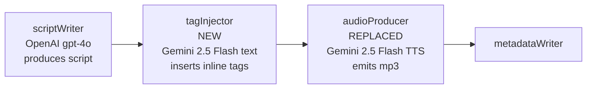
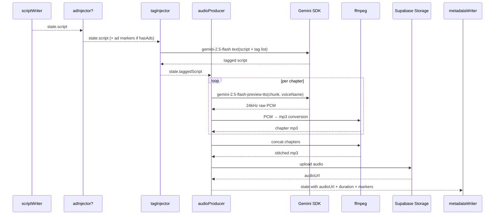

# Gemini TTS + Audio Tag Injection — Design Spec

**Date:** 2026-05-07
**Status:** Draft
**Author:** Isuru + Claude

---

## TL;DR

Replace OpenAI `gpt-4o-mini-tts` with Gemini 2.5 Flash TTS for podcast audio generation. Add a new `tagInjector` node between `scriptWriter` and `audioProducer` that uses Gemini 2.5 Flash (text model) to insert inline emotion/pacing tags (`[laughs]`, `[whispers]`, `[chuckles]`, etc.) into the script before TTS. Tags drive finer-grained audio expression than OpenAI's whole-text style instructions. Voice picker stays in onboarding with 4 new Gemini voices (Sulafat / Charon / Sadaltager / Achird). Hard cutover, no flag — greenfield, zero users.

## Goals

- Produce more textured, conversational audio that matches the "warm, slightly amused, knowledgeable friend at a coffee table" target in our existing `SCRIPT_WRITER_PROMPT`.
- Use Gemini's native inline tag mechanism for finer emotional control than OpenAI's single-instruction string.
- Keep cost in the same ballpark (~$0.20 per podcast vs ~$0.15 today).
- Allow tag set to be tuned via env var without redeploying source code.

## Non-goals

- A/B testing voice quality before commit (user picked direction).
- Multi-speaker podcasts (Gemini supports it; not in scope here).
- Migrating existing user data — there are no users; clearing `profiles.preferred_voice` is fine.
- Replacing `briefBuilder` / `scriptWriter` / research stack — those stay on OpenAI/OpenRouter as-is.

---

## Architecture



**New node insertion in `graph.ts`:**

Before:
```
scriptWriter → adInjector? → audioProducer → metadataWriter
```

After:
```
scriptWriter → adInjector? → tagInjector → audioProducer → metadataWriter
```

The `tagInjector` node accepts the script (with optional ad markers) and emits a tag-enriched version. `audioProducer` consumes the tagged script and produces mp3 chunks per chapter.

**Why a separate node:** Tag injection is a discrete LLM step with its own model + prompt. Wiring it into `audioProducer` would tangle two unrelated concerns (text-tag generation, audio synthesis) into one node, complicating retry semantics. Separate nodes also let us trace each step independently in Langfuse.

---

## Components

### 1. tagInjector node

**Input:** `state.script` (string with `[CHAPTER: ...]` markers from `scriptWriter`).

**Output:** `state.taggedScript` (string with `[CHAPTER: ...]` markers preserved + inline `[tag]` markers).

**Model:** `gemini-2.5-flash` (text variant, NOT TTS) via the Google Gen AI SDK directly.

**Prompt:**

```
You are inserting audio tags into a podcast script that will be read aloud
by an expressive TTS model.

Available tags: {AUDIO_TAGS_LIST}

Rules:
- Insert tags immediately before the phrase or sentence they should
  influence (e.g., "[chuckles] You'd think they'd have figured it out
  by then.")
- Match the emotional arc — don't overuse tags. Aim for one tag per
  ~3-5 sentences, more sparse in factual sections, denser in
  conversational asides and chapter transitions.
- Do NOT modify the script's text — only insert bracketed tags.
- Preserve all [CHAPTER: ...] markers verbatim.
- Preserve any [AD:PRE_ROLL] / [AD:MID_ROLL] markers verbatim.

Script:
{script}
```

**Tag set** (configurable via `AUDIO_TAGS` env var, default in `config.ts`):

```typescript
export const AUDIO_TAGS_DEFAULT = [
  "laughs", "whispers", "sighs", "chuckles", "curious",
  "thoughtful", "serious", "surprised", "exhales", "pauses",
] as const;

export const AUDIO_TAGS =
  process.env.AUDIO_TAGS?.split(",").map(s => s.trim()).filter(Boolean)
  ?? [...AUDIO_TAGS_DEFAULT];
```

To change tags in production: edit `AUDIO_TAGS=...` on Railway and restart. No code push.

**Empty `AUDIO_TAGS` resolves to defaults** — the `?? AUDIO_TAGS_DEFAULT` fallback only triggers when the env var is unset. If it's set to an empty string or just commas (typo), `.split.map.filter(Boolean)` produces `[]` and `?? `won't catch that. Guard:

```typescript
const parsed = process.env.AUDIO_TAGS?.split(",").map(s => s.trim()).filter(Boolean);
export const AUDIO_TAGS = parsed && parsed.length > 0 ? parsed : [...AUDIO_TAGS_DEFAULT];
```

If a future user nukes the env var, we fall back rather than feeding an empty list to the model and getting silent improvisation.

**Failure handling — concrete validation gates (in order):**

1. **SDK error** (network, auth, rate-limit, refusal): `try/catch` around the Gemini call. On catch → fall through with `taggedScript = script`.
2. **Empty output**: if model returns empty/whitespace string → fall through with `taggedScript = script`.
3. **Chapter-marker preservation check**: count `[CHAPTER:` occurrences in input vs output. If they differ → fall through with `taggedScript = script` (model dropped/added chapters, can't trust output).
4. **Pass-through if any check fails**, log a `console.warn` at `[tagInjector] fallthrough` with the reason.

We do **NOT** validate that only allowlisted tags appear, do **NOT** strip unknown tags. If the model occasionally inserts a tag outside `AUDIO_TAGS` (e.g., `[grins]`), Gemini TTS either ignores it or interprets it loosely — empirically benign, and trying to filter introduces brittle regex maintenance.

We do **NOT** validate that text content is byte-identical to input; the model can lightly punctuate or shift whitespace and that's fine. The chapter-marker count is the single structural invariant.

### 2. audioProducer node (replaced)

**Input:** `state.taggedScript`, `state.voice` (Gemini voice name from picker), chapter markers from script structure.

**Output:** `state.audioUrl` (Supabase Storage URL of stitched mp3), `state.transcript`, `state.chapterMarkers`, `state.durationSeconds`.

**Model:** `gemini-2.5-flash-preview-tts` via the Google Gen AI SDK.

**Chunking (unchanged from current behavior):**

`splitScriptSegments` (in `audioProducer.ts:29-52`) splits the script on **ad markers** (`[AD:PRE_ROLL]` / `[AD:MID_ROLL]`), not chapter markers — chapter markers are stripped from each text segment before TTS. The new audioProducer keeps that behavior verbatim. One Gemini TTS call per text segment (typically 1-3 calls per podcast: pre-roll-text, mid-roll-text, post-roll-text). Calls run sequentially today; that stays the same in this spec (parallelization is future work, not v14).

**`[CHAPTER:]` strip location:** `splitScriptSegments` strips `[CHAPTER:...]` from each text segment via the existing regex at `audioProducer.ts:44`. The new tagInjector preserves chapter markers in `taggedScript` (Q3 of failure-handling), and the strip still happens inside `splitScriptSegments` as today. No new strip logic.

**API call shape (one per text segment):**

```typescript
const response = await client.models.generateContent({
  model: GEMINI_TTS_MODEL,
  contents: segmentText,  // tag-injected script text from segment.content; chapter markers already stripped by splitScriptSegments
  config: {
    responseModalities: ["AUDIO"],
    speechConfig: {
      voiceConfig: {
        prebuiltVoiceConfig: { voiceName: state.voice ?? DEFAULT_GEMINI_VOICE },
      },
    },
  },
});

// inlineData.data is a BASE64-ENCODED string (per @google/genai SDK), not raw bytes.
const base64Audio = response.candidates[0].content.parts[0].inlineData.data;
const pcmBytes = Buffer.from(base64Audio, "base64");
```

**Audio format conversion:** Gemini returns 24 kHz, 16-bit, mono raw PCM as base64. Decode → write tmp `.pcm` file → ffmpeg-encode to mp3 per segment:

```bash
ffmpeg -f s16le -ar 24000 -ac 1 -i segment_N.pcm -codec:a libmp3lame -qscale:a 2 segment_N.mp3
```

Then ad-stitching is unchanged: ffmpeg `-f concat` over the list of segment mp3s + ad asset mp3s in order, exactly as `stitchAudio` (`audioProducer.ts:54-108`) does today.

**Ad assets:** the existing ad-stitching path (reading `ad_assets/pre_roll.mp3` and `ad_assets/mid_roll.mp3` from disk and concatenating between text segments) is preserved verbatim. Only the per-segment TTS provider changes.

### 3. Voice picker (mobile)

4 Gemini voices, samples regenerated:

| Voice | Google descriptor | Maps to |
|---|---|---|
| `Sulafat` | Warm | warm conversational tone |
| `Charon` | Informative | substance-forward, news-anchor adjacent |
| `Sadaltager` | Knowledgeable | "knowledgeable friend" — most direct match for prompt |
| `Achird` | Friendly | casual upbeat |

**Default voice** if user skips onboarding: `Sulafat`.

**Voice samples:** regenerated via existing `pipeline/scripts/build-voice-samples.ts` flow, swapping OpenAI for Gemini TTS. Output bundled as 4 mp3s.

**Asset filename casing:** lowercase to match the existing convention in `mobile/src/lib/voiceSamples.ts:19` (the current `coral.mp3`/`ballad.mp3`/etc.). New files: `sulafat.mp3`, `charon.mp3`, `sadaltager.mp3`, `achird.mp3`. The `state.voice` capitalization stays as Gemini expects (`Sulafat`), but bundled asset paths are lowercased — convert at the resolver in `voiceSamples.ts`.

**Sample script copy** (~10 seconds each, embeds the audio-tag system to advertise it):

| Voice | Sample script |
|---|---|
| Sulafat | `[chuckles] Hey, I'm Sulafat. I'll narrate your podcast like a friend who happened to know a lot about whatever you're curious about.` |
| Charon | `I'm Charon. I'll bring substance to the topic — clear, informed, and to the point. [pauses] No fluff.` |
| Sadaltager | `[thoughtful] I'm Sadaltager. Think of me as the person at dinner who actually knows the history behind whatever you brought up.` |
| Achird | `I'm Achird. [chuckles] I'll keep it casual and conversational, like we're catching up over coffee.` |

### 4. Provider — `providers/gemini.ts`

New factory:

```typescript
import { GoogleGenAI } from "@google/genai";

export function getGeminiClient(): GoogleGenAI {
  const apiKey = process.env.GEMINI_API_KEY;
  if (!apiKey) throw new Error("GEMINI_API_KEY is not set");
  return new GoogleGenAI({ apiKey });
}
```

Single client instance, used by both `tagInjector` (text model) and `audioProducer` (TTS model).

---

## Configuration

### Env vars

**New:**
```
GEMINI_API_KEY=AIza...
AUDIO_TAGS=laughs,whispers,sighs,chuckles,curious,thoughtful,serious,surprised,exhales,pauses
GEMINI_TAG_INJECTOR_MODEL=gemini-2.5-flash    # default; override for eval
GEMINI_TTS_MODEL=gemini-2.5-flash-preview-tts # default; override to gemini-3.1-flash-tts-preview if quality demands
```

**Removed (no longer used):**
- `TTS_VOICE` constant in `config.ts` (replaced by per-user `state.voice` from picker)
- `TTS_VOICE_INSTRUCTIONS` constant in `config.ts` (Gemini uses inline `[tag]` markers; whole-text instructions are an OpenAI concept)

**Unchanged:** `OPENAI_API_KEY` stays — `briefBuilder`, `scriptWriter` still use it.

### Constants in `config.ts`

```typescript
export const GEMINI_TTS_MODEL =
  process.env.GEMINI_TTS_MODEL ?? "gemini-2.5-flash-preview-tts";
export const GEMINI_TAG_INJECTOR_MODEL =
  process.env.GEMINI_TAG_INJECTOR_MODEL ?? "gemini-2.5-flash";

export const GEMINI_VOICES = ["Sulafat", "Charon", "Sadaltager", "Achird"] as const;
export const DEFAULT_GEMINI_VOICE = "Sulafat";

// (AUDIO_TAGS_DEFAULT + AUDIO_TAGS as shown earlier)
```

---

## Data flow

### Pipeline state changes

```typescript
// state.ts — add one field:
taggedScript: Annotation<string>,
```

`script` keeps the original output of `scriptWriter` for traceability/debugging. `taggedScript` is what `audioProducer` consumes.

| Field | Before | After |
|---|---|---|
| `script` | from scriptWriter | unchanged — original |
| `taggedScript` | (didn't exist) | from tagInjector — script + `[tag]` markers |
| `voice` | OpenAI voice ("ballad") | Gemini voice ("Sulafat") |
| `audioUrl` | mp3 from OpenAI | mp3 from Gemini (post-PCM-conversion) |

### DB migration

**Migration `00016_gemini_voice_migration.sql`:**

`00012_voice_selection.sql` added `preferred_voice text` with no DEFAULT and no CHECK constraint. So we just need to clear existing values, set a default, add a constraint, and update the comment:

```sql
-- 00016_gemini_voice_migration.sql
-- Switch from OpenAI voices to Gemini voices. Greenfield project (zero users)
-- so we clear all existing voice preferences and force re-onboarding.

UPDATE public.profiles SET preferred_voice = NULL WHERE preferred_voice IS NOT NULL;
UPDATE public.podcasts SET voice = NULL WHERE voice IS NOT NULL;

ALTER TABLE public.profiles
  ALTER COLUMN preferred_voice SET DEFAULT 'Sulafat';

ALTER TABLE public.profiles
  ADD CONSTRAINT profiles_preferred_voice_check
  CHECK (preferred_voice IS NULL OR preferred_voice IN ('Sulafat', 'Charon', 'Sadaltager', 'Achird'));

COMMENT ON COLUMN public.profiles.preferred_voice IS
  'Gemini TTS voice name (Sulafat|Charon|Sadaltager|Achird). Default: Sulafat. Reset by v14 Gemini TTS migration on 2026-05-07.';

COMMENT ON COLUMN public.podcasts.voice IS
  'Gemini voice this podcast was rendered with. Snapshot from profiles.preferred_voice at submit-podcast time. NULL on legacy rows = pipeline default (Sulafat).';
```

We also clear `podcasts.voice` for completeness — old OpenAI voice strings on existing rows would never replay correctly anyway.

### Status transitions (unchanged)

```
queued → researching → scripting → producing audio → complete
```

The new `tagInjector` runs during the `producing audio` phase. Doesn't introduce a new visible status.

### End-to-end sequence



---

## Failure handling

| Layer | Failure mode | Detection | Handling |
|---|---|---|---|
| Tag injector | Gemini error, malformed output, refuses to tag | try/catch on Gemini call | Fall through with `taggedScript = script`. Log warning. Audio still gets produced, just without tags. |
| Per-chapter TTS | Gemini error (rate limit, invalid input) | thrown from SDK | Retry once with same input; if still fails, hard-fail the pipeline (matches today's audioProducer semantics). |
| Voice null OR not in allowlist | `state.voice ∉ GEMINI_VOICES` (covers null and stale OpenAI strings) | validation in `audioProducer` entry | Fall back to `DEFAULT_GEMINI_VOICE`. Log warning. (DB constraint catches most of this; validation is belt + suspenders + handles legacy podcasts submitted before this migration.) |
| PCM → mp3 conversion | ffmpeg failure | exit code | hard fail — same as today's chunk failures |
| Empty `taggedScript` | tagInjector returned empty string | length check | Use original `script`. Log warning. |

The graceful tag-injector failure is the key new resilience — we never want a stylistic enhancement to block podcast generation.

---

## Cost expectations

Per 10-minute podcast (~2000 words, ~3000 text tokens, ~19,200 audio tokens at 32 tok/s × 600s):

| Component | Tokens | Cost (paid tier) |
|---|---|---|
| Tag injector — Gemini 2.5 Flash text | 3k in + 3k out | $0.30/M × 3k + $2.50/M × 3k ≈ ~$0.008 |
| TTS — Gemini 2.5 Flash preview | 3.5k text in + 19.2k audio out | $0.50/M × 3.5k + $10/M × 19.2k ≈ ~$0.194 |
| **Total per podcast** | | **~$0.20** |

Compare:
- OpenAI gpt-4o-mini-tts today: ~$0.15
- Cost increase: ~$0.05 / podcast (~33%)

Worth it for the 30-voice palette + inline tag expressiveness. Still well under the old $1.88/research path we eliminated in v11.

---

## Acceptance criteria

| Behavior | Test |
|---|---|
| `tagInjector` returns tagged script preserving `[CHAPTER:]` markers | Unit test with mocked Gemini text response containing `[chuckles]` between `[CHAPTER:]` boundaries |
| `tagInjector` handles Gemini failure gracefully | Mock thrown error; assert state.taggedScript === state.script + warning logged |
| `tagInjector` only inserts tags from the configured set | Mock model emitting an unknown tag like `[shouts]`; either filter or accept (test asserts current behavior) |
| `audioProducer` calls Gemini with correct voice name | Mock SDK; assert `voiceName` in payload matches `state.voice` |
| `audioProducer` falls back to default voice on invalid input | Set `state.voice = "ballad"` (old OpenAI); assert call uses `Sulafat` + warning logged |
| `audioProducer` converts PCM → mp3 | Mock SDK returns sample PCM; assert ffmpeg invocation has correct args |
| `audioProducer` retries TTS once on chunk failure | Mock first call to throw, second to succeed; assert chunk produced |
| `AUDIO_TAGS` env var override is read | Set env to comma-list; assert prompt contains those tags |
| Per-chapter chunking unchanged | Existing chunking tests still pass |
| `TTS_VOICE` constant fully removed | grep returns empty |
| End-to-end (gated live) | Submit a topic via API in production; podcast completes with mp3 audible and tags audibly affecting delivery |

---

## Risks + mitigation

| Risk | Mitigation |
|---|---|
| Gemini 2.5 Flash TTS preview is removed/deprecated | env var `GEMINI_TTS_MODEL` allows swap to `gemini-3.1-flash-tts-preview` (or future stable) without code change |
| Tag injector goes off-script (modifies text, hallucinates content, drops `[CHAPTER:]` markers) | Prompt explicitly says "do NOT modify text"; tagInjector falls through to original script on validation failure |
| 24 kHz audio quality lower than 16 kHz mp3 from OpenAI | 24 kHz is fine for speech (the human voice fundamentals top out around 8 kHz); listen to first podcast and judge |
| Gemini latency higher than OpenAI per chunk | Gemini Flash TTS is reasonably fast (~2-5s per chunk). Today's `stitchAudio` calls TTS sequentially (audioProducer.ts:64-80); we keep that. With typically 1-3 segments per podcast, sequential is fine. If future profiling shows it as a bottleneck, parallelize via `Promise.all` over `partFiles`. |
| Voice name typo in DB | DB check constraint enforces allowlist |
| Inline tags break TTS rendering with weird artifacts | Tag set is curated (Q2 decision); if specific tag misbehaves, remove from `AUDIO_TAGS` env var |
| Mobile app's bundled voice samples become stale | Regenerate via `build-voice-samples.ts` script as part of cutover; bump app version + force users back through onboarding (clearing preferred_voice) |
| Cost overrun if podcast is much longer than 10 min | Hard cap on script length already enforced upstream by scriptWriter prompt (target 1500-2200 words, hard floor 1800) |

---

## Migration

### File changes

**Added:**
```
pipeline/src/podcast_pipeline/
├── nodes/tagInjector.ts           # new node
├── providers/gemini.ts             # GoogleGenAI client factory
└── ... (audioProducer.ts replaced in place)

supabase/migrations/00016_gemini_voice_migration.sql
mobile/assets/voice-samples/sulafat.mp3        # regenerated, lowercase to match existing convention
mobile/assets/voice-samples/charon.mp3
mobile/assets/voice-samples/sadaltager.mp3
mobile/assets/voice-samples/achird.mp3
```

**Modified:**
- `pipeline/package.json` — add `@google/genai`
- `pipeline/.env.example` — add `GEMINI_API_KEY`, `AUDIO_TAGS`, `GEMINI_TAG_INJECTOR_MODEL`, `GEMINI_TTS_MODEL`
- `pipeline/src/podcast_pipeline/config.ts` — add Gemini constants, voice list, audio tags; remove `TTS_VOICE`, `TTS_VOICE_INSTRUCTIONS`
- `pipeline/src/podcast_pipeline/state.ts` — add `taggedScript` field
- `pipeline/src/podcast_pipeline/graph.ts` — wire `tagInjector` between adInjector/audioProducer
- `pipeline/src/podcast_pipeline/nodes/audioProducer.ts` — replace OpenAI TTS with Gemini TTS + PCM→mp3
- `pipeline/src/podcast_pipeline/nodes/index.ts` — export tagInjector
- `pipeline/scripts/build-voice-samples.ts` — replace OpenAI calls with Gemini, generate 4 new sample mp3s
- `mobile/src/components/VoicePicker.tsx` — new voice metadata + sample paths
- `mobile/src/types/database.ts` — `preferred_voice` literal type updated to `'Sulafat' | 'Charon' | 'Sadaltager' | 'Achird' | null`
- `mobile/src/lib/voiceSamples.ts` — update voice sample mapping

**Deleted:**
- 4 OpenAI voice sample mp3s in `mobile/assets/voice-samples/` (e.g. `ballad.mp3`)

### Steps

1. Add deps + env vars locally + on Railway.
2. Build new pipeline code (TDD where possible — `tagInjector`, `audioProducer` Gemini path).
3. Apply migration `00016` to Supabase (clears existing `preferred_voice` rows; greenfield, no users affected).
4. Regenerate voice samples via `build-voice-samples.ts` script (one-shot, ~$0.05 in Gemini calls).
5. Replace bundled mp3s in `mobile/assets/voice-samples/`.
6. Update mobile `VoicePicker` + `voiceSamples` to point at the new files + names.
7. Local end-to-end smoke: submit a topic via the live API, listen to the produced mp3 — verify voice + tag expression.
8. Bump mobile app version, rebuild dev client (native modules unchanged so this might just be a JS reload, depends on what the picker assets need).
9. Deploy pipeline to Railway via `railway up`.

### Rollback

`git revert <merge-commit>; railway up` — old OpenAI path code is still in git history. The DB migration (00016) sets a default + adds a check constraint; reverting the code does NOT auto-revert the migration. That's fine — the cleared `preferred_voice` rows + Sulafat default + check constraint are the desired state regardless of which TTS path runs (and if we go back to OpenAI we'd write a 00017 to drop the constraint and reset the default). Practical: code revert restores OpenAI flow; DB stays where it is.

### Langfuse traces

Threading is automatic — `tagInjector` and `audioProducer` are LangGraph nodes called via `graph.invoke(state, { callbacks: [...] })`, and the v11 work to thread `RunnableConfig` through nested `.invoke()` calls means Gemini text + Gemini TTS calls inherit the same callback handler as the rest of the pipeline. New nodes inherit the threading; no extra wiring.

---

## Out of scope

- Multi-speaker podcasts (Gemini supports it via `multi_speaker_voice_config`).
- A/B testing voice quality (user opted out).
- Per-chapter voice variation (single voice per podcast, picker-driven).
- Hot-reload of `AUDIO_TAGS` without service restart (env var is enough).
- Migrating any in-flight podcast jobs (treat as a fresh start; greenfield).
- Tag set quality tuning beyond the curated 10 — any future expansion is an env-var change.

---

## Rollout

| Step | Owner | Duration |
|---|---|---|
| 1. Sign up Gemini API, get key, top up if needed | Isuru | 5 min |
| 2. Add env vars to Railway + local | Isuru/Claude | 10 min |
| 3. Implement tagInjector + Gemini provider (TDD) | Claude | half day |
| 4. Replace audioProducer with Gemini TTS path | Claude | half day |
| 5. Migration + DB constraint | Claude | 15 min |
| 6. Regenerate 4 voice samples | Claude | 10 min |
| 7. Update mobile picker + types | Claude | 30 min |
| 8. Local smoke: end-to-end podcast | Isuru/Claude | 20 min |
| 9. Deploy + verify production | Isuru/Claude | 20 min |

Total: 1.5-2 days.
