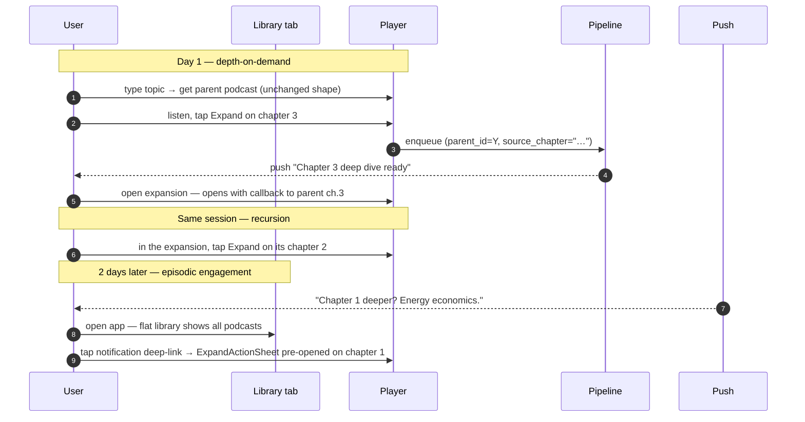
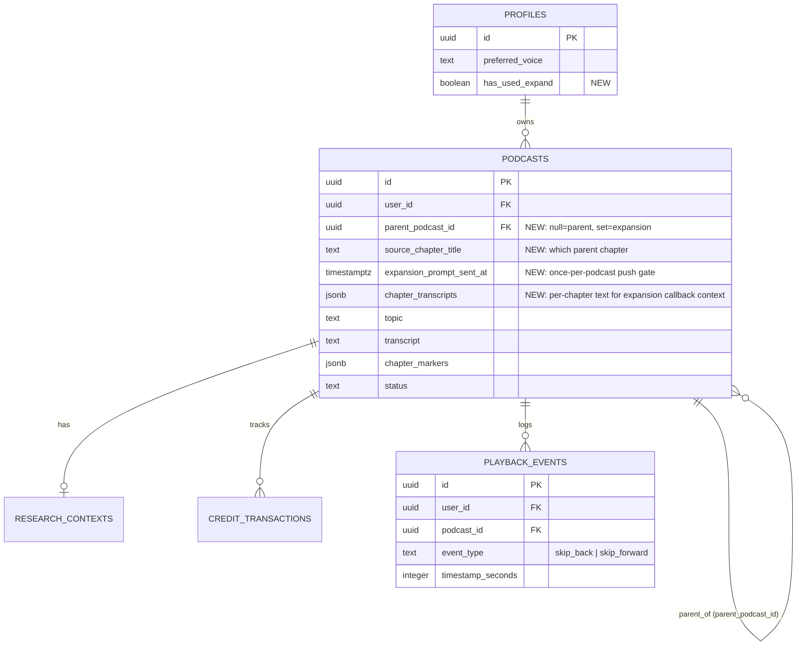
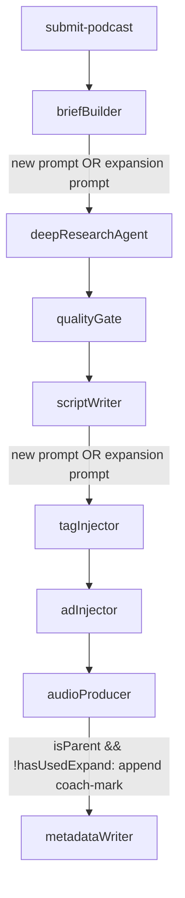
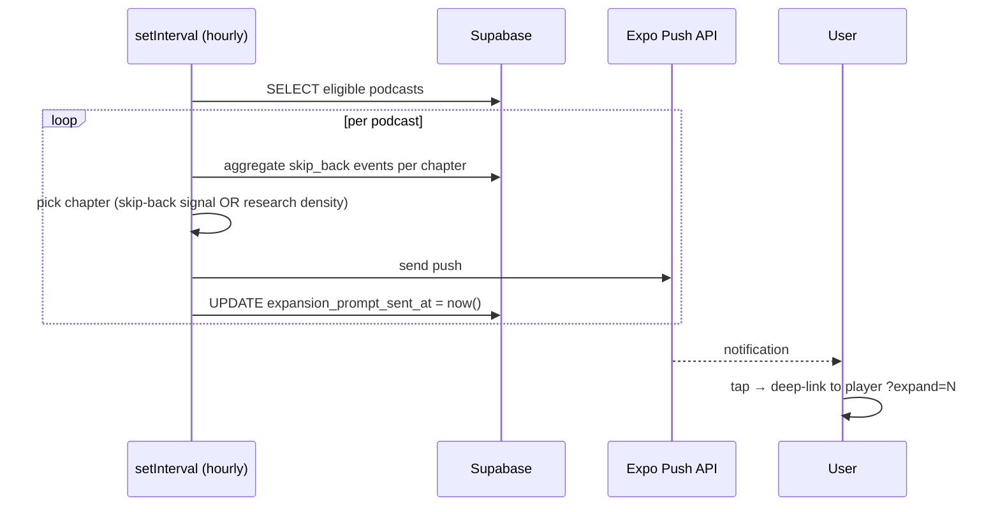

# Chapter Expansions (Series of Episodes) — design spec

**Date:** 2026-05-12
**Status:** Draft
**Ships as:** v15-v17 (foundation → mobile → re-engagement, three plans)
**Replaces:** Deep Dive (voice Q&A) UI surface — code stays for future revival.

## Why this exists

The Deep Dive feature (voice Q&A grounded in research, gated to Plus/Pro) is sunset from the UI. In its place, a feature that maps better to the brand promise and naturally drives both within-session depth and cross-session return:

Once a user finishes a podcast, any chapter they care about can be **expanded into its own full-length podcast** — a continuation episode that picks up from the parent chapter and goes deeper. Chapters of expansions can themselves be expanded. The library accumulates as a personal series feed.

Two user behaviors this serves simultaneously:

- **Depth-on-demand**: user finishes a podcast and immediately taps an interesting chapter to keep going. Continuous binge.
- **Episodic engagement**: 2 days later, a push notification suggests deepening a specific chapter. User comes back with curiosity already primed.

The expansion replaces Deep Dive's role as the paid-tier wedge. Plus/Pro spend monthly credits on expansions (fungible with new podcasts). Free users can pay-as-they-go via extra credit purchase or upgrade.

## Final UX



### What changes vs today

- **Parent podcast**: no script-level change. Same ~10-40 min target, same 4-6 chapters, same cold-open-to-closer arc.
- **Expansion podcast** (new): same length target, but **B-mode script** — opens with a callback to the source chapter. Continuation, not standalone. Assumes you heard the parent.
- **Library tab**: flat list of all podcasts (parent + expansions interleaved by recency). Expansion rows get a one-line subtitle: "from \<parent topic\> · chapter X".
- **Player**: each chapter marker gets an inline Expand affordance. Taps open ExpandActionSheet. State-aware: shows "Expand" if not yet expanded, "Open expansion ›" if already done, "Generating…" if mid-flight.
- **First-time discovery**: an audio post-roll coach-mark explains the expand feature. Plays on EVERY parent podcast until the user expands their first chapter (`profiles.has_used_expand` flips to `true`). For users who never expand, it keeps playing on every new parent — by design, the system retries explaining the feature until the user engages with it. After the first expansion, it never plays again.
- **Push notifications**: 2 days after a parent podcast, if the user hasn't expanded any chapter yet, fire a single suggestion push.

### What goes away (UI only)

- `DiveBar.tsx` hidden from player
- Deep Dive section hidden from `account.tsx`
- All other Deep Dive infrastructure (routes, hook, qa_sessions table, ElevenLabs deps, RC webhook deep-dive logic) stays untouched

## Data model

### Migration `00019_chapter_expansions.sql`

```sql
-- 1. Expansion relationship on podcasts
ALTER TABLE public.podcasts
  ADD COLUMN parent_podcast_id uuid REFERENCES public.podcasts(id) ON DELETE SET NULL,
  ADD COLUMN source_chapter_title text,
  ADD COLUMN expansion_prompt_sent_at timestamptz,
  -- Chapter-aligned transcript storage so expansions can extract just the
  -- relevant chapter slice as scriptWriter callback context. Today's
  -- transcript field has [CHAPTER:] markers stripped (metadataWriter strips
  -- them before storage), so there's no way to slice it by chapter boundary
  -- after the fact. Storing per-chapter text keyed by title gives O(1)
  -- lookup at expansion time. Shape: { "Chapter Title 1": "text", ... }.
  ADD COLUMN chapter_transcripts jsonb,
  ADD CONSTRAINT podcasts_expansion_consistency
    CHECK (parent_podcast_id IS NULL OR source_chapter_title IS NOT NULL);

-- 2. Idempotency: a chapter can be expanded exactly once per parent
--    (excluding soft-deleted expansions so users can re-roll a bad one)
CREATE UNIQUE INDEX idx_podcasts_unique_expansion
  ON public.podcasts (parent_podcast_id, source_chapter_title)
  WHERE parent_podcast_id IS NOT NULL AND deleted_at IS NULL;

-- 3. Lookup index for "what expansions has this podcast spawned?"
CREATE INDEX idx_podcasts_parent
  ON public.podcasts (parent_podcast_id)
  WHERE parent_podcast_id IS NOT NULL;

-- 4. Feature-introduced flag on profiles (coach-mark gate)
ALTER TABLE public.profiles
  ADD COLUMN has_used_expand boolean NOT NULL DEFAULT false;

-- 5. Playback event log (drives chapter selection heuristic for the push)
CREATE TABLE public.playback_events (
  id uuid PRIMARY KEY DEFAULT gen_random_uuid(),
  user_id uuid NOT NULL REFERENCES auth.users(id) ON DELETE CASCADE,
  podcast_id uuid NOT NULL REFERENCES public.podcasts(id) ON DELETE CASCADE,
  event_type text NOT NULL,
  timestamp_seconds integer NOT NULL,
  created_at timestamptz NOT NULL DEFAULT now(),
  CONSTRAINT playback_event_type_valid CHECK (event_type IN ('skip_back', 'skip_forward'))
);
-- v1 only consumes 'skip_back' (chapter selection heuristic). 'skip_forward'
-- is logged because the mobile change is trivial (already firing both buttons)
-- and the data is useful for future "less-interesting" chapter signals or
-- analytics. No v1 code reads skip_forward events; they sit in the log until
-- a future feature consumes them.

CREATE INDEX idx_playback_events_podcast ON public.playback_events(podcast_id);
CREATE INDEX idx_playback_events_user ON public.playback_events(user_id);

ALTER TABLE public.playback_events ENABLE ROW LEVEL SECURITY;

CREATE POLICY "Users can view own playback events"
  ON public.playback_events FOR SELECT
  USING (auth.uid() = user_id);

CREATE POLICY "Users can create own playback events"
  ON public.playback_events FOR INSERT
  WITH CHECK (auth.uid() = user_id);
```

### Relationships



### RLS

**No new RLS migrations needed for `podcasts`.** Existing policies already scope all reads to `user_id = auth.uid()`. Expansions inherit their user's `user_id`, so they're naturally visible only to their owner. Parent self-joins (for the library subtitle) work because the user owns both rows. The lookup query "which chapters of this podcast are expanded" filters by `parent_podcast_id` and is naturally scoped by user.

**The only new RLS** is on `playback_events` (above) — own-row SELECT + INSERT, standard pattern.

**Server-side ownership check (critical)**: `submitPodcast` must verify supplied `parent_podcast_id` belongs to the requesting user before insert, and the supplied `source_chapter_title` exists in `parent.chapter_markers`. Otherwise user A could expand user B's podcast. Existing service-role-only insert pattern means there's no DB-level INSERT policy to defend us — server code is the trust boundary.

### Cascade behavior

- Parent soft-deleted (`deleted_at` set) → expansions still exist, still readable, still playable. Subtitle in library shows source chapter name. RLS view filter (`deleted_at IS NULL`) hides only the parent.
- Parent hard-deleted → `ON DELETE SET NULL` orphans expansions, preserves `source_chapter_title` as metadata. UI handles null parent gracefully ("from a deleted podcast").
- Expansion soft-deleted → its row stays but `deleted_at IS NOT NULL` excludes it from the partial unique index, so user can re-expand the same chapter.

## Pipeline

The graph topology is unchanged. Each node behaves differently when `state.parentPodcastId` is set.

### New `PipelineState` fields

```ts
parentPodcastId: Annotation<string | null>,
sourceChapterTitle: Annotation<string | null>,
parentResearchDigest: Annotation<string | null>,        // for planner
parentResearchDocument: Annotation<Record<string, unknown> | null>,  // for synthesizer
parentChapterTranscript: Annotation<string | null>,
hasUsedExpand: Annotation<boolean>,
```

All default null/false. Populated in `submitPodcast` from request payload + parent lookup. Self-contained — pipeline nodes don't re-query Supabase for parent context.

**Digest vs full document split**: the planner only needs to know the topology of what's already covered (section titles + 1-2 sentence summaries), so it gets `parentResearchDigest` — a compact string ~500-1000 tokens. The synthesizer needs richer parent context for actual merging (sections + claims + sources), so it gets the full `parentResearchDocument`. Digestion happens once in `submitPodcast` (a single Sonnet call or just a deterministic text extraction depending on parent research shape) and both fields ride together in pipeline state.

### `submitPodcast` route changes

Accept optional `parentPodcastId` + `sourceChapterTitle`. When set:

1. **Parent lookup** — pull parent row (`user_id`, `chapter_markers`, `chapter_transcripts`) + joined `research_contexts.research_document`. Filter `deleted_at IS NULL`.
2. **Ownership check** — `parent.user_id !== req.user.id` → return 404 (don't leak existence).
3. **Chapter validation** — `source_chapter_title` must match a `parent.chapter_markers[].title`. Else 400.
4. **Idempotency check** — if `(parent_podcast_id, source_chapter_title)` already has an active expansion, return 409 with `{ podcastId: existing.id }`. Mobile navigates instead of generating a duplicate.
5. **Chapter transcript lookup** — `parent.chapter_transcripts[source_chapter_title]`. If null (legacy podcasts created before this migration), return 400 with `"This podcast can't be expanded — regenerate it to enable expansions."` Greenfield + no real users yet means we don't backfill.
6. **Research digest** — build the planner-bound digest from `parent.research_document.sections`: extract `{title, content.slice(0, 200)}` per section. ~500-1000 tokens. Deterministic, no LLM call.
7. **Existing CAS credit deduction** — fungible, no special pricing for expansions.
8. **Insert podcast row** with `parent_podcast_id` + `source_chapter_title` set.
9. **Flag flip** — `UPDATE profiles SET has_used_expand=true WHERE id=user_id AND has_used_expand=false`. Idempotent. Runs via service role; bypasses RLS regardless of the `00007_restrict_podcast_update` UPDATE policy (which gates user-direct podcast updates to soft-deletes only).
10. **Enqueue** with the expansion fields populated in `PipelineState`.

### Per-node behavior



**`briefBuilder`** — new `BRIEF_BUILDER_EXPANSION_PROMPT`. Takes parent topic + chapter title + a **digested** parent research (section titles + 1-2 sentence summaries) + the source chapter transcript. Same output shape (`{ scope, angle, depth, keyQuestions }`) but scoped to the chapter.

**`deepResearchAgent`**:

- **Planner**: when `state.parentResearchDocument` is set, the prompt includes a "What's already known" digest from parent research. Direction: "produce sub-questions that drill DEEPER, don't duplicate." Same `RESEARCH_MAX_TOKENS.planner = 4096` cap.
- **Subagent**: no changes. Each takes a focused question; gpt-4o-mini handles tight queries well.
- **Synthesizer**: when `state.parentResearchDocument` is set, the prompt includes more-complete parent context (sections + claims + sources). Direction: "build a research_document for THIS expansion. Layer on top of parent; don't replicate." Output goes into a fresh `research_contexts` row keyed by the expansion's `podcast_id`.

Input sizes are comfortable for Sonnet 4.6: planner ~5K tokens, synthesizer ~17K tokens — both well within the effective-reasoning zone.

**`scriptWriter`** — new `SCRIPT_WRITER_EXPANSION_PROMPT`. Receives the expansion's `researchDocument` + `parentChapterTranscript`. First chapter opens with a callback ("Back in the chapter on X we touched on Y. Let's go deeper."). Same `TARGET_WORD_COUNT` (40-min target) and 4-6 chapters. Same `chapter_research_map` output so recursion works uniformly — the expansion's own chapters can themselves be expanded.

**`metadataWriter`** — populates `chapter_transcripts`. The node already walks the script to extract `chapter_markers`; it now also produces a `{ chapterTitle: chapterText }` map by splitting the script on `[CHAPTER:]` markers BEFORE the strip step that produces the flat `transcript`. The flat `transcript` field stays as-is (chapter markers stripped, for mobile display). The new `chapter_transcripts` column is a sibling field populated from the same source. One additional `.update()` field in the existing Supabase write; no separate DB call.

**`tagInjector` + `adInjector`** — no changes.

**`audioProducer`** — two conditions for the coach-mark post-roll:

```ts
const isParent = !state.parentPodcastId;
const showCoachMark = isParent && !state.hasUsedExpand;
```

When true, append `coachmark_audio/coachmark_expand_<voice>.mp3` as the last file in the concat list. The coach-mark sits OUTSIDE the chunked-TTS validation path (`synthesizeChunkValidated`) — it's a pre-recorded asset, not a generated chunk, so the WPM/sub-split logic doesn't apply.

**Pre-recorded encoding contract** (must match the live TTS chunks exactly so the final libmp3lame re-encode at concat doesn't produce an audible level/timbre shift at the join):

- Source PCM: 16-bit signed little-endian, 24 kHz, mono (same as `ttsGemini.ts` ffmpeg input)
- Encoded MP3: libmp3lame, qscale=2, mono, 24 kHz (same as per-chunk encode)
- Loudness: normalize to match the average loudness of Gemini's TTS output. Build script measures Gemini-output dBFS on a reference sample, applies matching gain to coach-mark before encoding. Single-step `loudnorm` filter sufficient.
- Length: ~10 seconds, ±2 seconds. Single sentence.

Build script: `pipeline/scripts/build-coachmark-audio.ts` (analogous to existing `build-voice-samples`). Generates one MP3 per voice (Sulafat / Charon / Sadaltager / Achird) via Gemini TTS, applies normalization, writes to `pipeline/coachmark_audio/`. Run once at setup time; commit the resulting MP3s to the repo (they're small, <100KB each).

One-time generation cost: 4 voices × ~$0.002 = ~$0.008.

### Recursion bounding

Each expansion only carries its **immediate parent's** chapter transcript and a **digested** parent research, not the entire ancestry. Recursion stays bounded regardless of depth:

- Level-N expansion sees: digest of level-(N-1) research + level-(N-1)'s source chapter transcript
- Total prompt size at the synthesizer stays ~17K tokens regardless of N

**Non-cumulative research doc per expansion**: the synthesizer writes a FRESH `research_document` for each expansion (its own subagent findings + the parent's research as priors, merged into a single new document). It does NOT carry forward parent content verbatim into the child's doc. So at level-N, only `parent_research_document` from level-(N-1) is sized to the same ~10-20K tokens it always is — not 2x bigger because the grandparent's content got nested in. The digest extraction step in `submitPodcast` (sections + first-sentence-of-each) always produces ~500-1000 tokens regardless of depth.

No depth caps in v1. Credit cost and diminishing-returns naturally self-regulate.

## Mobile UX

### Library (`mobile/app/(tabs)/index.tsx` + `usePodcasts.ts`)

Flat list, sorted by recency, no nested nav. Query adds parent topic via self-join:

```ts
.select(`
  id, topic, status, duration_seconds, audio_url, cover_url, created_at,
  parent_podcast_id, source_chapter_title,
  parent:parent_podcast_id (topic)
`)
```

`PodcastRow.tsx` renders a one-line subtitle when `parent_podcast_id` is set: `from "<parent.topic>" · chapter <source_chapter_title>`. Styling: `text.caption`, `inkSecondary`, single-line ellipsis. Falls back to `from a deleted podcast · chapter X` when parent is null (orphan).

### Player (`app/player/[id].tsx`)

New hook `useChapterExpansions(podcastId)` fetches expansion state per chapter of the current podcast:

```sql
SELECT id, source_chapter_title, status
FROM podcasts
WHERE parent_podcast_id = $1 AND deleted_at IS NULL
```

Returns `Map<chapterTitle, { podcastId, status }>`. `ChapterMarkers.tsx` reads this and renders state-aware affordances per chapter:

| State | Visual | Tap behavior |
|---|---|---|
| Not yet expanded | Inline "Expand" pill, accent color | Open `ExpandActionSheet` |
| Generation in flight | Spinner + "Generating…" | Stay on parent player; show a thin progress strip with pipeline status |
| Ready | "Open expansion ›" link, inkSecondary | Navigate to expansion's player |
| Failed | "Try again" + subtle error | Re-open `ExpandActionSheet` |

Realtime: subscribe to `INSERT`/`UPDATE` on `podcasts` filtered by `parent_podcast_id = currentPodcastId`. Generation completion flips the chapter marker without a manual refresh.

**In-flight UX** — `app/player/[id].tsx` today expects `status='complete'` for playback. For "Generation in flight" tapping on a chapter, we DON'T navigate into the in-progress podcast's player (it'd render a broken state). Instead the chapter marker shows a status strip inline that updates via the existing pipeline status realtime subscription. The strip surfaces the raw `podcasts.status` enum values (`queued` / `researching` / `fact_checking` / `scripting` / `generating_audio` / `failed` — see the enum in `00001_initial_schema.sql`), mapped to short human-readable labels ("Researching…", "Writing…", "Recording…", "Failed"). Add a small inline status component shared with the library card status pattern. This avoids needing to teach `app/player/[id].tsx` how to render non-`complete` podcasts — it stays focused on playback.

**Legacy podcasts without `chapter_transcripts`**: rather than letting users tap Expand and hit a 400, `useChapterExpansions` adds a pre-flight check on the parent: if `parent.chapter_transcripts IS NULL`, hide the Expand affordance for all chapters of that podcast. Shows nothing instead of a broken interaction. Greenfield, the only legacy podcasts that hit this are the user's own test podcasts; UX is graceful for them.

Player also handles the deep-link param `?expand=<chapter_index>` from push notifications — scrolls to that chapter and opens `ExpandActionSheet` automatically.

### `ExpandActionSheet.tsx` (new component)

Bottom sheet, slide-up, paper-light. Two variants based on `subscription.tier`:

**Paid (Plus / Pro):**
- "Expand this chapter" eyebrow
- Chapter title (serif)
- "Uses 1 credit · ~10 min to generate" subtitle
- Filled CTA: "Expand chapter"
- Text-link cancel

On confirm: POST `/api/submit-podcast` with the expansion fields. UI shows in-flight state on the chapter marker.

**Free:**
- Same eyebrow + chapter title
- "Two ways to keep going" subtitle
- Outline option 1: "Buy one credit ($5) · use for this episode" → opens existing `SubscriptionModal` (RC purchase flow). On success, auto-submit the expansion.
- Filled option 2: "Upgrade to Plus · $14.99/mo with 8 credits, no ads" → opens existing `PaywallScreen`. On purchase, return to player and auto-submit.
- Text-link cancel

Both options reuse existing RC components. Only the wrapping sheet is new.

### Playback event tracking

New hook `usePlaybackEvents(podcastId)` exposes `recordSkipBack(seconds)` + `recordSkipForward(seconds)`. Fire-and-forget inserts to `playback_events` via supabase-js with user JWT (RLS allows own-row insert). `AudioPlayer.tsx` calls these from the existing 10-second skip buttons. No new UI; one line added per button.

### Deep Dive sunset (UI-only)

- Hide `<DiveBar />` from player layout
- Hide Deep Dive section in `account.tsx` (minutes-remaining display)
- Don't remove: deep-dive.tsx route, useDeepDive.ts, startDeepDive/endDeepDive endpoints, qa_sessions table, ElevenLabs deps, RC webhook deep-dive logic, DB columns `deep_dive_minutes_*`

One-line render conditionals on the entry points. Reversible in a single PR.

### Files summary

| File | Action |
|---|---|
| `mobile/src/components/ExpandActionSheet.tsx` | Create |
| `mobile/src/hooks/useChapterExpansions.ts` | Create |
| `mobile/src/hooks/useExpansionSubmit.ts` | Create |
| `mobile/src/hooks/usePlaybackEvents.ts` | Create |
| `mobile/src/components/ChapterMarkers.tsx` | Modify — state-aware Expand affordance |
| `mobile/src/components/PodcastRow.tsx` | Modify — parent subtitle |
| `mobile/src/components/AudioPlayer.tsx` | Modify — fire playback events on skip buttons |
| `mobile/src/hooks/usePodcasts.ts` | Modify — self-join on parent_podcast_id |
| `mobile/src/services/podcast.ts` | Modify — expansion submit signature |
| `mobile/app/player/[id].tsx` | Modify — deep-link `?expand=N` handler, hide DiveBar |
| `mobile/app/(tabs)/account.tsx` | Modify — hide Deep Dive section |
| `mobile/src/types/database.ts` | Modify — new columns + playback_events table |

## Re-engagement push

### Eligibility

Fire one push per parent podcast, exactly once, when ALL conditions hold:

- `podcasts.status = 'complete'`
- `podcasts.parent_podcast_id IS NULL` (only push for parents)
- `podcasts.deleted_at IS NULL`
- `podcasts.expansion_prompt_sent_at IS NULL` (once-per-podcast)
- `podcasts.created_at < now() - interval '2 days'`
- `profiles.has_used_expand = false` (don't push to users who have already discovered the feature)
- `profiles.expo_push_token IS NOT NULL`
- No existing expansion of this parent

### Chapter selection heuristic

```ts
// Precondition: don't push at all if the podcast has fewer than 3 chapters.
// The slice(1, -1) below assumes we can carve out a meaningful middle.
// A 1- or 2-chapter podcast (rare, but extractChapters falls back to
// [{title: "Full Episode"}] when no [CHAPTER:] markers were emitted) has
// nothing useful to expand.
if (chapter_markers.length < 3) {
  return null; // caller skips this podcast; does NOT stamp expansion_prompt_sent_at
}

// 1. Try playback-engagement signal first
const skipBackEvents = await querySkipBackEvents(podcastId);
const countsByChapter = aggregateByChapter(skipBackEvents, chapter_markers);
// Skip cold-open (idx 0) and closer (last idx) — usually intro/conclusion
const middleCounts = Object.entries(countsByChapter).filter(([idx]) =>
  idx > 0 && idx < chapter_markers.length - 1
);
const topByEngagement = middleCounts.sort((a, b) => b[1] - a[1])[0];

if (topByEngagement && topByEngagement[1] >= 2) {
  // At least 2 go-backs in this chapter — strong signal
  return parseInt(topByEngagement[0]);
}

// 2. Fall back to research density
const map = researchContext.chapterResearchMap;
const candidates = chapter_markers.slice(1, -1).map((m, i) => ({
  title: m.title,
  index: i + 1,
  score: map[m.title]?.sourceIndexes?.length ?? 0,
}));
return candidates.sort((a, b) => b.score - a.score)[0]?.index ?? 1;
```

**Heuristic bias for offline listeners**: `playback_events` are best-effort fire-and-forget inserts requiring network. Offline listeners' skip-back signal is lost. For them, the heuristic quietly falls through to research-density. Acceptable v1 trade-off — worst case is "less personalized push," not "no push." Revisit when we add offline event queueing.

### Push payload

```ts
{
  to: expo_push_token,
  title: `Going deeper on chapter ${idx}?`,
  body: `${title}. Tap to expand.`,
  data: { deepLink: `/player/${podcastId}?expand=${idx}`, podcastId },
  sound: "default",
}
```

Copy tuned per PRODUCT.md voice rules ("direct, confident, no hedging"). Avoid the marketing register of "More on your podcast?" — phrase it like a friend.

### Delivery atomicity + token errors

**Ordering**: stamp `expansion_prompt_sent_at` FIRST (as a CAS write: `UPDATE … WHERE expansion_prompt_sent_at IS NULL`), THEN call the Expo push API. If two server instances race, only one wins the CAS and only one sends the push. If the Expo call fails after the stamp, we accept the missed push — the cron won't retry, but the user can still discover the feature on their own (the coach-mark plays on parent outro, the in-app player has the expand affordance). A missed push is recoverable; a duplicate push is annoying and the user can't undo it.

**Token-revoked errors**: Expo returns `DeviceNotRegistered` when a token is stale (user uninstalled, disabled notifications, or replaced the device). The cron must NOT treat this as a permanent failure for the podcast — the token will be re-registered next time the user opens the app and `usePushNotifications` runs. Handling:

1. On `DeviceNotRegistered`, null out `profiles.expo_push_token` for that user (so we stop trying until they re-register).
2. Leave `expansion_prompt_sent_at` set on the podcast (cron already stamped pre-send). User who re-installs won't get a retroactive push for this podcast — accepted limitation. They'll get pushes for podcasts generated after re-registration.
3. Log the event for visibility.

Any other Expo error (server 5xx, timeout) just logs + retries on the next hourly scan (since `expansion_prompt_sent_at` was set, this podcast is now off the eligibility query — accept the miss). If we want to retry transient errors specifically, we'd need a separate retry queue; out of scope for v1.

### Delivery infrastructure

Pre-launch: **`setInterval` inside the existing Railway server**.

```ts
// pipeline/src/server.ts after server starts:
const HOUR_MS = 60 * 60 * 1000;
setInterval(async () => {
  try {
    await runExpansionPromptsScan();
  } catch (err) {
    console.error("[expansion-prompts cron] failed:", err);
  }
}, HOUR_MS);
```

`runExpansionPromptsScan` queries eligibility, picks chapter, fires Expo push, atomically marks `expansion_prompt_sent_at = now()`. Hourly cadence; the 2-day window ensures we don't miss firing due to server restarts.

**Acceptable pre-launch limitations:**
- Resets on server restart (recovered next hour)
- Single point of failure (one Railway instance)
- Doesn't scale to multi-instance without coordination

**Multi-instance hazard (must address before scaling beyond one Railway dyno)**: if two instances run `setInterval` concurrently, both could observe the same eligible podcast and both could try to fire. The CAS write on `expansion_prompt_sent_at` prevents the *duplicate stamp*, but if both instances called Expo BEFORE the CAS resolved, both pushes would deliver. The CAS-first ordering above (stamp then push) avoids this — only the CAS winner reaches the push call. But the spec MUST be revisited if we ever add a second Railway instance, because the `setInterval` approach is no longer safe to run identically on N replicas (each fires every hour independently, multiplying scan cost). Swap to `pg_cron` calling a single Railway endpoint via `pg_net` at that point — single trigger, single execution. Greenfield/single-instance today (per MEMORY: pre-launch zero users) so this is fine for v15-v17 ship.

**When we scale beyond single-instance**, swap to `pg_cron` on Supabase calling a Railway endpoint via `pg_net`. Logic stays the same; only the trigger changes.



## Out of scope for v1

- **Series view / collection filter.** Library stays flat.
- **`series_root_id` denormalization.** Recursive parent traversal on the rare query that needs root identity.
- **Expansion regeneration in-place.** Soft-delete then re-expand pattern is supported via the index design; "re-roll without delete" is not.
- **Depth indicators on player UI.**
- **Cross-podcast similarity suggestions.**
- **`pause` / `chapter_complete` event types.** `event_type` is constrained to `skip_back | skip_forward` for v1; check constraint can be ALTERed to add more types when needed.
- **Per-user A/B testing of push copy.**
- **Do-not-disturb hour awareness.**
- **Offline event queueing on mobile.** Network failures lose individual `playback_events` inserts. Accepted bias: offline-heavy listeners get research-density fallback instead of engagement-driven push.
- **Playback event debounce.** Rapid skip-back taps (user hunting for a specific second) all log as separate events. Cheap inserts; noisy data. Heuristic threshold of `>= 2 events per chapter` partially mitigates the noise. Add debounce in mobile if real users generate excessive events.

## Testing

**Unit (vitest, additions):**
- `briefBuilder.test.ts` — expansion-prompt branch + state shape
- `planner.test.ts` — narrower task list with `parentResearchDigest` set
- `synthesizer.test.ts` — merged-vs-replaced research_document with `parentResearchDocument` priors
- `scriptWriter.test.ts` — callback-shaped first chapter with `parentChapterTranscript`
- `audioProducer.test.ts` — coach-mark conditional appendage (matches encoding contract — same sample rate/channels as live chunks); doesn't run through `synthesizeChunkValidated` since coach-marks are pre-recorded assets
- `metadataWriter.test.ts` — `chapter_transcripts` populated from script with markers preserved, even though `transcript` strips them
- `submitPodcast.test.ts` — parent ownership (404 leak avoidance), chapter validation (400), idempotency (409 with existing id), `chapter_transcripts` null (400 "regenerate to enable expansions"), `has_used_expand` flip via service role bypassing the 00007 update policy

**Integration:**
- Full pipeline expansion test: parent → expansion → linked `research_contexts`
- Cron scan with mock eligible podcasts → correct push payload + DB markup
- Chapter selection: skip-back events present → engagement winner; events absent → research density winner; chapter count < 3 → null (skip)
- Push delivery: `DeviceNotRegistered` Expo response → token nulled on profile, stamp NOT rolled back
- Push delivery: CAS-first ordering — concurrent cron runs (simulated) only result in one push delivered
- **RLS join scope**: user A queries library with `parent:parent_podcast_id(topic)` self-join — only sees their own parents; user B's podcasts never appear even if user A's `parent_podcast_id` somehow referenced user B's row (won't happen via server, but defense-in-depth verification)

**Manual:**
- Coach-mark plays at end of first parent (per voice: Sulafat / Charon / Sadaltager / Achird)
- Coach-mark does NOT play on second parent after first expansion
- Coach-mark does NOT play on expansion itself
- Push fires 2 days after parent + deep-links correctly
- Two-path bottom sheet for free user round-trips through both buy-credit and upgrade paths
- Recursion: expand a chapter of an expansion, verify parent chain
- Voice continuity: parent + expansion use the same voice from `profiles.preferred_voice`

## Phasing

Three plans for cleaner reviews and incremental ship:

1. **v15-chapter-expansions-foundation.md** — migration 00019, server changes (submitPodcast, pipeline state, briefBuilder/scriptWriter expansion prompts, planner/synthesizer prior handling). No mobile UI yet; server can accept expansion requests via curl.
2. **v16-chapter-expansions-mobile.md** — mobile UX (library subtitle, Expand affordance, ExpandActionSheet, playback event tracking, deep-link handling). Feature usable end-to-end.
3. **v17-chapter-expansions-reengagement.md** — coach-mark per-voice audio assets + audioProducer post-roll, cron endpoint + setInterval scheduler, **Deep Dive UI sunset** (one-line render conditionals on `DiveBar` import in player + Deep Dive section in account screen). The lure-back loop and the feature-discovery surface ship together. Deep Dive stays visible through v15 and v16 so the feature transition happens in one cut, not gradually — users see "still the old Deep Dive" until the new feature is fully ready.

Phase 1 can be tested with curl before any mobile work. Phase 3 is independent of phase 2 and can ship later if needed.

## Open questions

None. All design decisions resolved in this brainstorming pass.
