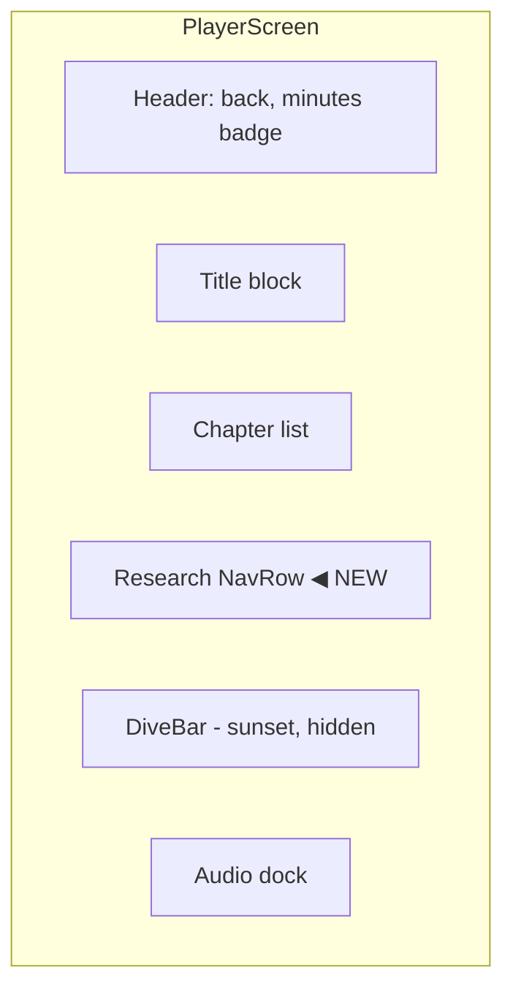

# Research Access for Paid Plans

**Goal:** Surface the structured research that powers every podcast (sections, sources, citations) to paid users. One trigger in the player, one screen that groups research inline by chapter with clickable citations. Works for both parents and expansions (each podcast surfaces its own research).

**Scope:** Mobile UI + thin DB read. No pipeline change. No new tables. Existing `research_contexts` data is already written by `metadataWriter` on successful completion. `chapter_research_map` on `podcasts` already maps chapters to research sections + sources.

**Status:** Brainstorm approved 2026-05-13.

---

## Why this exists

The pipeline produces real research: Tavily-sourced findings, deduped sources, claims linked back to source URLs, organized into 4-6 sections per podcast. Today none of that surfaces to the listener. The audio is the only output.

Two motivations:

1. **Trust.** Paid users are paying for AI-generated content. Showing the sources behind every claim is the strongest trust signal we can offer. "Here's what the model read, here's what it said about your topic, here's where it got it."
2. **Differentiation.** Paid plans need an upgrade story. Research access is high-value, costs nothing extra at generation time (data already in the DB), and naturally segments paid vs free.

Expansions raise the value further: the expansion's research is *deeper* than the parent's because the synthesizer was prompted to layer on top of the parent's coverage. A user who taps Expand on a chapter and then reads the expansion's research is getting actual primary-source-grade material on a narrow topic.

---

## Architecture

### Data flow

```mermaid
flowchart LR
  pipeline[Pipeline] -->|metadataWriter writes on success| rc[(research_contexts<br/>research_document<br/>sources<br/>raw_response)]
  pipeline -->|metadataWriter writes| pc[(podcasts<br/>chapter_research_map)]
  rc -.read.-> screen[/Research screen/]
  pc -.read.-> screen
  trigger[Player NavRow:<br/>'Research'] -->|tap, paid only| screen
  trigger -->|tap, free| plans[/plans paywall]
```

`research_contexts` has been part of the schema since v1. `chapter_research_map` lives on the podcasts row directly and is populated by `metadataWriter` based on the LLM's structured output. Both already cover parents and expansions because the pipeline writes them the same way regardless of mode.

### Data shape

`research_contexts.research_document` (jsonb):

```ts
{
  sections: [{ title: string, content: string }],
  sources: [{ url: string, title: string }],
  claims: [{ text: string, sourceIndexes: number[] }],
  droppedQuestions: string[]
}
```

`podcasts.chapter_research_map` (jsonb):

```ts
Record<chapterTitle, {
  researchSections: number[],   // indexes into research_document.sections
  sourceIndexes: number[]       // indexes into research_document.sources
}>
```

Content prose uses `[N]` markers where N is 1-indexed into `research_document.sources`. So `[1]` in the prose corresponds to `sources[0]`. The synthesizer prompt at `pipeline/src/podcast_pipeline/nodes/research/prompts.ts` enforces this.

---

## Surface 1: trigger in the player

A new NavRow below the chapter list, separated by a hairline. Editorial style: eyebrow, title, chevron. Reads as a content-side affordance, not chrome.



Component: new file `mobile/src/components/ResearchNavRow.tsx`. Wraps the existing visual language (the `NavRow` pattern already in `app/(tabs)/account.tsx`). Reads `useSubscription()` to decide locked vs unlocked rendering.

Visual states:

| Tier | Eyebrow | Title | Trailing | Tap action |
|---|---|---|---|---|
| Free | "Research · Plus" (accent) | "Sources behind this episode" | chevron | `router.push("/plans")` |
| Plus / Pro | "Research" | "Sources behind this episode" | chevron | `router.push("/player/{id}/research")` |

Hidden entirely when:
- The podcast is still in flight (status not `complete`).
- The podcast is `failed` (failed-row UX already handles "tap to try again").
- The podcast is a legacy row predating `research_contexts` (no row in `research_contexts` for this podcast id).

The hidden-on-legacy check has to happen at render time. Cheapest path: include a `has_research_context` boolean derived in the existing `usePodcasts` query, OR a join lookup in the player screen's podcast-fetch. We'll add it to the player screen's existing fetch (Section 7).

---

## Surface 2: the research screen

New route: `mobile/app/player/[id]/research.tsx`.

Layout:

```
[Back ‹ Episode title]                          [topic small subtitle]

Research
Sources behind this episode

[Chapter 1: Opening]                                  ← section heading
  Cited prose with [1] [2] markers.                   ← content paragraph(s)
  More cited prose.

  Sources                                             ← subsection eyebrow
  [1]  Title of source one                            ← OptionRow-style
       example.com ›
  [2]  Title of source two
       another.com ›

[Chapter 2: Middle]
  …
  Sources
  [3] …

[Chapter 3: …]
  …

[Coverage gaps]                                       ← footer, optional
  The research didn't manage to answer:
  · "How does mechanism X behave under condition Y?"
  · "What's the empirical rate of Z?"
```

### Citation rendering

Each `[N]` in the content is tappable. Tap → `Linking.openURL(sources[N-1].url)`. Falls back to a toast if the URL fails to open (rare, but possible if URL is malformed or device blocks the scheme).

### Sources scoping

Sources are listed per chapter, drawn from `chapter_research_map[chapterTitle].sourceIndexes`. Numbering is **global** — the `[3]` in chapter 1's prose is the same `[3]` shown in chapter 1's sources subsection, and the same `[3]` would appear in chapter 4's prose and sources subsection if chapter 4 cites the same source.

This means a source can appear in multiple chapters' sources subsections. That's deliberate: chapter-scoped grouping with consistent global numbering. Cleaner than one bibliography at the bottom — the user can trace what fed each chapter without scrolling.

### Coverage gaps

Optional footer section, rendered only when `research_document.droppedQuestions` is non-empty.

Copy: "The research didn't manage to answer:" + bulleted list of the dropped questions.

Surfaces transparency about what the AI's research stage couldn't cover. Doesn't appear when everything was answered.

### Empty / loading / error states

| State | Visual |
|---|---|
| Loading | Editorial skeleton (matches the library skeleton pattern) |
| No research_contexts row found (race or legacy) | "Research isn't available for this podcast." Single line, ink-secondary, with a back link. |
| Network error fetching | "Couldn't load research. Pull to refresh." with RefreshControl. |

---

## Tier gating

Add `research: "plus"` to `FEATURE_MIN_TIER` in `mobile/src/lib/tiers.ts`. Same pattern as existing entries (`deepDive`, `noAds`, `cheaperCredits`).

The `ResearchNavRow` reads subscription tier and renders locked-or-unlocked per the table in Surface 1. The research screen itself is also tier-gated server-side via RLS — paid users can read their own `research_contexts` (own-row RLS is already in place from v1).

Free user accidentally deep-linked to `/player/{id}/research`: the screen detects tier on mount, redirects to `/plans` with a small toast "Research is a Plus feature."

---

## Expansion behavior

Each podcast (parent or expansion) has its own `research_contexts` row. The expansion's research is independently produced (deeper, with parent priors injected at synthesizer time, but rendered as its own artifact).

When the user is on an expansion player, the same ResearchNavRow appears at the bottom of the chapter list. Tap → the expansion's research, scoped to that expansion's chapters (the expansion has its own `chapter_research_map`).

The library subtitle ("from <parent topic> · chapter <X>") already shows the relationship, so users wanting parent context navigate up via the chapter markers' "Open expansion" link (in reverse).

Recursive expansion-of-expansion is supported by construction: each level is just another podcast with its own research_contexts row.

---

## Data fetch pattern

Lazy fetch on the research screen, not preloaded with the library.

`mobile/src/hooks/useResearchContext.ts` (new):

```ts
export interface ResearchContext {
  researchDocument: {
    sections: Array<{ title: string; content: string }>;
    sources: Array<{ url: string; title: string }>;
    claims: Array<{ text: string; sourceIndexes: number[] }>;
    droppedQuestions: string[];
  };
  chapterResearchMap: Record<string, {
    researchSections: number[];
    sourceIndexes: number[];
  }> | null;
  chapterMarkers: Array<{ timestampSeconds: number; title: string }>;
}

export function useResearchContext(podcastId: string): {
  data: ResearchContext | null;
  loading: boolean;
  error: string | null;
  refresh: () => Promise<void>;
}
```

The hook does one Supabase round-trip: `research_contexts` joined with `podcasts.chapter_research_map` and `podcasts.chapter_markers` for the same podcast id. Own-row RLS enforces ownership.

Caching: in-memory map keyed by podcastId, lives in a module-scoped Map. Cleared on signOut. Reads are stale-while-revalidate: return cached immediately if present, then refresh in background. Cache invalidates on a manual `refresh()` call (pull-to-refresh).

The `ResearchNavRow` does NOT need to know whether a `research_contexts` row exists — only the player screen does (for the hide-on-legacy case). Two paths:

1. **Player screen fetches a lightweight `has_research_context` flag** on the existing podcast fetch (boolean derived from a count query, or just a separate `.from("research_contexts").select("id").eq("podcast_id", id).maybeSingle()`).
2. **`ResearchNavRow` always renders** when status is complete; the screen handles the "Research isn't available" empty state.

Option 2 is simpler. Risk: free users see the locked NavRow and pay for Plus, then discover their (legacy) podcast has no research. Mitigation: legacy podcasts pre-`research_contexts` are zero today (the table existed since v1; only failed-mid-pipeline rows lack it). Acceptable.

Going with option 2.

---

## File structure

### New

| Path | Purpose |
|---|---|
| `mobile/app/player/[id]/research.tsx` | The research screen route |
| `mobile/src/components/ResearchNavRow.tsx` | Locked-or-unlocked NavRow component |
| `mobile/src/components/ResearchChapterSection.tsx` | One chapter's heading + prose + sources block |
| `mobile/src/components/ResearchCitation.tsx` | Tappable `[N]` inline citation |
| `mobile/src/components/ResearchSourceRow.tsx` | One source entry with global number + title + URL |
| `mobile/src/hooks/useResearchContext.ts` | Lazy-fetch + cache hook |

### Modified

| Path | What changes |
|---|---|
| `mobile/src/lib/tiers.ts` | Add `research: "plus"` to `FEATURE_MIN_TIER` |
| `mobile/app/player/[id].tsx` | Mount `ResearchNavRow` below the chapter list ScrollView |
| `mobile/src/types/database.ts` | (already has `research_contexts` type; no schema change) |

### Unchanged

- Pipeline. `research_contexts` and `chapter_research_map` are already populated for every completed podcast (parent or expansion).
- Database. No new tables, columns, or migrations.

---

## Tests

### `useResearchContext.test.ts`

- Returns cached data immediately on second call with same id.
- Re-fetches when `refresh()` is called.
- Returns `null` data + non-null error when the query fails.
- Returns `null` data + `null` error when no row exists (legacy podcast).

### `ResearchNavRow.test.tsx`

- Renders "Research · Plus" eyebrow with chevron when tier is free.
- Renders plain "Research" eyebrow when tier is plus or pro.
- onPress routes to `/plans` for free; `/player/{id}/research` for paid.

### Manual smoke (post-deploy)

- Paid account on a completed parent: tap Research, see chapters with citations, tap a `[1]` opens the source URL.
- Paid account on a completed expansion: tap Research, see the expansion's research (different from parent's).
- Free account: tap Research, get bounced to /plans.
- Failed podcast: NavRow doesn't render at all.
- Podcast with empty droppedQuestions: Coverage gaps section doesn't render.

---

## Risks

| Risk | Likelihood | Mitigation |
|---|---|---|
| Citation tap opens a broken URL (Tavily returned a dead link) | Medium | `Linking.canOpenURL` check before opening; toast on failure. Acceptable to let the system browser handle 404s. |
| `chapter_research_map` is null on a podcast (old code path) | Low | Render the research as a flat list of sections without chapter grouping; surface "Chapter mapping unavailable" eyebrow. |
| Long content makes the screen unwieldy (5400+ word episode → proportional research density) | Medium | Chapter sections collapse-by-default? Not for v1. If problem, ship in v2. |
| Free user discovers a legacy podcast has no research after upgrading | Low | Only failed-mid-pipeline rows lack research; failed rows already hide the NavRow. Acceptable risk. |
| Source titles contain prompt-injection text rendered as content | Low | Treat source.title and source.url as untrusted; render with `<Text>` (no HTML rendering anywhere). Already the case. |

---

## Out of scope

- **Search across all research.** Library-level "find a source" search. Not v1. Each podcast's research is self-contained.
- **Export to PDF / share.** Plus-tier users might want to download the bibliography. Defer to v2.
- **Highlighting / annotations.** Read-only for v1. No persistent UI state per user.
- **Inline audio playback from a research section.** Tap a chapter heading in the research screen → seek the player to that chapter. Tempting, but adds coordination with the persistent PlayingPodcastContext and isn't core to the "show your work" pitch. Defer.
- **Listing podcasts grouped by source / cross-reference.** "What other podcasts cited example.com?" Cool but out of scope.
- **Showing the planner / subagent / raw_response data.** That's diagnostics, not user-facing research. Stays in `research_contexts.raw_response` for our own debugging via the diagnostics column.

---

## Phase exit criteria

Before declaring this feature done:

- `npx tsc --noEmit` in mobile: clean.
- All new component tests pass.
- Manual smoke on all four states (paid parent, paid expansion, free, failed) per the test plan above.
- Tap on `[N]` opens a URL on iOS + Android dev clients.
- Coverage gaps section renders only when dropped questions exist (verified on a real generation that had any).

## Reverting

Single mobile-only PR. Revert path is `git revert <merge-commit>`. No DB migration. Pipeline unchanged. Failed revert path: the new route returns 404 in expo-router, NavRow disappears.
