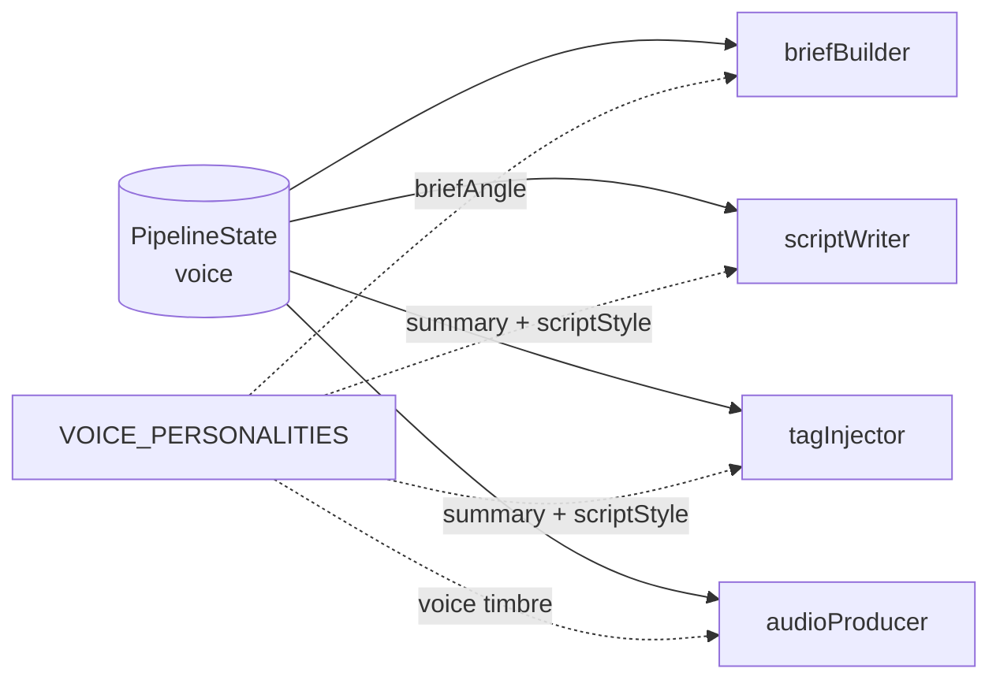

# Voice Personality Propagation

**Goal:** When a user picks Sulafat (warm) vs Charon (informative), the generated podcast should *feel* different. Today only the TTS render reads `state.voice`; earlier nodes produce voice-blind output, so the same content read in different voices sounds generic. Fix: thread per-voice personality data into `briefBuilder`, `scriptWriter`, and `tagInjector`.

**Scope:** Pipeline-side only. No DB migration. No mobile changes. No feature flag.

**Status:** Brainstorm approved 2026-05-13.

---

## Why this exists

`state.voice` is currently consumed at exactly one place: `audioProducer` calls `GeminiTTS.synthesize(text, voice)`, which sets `speechConfig.voiceConfig.prebuiltVoiceConfig.voiceName` on the Gemini TTS request. The voice picks **timbre** at render time. The script text being read is identical regardless of who's reading it.

That's why Sulafat doesn't sound like Sulafat. The text was written for a generic narrator. Gemini reads it in Sulafat's voice but the prose was never shaped to match the personality.

Five nodes write text, only one reads `state.voice`:

| Node | Currently reads `state.voice`? | Should it? |
|---|---|---|
| briefBuilder | No | Yes, lightly. Voice shapes what kind of answers research should produce. |
| planner / subagent / synthesizer | No | No. Decomposing research is voice-agnostic. |
| scriptWriter | No | Yes. Biggest leverage point. Prose style, sentence rhythm, humor. |
| tagInjector | No | Yes. Which tags to pick depends on the voice. |
| audioProducer / Gemini TTS | Yes | Yes, already correct. |

So three nodes get a new dependency on voice. Three new injection sites, one source of truth.

---

## Architecture

### Data model

New file: `pipeline/src/podcast_pipeline/voicePersonality.ts`.

```ts
import type { GeminiVoice } from "./config.js";

export interface VoicePersonality {
  /** One-line headline. Used in logs and as the prompt summary. */
  summary: string;

  /** Sentence-long nudge for briefBuilder. Shapes what kinds of
   *  answers the research stage should produce for this voice. */
  briefAngle: string;

  /** ~5 lines of prose guidance. Inserted into scriptWriter AND
   *  tagInjector as a "Voice context" block. Covers tone, sentence
   *  rhythm, humor, asides, closings. Everything the generic
   *  "Voice rules" used to cover, but per-voice. */
  scriptStyle: string;
}

export const VOICE_PERSONALITIES: Record<GeminiVoice, VoicePersonality> = {
  Sulafat: { /* see Section 4 */ },
  Charon: { /* see Section 4 */ },
  Sadaltager: { /* see Section 4 */ },
  Achird: { /* see Section 4 */ },
};

/** Falls back to Sulafat (the mobile default) when state.voice is null
 *  or doesn't match a known voice. The generic prompt path is removed
 *  in this refactor; every prompt always reads a real personality. */
export function getVoicePersonality(
  voice: string | null | undefined,
): VoicePersonality {
  if (voice && voice in VOICE_PERSONALITIES) {
    return VOICE_PERSONALITIES[voice as GeminiVoice];
  }
  return VOICE_PERSONALITIES.Sulafat;
}
```

`Record<GeminiVoice, VoicePersonality>` forces all four voices to be defined at compile time. TypeScript fails the build if any are missing.

### Diagram



---

## Section 2: Prompt refactors per node

Approach: **strip voice content out of the generic prompts, inject per-voice content via placeholders.** Generic prompt holds structure and format only. Per-voice content holds tone and personality.

### briefBuilder (both modes)

`BRIEF_BUILDER_PROMPT` and `BRIEF_BUILDER_EXPANSION_PROMPT` each gain one new line near the top:

```
Voice angle: {voiceAngle}
```

Where `{voiceAngle}` is `VOICE_PERSONALITIES[voice].briefAngle`. Nothing else changes.

### scriptWriter (both modes)

`SCRIPT_WRITER_PROMPT` currently has a "Voice rules:" block at the bottom:

> Voice rules: short sentences land, long sentences breathe, contractions natural, em-dash asides, restarts conversational, dry humor on a beat. Read each chapter's opening aloud in your head.

This entire block is **deleted** and replaced with a `{voicePersonality}` placeholder filled from `summary + scriptStyle`. Same replacement in `SCRIPT_WRITER_EXPANSION_PROMPT`.

Structure rules stay verbatim: chapter count target (4-6 chapters), word count floor (5400 words), hard avoids list, disclaimer slot, `chapter_research_map` output format.

### tagInjector

Two changes:

1. The function signature `TAG_INJECTOR_PROMPT(script, tags)` becomes `TAG_INJECTOR_PROMPT(script, tags, voiceName, personality)`.
2. The prompt itself shrinks substantially. Currently ~40 lines with bucket-categorized tag rules ("delivery tags freely, strong-emotion tags reserved"). New version follows Google's official tagging prompt pattern: simpler, with voice context.

New `TAG_INJECTOR_PROMPT`:

```
You are inserting audio tags into a podcast script that will be read
aloud by an expressive TTS model (Gemini's {voiceName} voice).

Voice context:
{summary}

{scriptStyle}

The script was written specifically for this voice. Pick tags that
reinforce its feel, not fight it.

Available tags: {tags}

Take the script and insert audio tags from the list above. Place each
tag immediately before the phrase or sentence it's meant to influence.
Ensure the tag matches the emotional arc of the narrative. Avoid
overusing tags. Place them where a natural change in tone or pace
would occur. One tag per sentence maximum.

Do NOT modify the script's text, only insert bracketed tags.
Preserve all [CHAPTER: ...] markers verbatim.
Preserve any [AD:PRE_ROLL] / [AD:MID_ROLL] markers verbatim.

Script:
{script}
```

### Asymmetry rationale

Why replace in scriptWriter, append in tagInjector?

`scriptWriter`'s "Voice rules" block IS voice content. It conflicts with per-voice prose guidance. Has to be replaced or both blocks fight.

`tagInjector`'s rules (insert before the phrase, one per sentence, match the arc, avoid overuse) are tag-vocabulary-agnostic. They describe HOW to tag, not WHAT feel. They survive the voice swap. The voice context just primes the model on which tags fit the personality.

---

## Section 3: Audio tag set expansion

Today `AUDIO_TAGS_DEFAULT` is 10 hand-picked tags (`laughs`, `whispers`, `sighs`, `chuckles`, `curious`, `thoughtful`, `serious`, `surprised`, `exhales`, `pauses`). The tagInjector prompt's selection rules enumerate these by name.

This refactor expands the set to ~200 tags covering granular emotions, energy levels, pacing, cognitive states, narrative markers, and reactions. Examples: `acceptance`, `admiration`, `anticipation`, `bargaining`, `concentration`, `contemplative`, `disillusionment`, `effervescence`, `incredulity`, `melancholy`, `nostalgia`, `pensive`, `recognition`, `reminiscence`, `self-deprecation`, `wistful`. Plus pacing tags `short pause`, `long pause`, `slow`, `fast`. Plus energy tags `high energy`, `low energy`, `active`, `passive`.

The full list (kept in a new file, `pipeline/src/podcast_pipeline/audioTags.ts`, to avoid bloating `config.ts`) is the one provided in the brainstorm.

The env var override (`process.env.AUDIO_TAGS`) stays. Default switches to the full list.

This is what motivated the tagInjector prompt rewrite. The old "delivery vs strong-emotion" categorization can't scale to 200 tags. The new prompt + voice context lets the model pick appropriately without us pre-categorizing.

---

## Section 4: Voice personality content

The four personality blocks. Each combines Gemini's official one-word descriptor with the mobile UI descriptor and project-specific tone direction.

### Sulafat (Gemini: Warm)

- **summary:** "Warm, conversational. The friendly-knowledgeable-friend voice. Dry humor on a beat, never performed."
- **briefAngle:** "Lean toward questions that surface concrete scenes and lived experience, not just statistics. Answers should have texture."
- **scriptStyle:**
  ```
  Lead with curiosity, not authority. Sentences run a beat longer than
  necessary, like thinking out loud. Contractions natural; em-dash
  asides welcome.

  Dry humor lands on a beat — a "huh" between two clauses, an aside
  parenthetical, a small under-statement. Never setup-and-punchline.
  Personal asides are appropriate: "and honestly", "the part that gets
  me", "here's the thing".

  Treat the listener as a smart friend, not a student. Don't over-
  explain mechanisms; trust them to keep up. Closings linger — let the
  last sentence breathe instead of buttoning it up.
  ```

### Charon (Gemini: Informative)

- **summary:** "Substance-forward, journalistic. The analyst voice. Cuts every word that doesn't carry information."
- **briefAngle:** "Lean toward questions that produce specifics: numbers, dates, named cases, primary sources. Avoid abstract framings."
- **scriptStyle:**
  ```
  Cut every word that doesn't carry information. Sentences short by
  default, long only when the data demands it. Contractions sparingly.

  State, don't gesture: "three hundred horsepower" not "around three
  hundred or so". Specifics, not vibes. No hedging language ("sort of",
  "kind of", "I guess") — confident verbs.

  Asides are rare and pointed; if you write one, make sure it earns the
  digression. Closings are clean: state the takeaway and stop.
  ```

### Sadaltager (Gemini: Knowledgeable)

- **summary:** "Thoughtful, lyrical. The dinner-party historian voice. Anchors ideas in stories and images."
- **briefAngle:** "Lean toward questions that surface tensions, irony, and unresolved aspects. Answers should suggest the human stories behind the facts."
- **scriptStyle:**
  ```
  Longer sentences than the others — the prose breathes. Em-dashes and
  parentheticals welcome. Contractions natural.

  Anchor ideas in stories or images. A mechanism is a scene, not a
  diagram. The listener should feel they're being told a story, not
  given a lecture. Reflective asides: "what's interesting", "what they
  didn't realize at the time", "the part that still surprises".

  Allow the prose to wander, then return to the point. Closings often
  land on irony or a quiet observation, not a thesis statement.
  ```

### Achird (Gemini: Friendly)

- **summary:** "Casual, bright, energetic. The coffee-shop voice. Faster pacing, more restarts, genuine enthusiasm."
- **briefAngle:** "Lean toward questions that lend themselves to direct examples and 'you know how' framings. Answers should translate into clear stories."
- **scriptStyle:**
  ```
  Faster pacing. Shorter sentences. More restarts, more contractions,
  more "yeah, so" connective tissue.

  Sounds like someone excited to share, but doesn't perform — genuine
  enthusiasm, not theatrics. Direct address welcome: "you know how",
  "you'd think", "the thing is". Quick punches of humor are fine; keep
  them light, not biting.

  Closings can be punchy. A one-liner is appropriate.
  ```

Note: em-dashes within `scriptStyle` are intentional. They're LLM prompt content that informs prose rhythm and TTS prosody. They're not human-facing copy.

---

## Section 5: Null-voice fallback

`state.voice` can be null today (when a user hasn't set a preference, or for legacy rows). `getVoicePersonality(null)` returns Sulafat's block. Sulafat is already the mobile default. No code path renders the "generic" prompt.

This is a deliberate trade-off. The generic prompt path is gone in this refactor. Every podcast generation runs against a real personality block. If we ever introduce a fifth voice we'd add it to `VOICE_PERSONALITIES` and `GEMINI_VOICES`; TypeScript would fail the build until both updates land.

---

## Section 6: Tests

### New: `pipeline/tests/voicePersonality.test.ts`

- `getVoicePersonality("Sulafat")` returns Sulafat
- `getVoicePersonality(null)` returns Sulafat
- `getVoicePersonality("unknown")` returns Sulafat
- Iterates `VOICE_PERSONALITIES` and asserts each entry has all three fields non-empty

### New: `pipeline/tests/tagInjector.test.ts`

- Currently no dedicated test file. Adds one.
- Mocks `getGeminiClient`, captures the prompt sent to `generateContent`.
- Asserts personality summary text appears in the prompt for Sulafat.
- Asserts a different personality summary appears when voice is Charon.
- Asserts hard constraints survive: `[CHAPTER:`, `[AD:PRE_ROLL]`, `[AD:MID_ROLL]` preservation rules are present.
- Asserts the new simplified rule block is present (e.g. `/Place each tag immediately before/`).

### Edits to existing test files

- `briefBuilder.test.ts` — assert `briefAngle` content appears in the prompt when voice set. Cover null-voice fallback. Both normal and expansion modes.
- `scriptWriter.test.ts` — assert `summary + scriptStyle` content appears AND the old generic `Voice rules: short sentences` string is GONE. Both modes.

### Verification

- `npx tsc --noEmit` clean in pipeline
- `npx vitest run --exclude tests/integration` all green (193+ → 198+)
- Manual smoke test via mobile: generate a new podcast under each of the four voices, listen, look for personality drift between voices.

---

## Section 7: Rollout

Single PR. Deploys to Railway like any other pipeline change. No DB migration. No feature flag.

Old completed podcasts are unaffected; they're already in storage. The next pipeline run after deploy uses the new prompts.

### Risks

| Risk | Likelihood | Mitigation |
|---|---|---|
| Typo or self-contradiction inside one voice's `scriptStyle` makes that voice produce odd output | Low | `tts-eval --inject-tags` lets us iterate fast on the tagInjector personality block; Langfuse traces show the rendered prompt per generation |
| New 200-tag set produces too many or too few tags in practice | Medium | Tunable in one line ("avoid overusing" can become "aim for roughly one tag per 2-3 sentences" if density drifts wrong) |
| Voice personality block conflicts with `scriptWriter`'s structural rules | Low | Replacement strategy (not append) avoids the conflict; structural rules stay voice-agnostic |
| Reverting requires a redeploy | Low | ~1 minute via `npm run deploy` to Railway |

### Out of scope

- **Langfuse migration of prompts.** Considered and parked. We can revisit once personality content stabilises. The current setup edits via redeploy; Langfuse would let us edit at runtime. Not urgent.
- **Per-voice full prompt variants.** Considered and rejected. Maintaining four parallel copies of `SCRIPT_WRITER_PROMPT` diverges fast.
- **Voice-aware metadata generation (titles, descriptions).** Smaller leverage; not part of this pass.
- **Custom user-defined voices.** Not on the roadmap yet.

---

## File summary

### New

| Path | Purpose |
|---|---|
| `pipeline/src/podcast_pipeline/voicePersonality.ts` | `VoicePersonality` interface, `VOICE_PERSONALITIES` map, `getVoicePersonality` helper |
| `pipeline/src/podcast_pipeline/audioTags.ts` | Full 200-tag set; imported by `config.ts` for backward compat |
| `pipeline/tests/voicePersonality.test.ts` | Unit tests for the helper and the map |
| `pipeline/tests/tagInjector.test.ts` | Unit tests for tagInjector with personality injection |

### Modified

| Path | What changes |
|---|---|
| `pipeline/src/podcast_pipeline/config.ts` | Strip "Voice rules" from `SCRIPT_WRITER_PROMPT` and `SCRIPT_WRITER_EXPANSION_PROMPT`, add `{voicePersonality}` slot; add `{voiceAngle}` slot to `BRIEF_BUILDER_PROMPT` and `BRIEF_BUILDER_EXPANSION_PROMPT`. Replace `AUDIO_TAGS_DEFAULT` array with import from `audioTags.ts` |
| `pipeline/src/podcast_pipeline/nodes/briefBuilder.ts` | Build `voiceAngle` from `getVoicePersonality(state.voice).briefAngle`; pass to prompt fill |
| `pipeline/src/podcast_pipeline/nodes/scriptWriter.ts` | Build `voicePersonality` from `summary + scriptStyle`; pass to prompt fill |
| `pipeline/src/podcast_pipeline/nodes/tagInjector.ts` | Change `TAG_INJECTOR_PROMPT` signature to take voice + personality; rewrite to simpler Google-style prompt with voice context block |
| `pipeline/tests/briefBuilder.test.ts` | Add personality-injection assertions; null-voice fallback case |
| `pipeline/tests/scriptWriter.test.ts` | Add personality-injection assertions; assert old generic block is gone |
