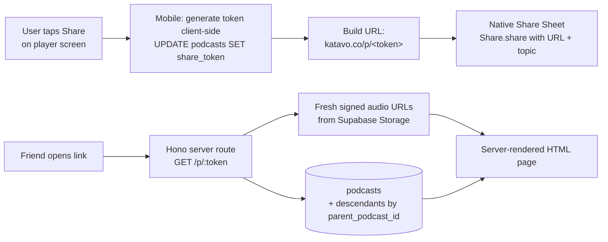

# Podcast Sharing — Public Web Page

**Goal:** Let any user (regardless of tier) share a generated podcast as a public link. Anyone with the link, no app required, can open it in a browser and listen. The audio + chapter structure is public on a shared podcast. Research data stays private. Sharing a podcast freezes its expansion tree: no new expansions can be created, and any existing expansions are accessible via the same share page.

**Scope:** Single feature. Touches DB (one column), server (one public route), mobile (share button + lock logic), no new external service. One coordinated spec.

**Status:** Brainstorm approved 2026-05-14.

---

## Why this exists

Today a podcast lives inside Katavo: the only way to hear it is to install the app and sign in as the owner. That's fine for personal consumption but kills any sharing-as-growth loop. A user can't text the link to a friend, can't paste it in a group chat, can't put it on social.

Public share links solve two things at once:
1. **Utility for the existing user.** They generated something interesting; they should be able to share it like any other audio.
2. **Soft growth lever.** The share page carries a "Made with Katavo, generate yours" footer with App/Play Store badges. Friends-of-users are the highest-converting cohort.

Constraint: the *research* behind a podcast (research_contexts, citations, sources) stays private. Sharing a podcast publishes the audio + chapter structure only. The research is still Plus-paid value for the owner.

---

## Architecture

### Data model

One column on `podcasts`:

```sql
ALTER TABLE public.podcasts
  ADD COLUMN share_token text;

CREATE UNIQUE INDEX podcasts_share_token_unique
  ON public.podcasts (share_token)
  WHERE share_token IS NOT NULL;
```

- `share_token` NULL means the podcast is private (default).
- `share_token` SET means the podcast is public via that token.
- Unique partial index enforces no collisions across the whole table without forcing every row to fill the column.

Token format: 10 chars base64url-encoded (7 random bytes, ~8 × 10^17 combinations). Generated client-side on first share via `expo-crypto.getRandomBytesAsync(7)` then base64url-encoded.

### Data flow



### Lock semantics

Once a podcast is shared, its entire descendant tree is frozen from new expansions:

- Sharing podcast X disables the "Expand" affordance on X.
- Sharing X also disables Expand on every descendant of X (children, grandchildren, etc.) since the share page bundles them.
- The lock check on the mobile player walks UP the tree from the current podcast: if the current node or any ancestor has a non-null `share_token`, the Expand affordance is disabled.
- Server-side: there's no enforcement in the API; submitPodcast doesn't check share_token. Mobile-side lock is sufficient because expansions can only be initiated from the app UI.

Reading "is this in a shared subtree?" requires walking ancestors. Tree depth is typically 1-2; runtime walk is cheap. No new column needed.

---

## Surface 1: mobile share button

New NavRow below the existing Research NavRow on the player screen. Same editorial pattern: eyebrow, title, chevron.

| State | Eyebrow | Title | Tap action |
|---|---|---|---|
| Not yet shared (`share_token` IS NULL) | "Share" | "Share this episode" | Generate token + invoke native share sheet |
| Already shared (`share_token` set) | "Share" | "Copy link" | Re-invoke native share sheet with the existing URL |

When `podcastStatus !== "complete"`, the row hides entirely (same pattern as ResearchNavRow).

### Share token generation (client-side)

```ts
import * as Crypto from "expo-crypto";

async function ensureShareToken(podcastId: string, existingToken: string | null): Promise<string> {
  if (existingToken) return existingToken;
  const bytes = await Crypto.getRandomBytesAsync(7);
  // Base64url: replace + with -, / with _, drop padding
  const token = Buffer.from(bytes).toString("base64url");
  const { error } = await supabase
    .from("podcasts")
    .update({ share_token: token })
    .eq("id", podcastId)
    .is("share_token", null);
  if (error) throw error;
  // Re-read to handle race: another tab beat us to it.
  const { data } = await supabase
    .from("podcasts")
    .select("share_token")
    .eq("id", podcastId)
    .single();
  return data?.share_token ?? token;
}
```

The `.is("share_token", null)` guard makes the UPDATE a no-op if someone already set the token (race-safe). The follow-up SELECT returns whichever token won.

### Share sheet content

```ts
import { Share } from "react-native";

await Share.share({
  url: shareUrl,
  message: `${podcast.topic}\n\n${shareUrl}`,
  title: podcast.topic,
});
```

Both `url` and `message` populated. iOS uses `url`, Android uses `message`. Topic in the message gives recipients context before they tap.

---

## Surface 2: server-rendered share page

New public route in the Hono pipeline server: `GET /p/:token`.

### Route behavior

1. Look up `podcasts` by `share_token = :token` AND `deleted_at IS NULL` AND `status = 'complete'`. If not found, render a 404 page (HTML).
2. If found, fetch all descendants recursively (single CTE or two queries — see below).
3. For each podcast (parent + descendants), generate a fresh Supabase signed URL for `audio_url` (Storage signed URLs are needed because the `podcast-audio` bucket is private).
4. Render the HTML page with all data inlined.

```sql
WITH RECURSIVE tree AS (
  SELECT id, parent_podcast_id, topic, cover_url, chapter_markers,
         duration_seconds, audio_url, status, deleted_at
  FROM podcasts
  WHERE share_token = $1
    AND deleted_at IS NULL
    AND status = 'complete'
  UNION ALL
  SELECT p.id, p.parent_podcast_id, p.topic, p.cover_url, p.chapter_markers,
         p.duration_seconds, p.audio_url, p.status, p.deleted_at
  FROM podcasts p
  INNER JOIN tree t ON p.parent_podcast_id = t.id
  WHERE p.deleted_at IS NULL AND p.status = 'complete'
)
SELECT * FROM tree;
```

Wrap in a Supabase RPC function or run via raw SQL through the supabase-js client (`.rpc()`). The route is `GET /p/:token`, served from `pipeline/src/routes/sharePage.ts`.

### Page structure

Single HTML template string. No JS framework. ~150 lines including styles.

```
<!doctype html>
<html lang="en">
  <head>
    <meta charset="utf-8" />
    <meta name="viewport" content="width=device-width, initial-scale=1" />
    <title>{topic} — Katavo</title>

    <!-- Open Graph -->
    <meta property="og:title" content="{topic}" />
    <meta property="og:type" content="music.song" />
    <meta property="og:image" content="{cover_url or default-og.png}" />
    <meta property="og:url" content="{absolute share URL}" />
    <meta property="og:description" content="Listen to this Katavo episode." />

    <!-- Twitter Card -->
    <meta name="twitter:card" content="summary_large_image" />
    <meta name="twitter:title" content="{topic}" />
    <meta name="twitter:image" content="{cover_url or default-og.png}" />

    <style>{inline CSS — paper-light editorial palette}</style>
  </head>
  <body>
    <header>
      <span class="brand">Katavo</span>
    </header>

    <main>
      {cover image if cover_url present}

      <h1 class="topic">{topic}</h1>
      <p class="meta">{duration} min · {chapter count} chapters</p>

      <audio id="player" controls preload="metadata">
        <source src="{signed audio URL}" type="audio/mpeg" />
      </audio>

      <section class="chapters">
        <h2 class="eyebrow">Chapters</h2>
        <ol>
          <li><button data-seek="{timestamp}">{timestamp formatted} {title}</button></li>
          ...
        </ol>
      </section>

      {if descendants exist:}
      <section class="series">
        <h2 class="eyebrow">More from this series</h2>
        <ul>
          <li><button data-episode="{index}">{topic} · {duration} min</button></li>
          ...
        </ul>
      </section>
      {/if}
    </main>

    <footer>
      <p>Made with Katavo · Generate your own</p>
      <div class="store-badges">
        <a href="{App Store URL}"></a>
        <a href="{Play Store URL}"></a>
      </div>
    </footer>

    <script>
      // 1. Chapter taps seek the audio player.
      // 2. Episode taps swap the audio source + chapter list + topic + scroll to top.
      // (~30 lines of vanilla JS, inlined.)
    </script>
  </body>
</html>
```

### Styles

Match the mobile app's editorial paper-light vibe via CSS custom properties matching the mobile token values:

```css
:root {
  --paper: #FBF8F1;
  --ink: #1A1B1F;
  --ink-secondary: #84858C;
  --hairline: #E8E2D2;
  --accent: #2D5040;
}
```

Type pairing: IBM Plex Serif for the topic, IBM Plex Sans for everything else. Loaded via Google Fonts in `<head>`.

### Mobile audio session handling on iOS

iOS Safari requires a user gesture before audio plays. The first tap on the `<audio>` element starts playback as normal. The chapter-seek and episode-swap JS work after the initial tap. No special handling needed for the v1 page.

### Caching

The route response is **not cached** at the CDN/edge layer:
- Signed audio URLs expire (default 1 year, but we re-sign on each request to be safe).
- Cover URLs are also Supabase signed URLs that expire.
- Render is fast enough (single DB query + template string render, <50ms).

Cache headers: `Cache-Control: no-store`. Acceptable for v1 traffic levels.

---

## URL structure

- Public share URL: `https://podcasts-production-3b07.up.railway.app/p/<token>`
- Once a custom domain (e.g., `katavo.co`) is pointed at Railway, swap the host prefix. The share token doesn't change. Custom domain is ops work, not part of this spec.

The mobile app generates URLs using an env-driven base:

```ts
const SHARE_BASE = process.env.EXPO_PUBLIC_SHARE_BASE_URL
  ?? "https://podcasts-production-3b07.up.railway.app";
const shareUrl = `${SHARE_BASE}/p/${token}`;
```

When the custom domain lands, swap the env var via EAS (no client rebuild needed since `EXPO_PUBLIC_*` vars are baked at build time, so this does need a new build — flag in the operational note).

---

## Edge cases

| Case | Behavior |
|---|---|
| Token doesn't exist | 404 HTML page with a back-to-Katavo link |
| Podcast was soft-deleted (`deleted_at` is set) | 404 (filter on `deleted_at IS NULL`) |
| Podcast was hard-deleted via cascade | 404 (row is gone) |
| Audio URL signing fails | Render the page without the audio source; show "Audio temporarily unavailable" inline |
| Cover URL signing fails | Render without cover image; topic + chapters still load |
| Podcast status is anything other than `complete` | 404 (filter on `status = 'complete'`). In practice, owners shouldn't be able to share an in-flight podcast — see "Lock & UI consistency" below |
| Owner soft-deletes a shared podcast | Cascade trigger from migration 00021 also soft-deletes descendants; share link 404s. Restoring the parent un-soft-deletes the tree; link works again |
| Owner re-shares after deleting the row entirely | Hard delete is destructive; row is gone, token is gone. New row, new token if re-generated |
| Bot crawler fetches a share URL | Public route serves it. Robots.txt isn't strictly needed since URLs are unguessable, but we'll add `<meta name="robots" content="noindex,nofollow">` to keep them out of search engines opportunistically |
| User taps Share on an in-flight podcast | The Share NavRow hides on non-`complete` podcasts (same pattern as ResearchNavRow). Owner can't reach the share action until the podcast is ready |

---

## File structure

### New

| Path | Purpose |
|---|---|
| `supabase/migrations/00022_share_token.sql` | Add `share_token` column + partial unique index |
| `pipeline/src/routes/sharePage.ts` | Hono route `GET /p/:token`. Renders the full HTML page in one template string. Resolves the podcast + descendants + signs audio URLs |
| `pipeline/src/routes/sharePage.test.ts` | Integration test (skipped when `envReady` is false): token lookup, 404, descendants included |
| `mobile/src/components/ShareNavRow.tsx` | NavRow under Research in the player. Handles token generation + share-sheet invocation |
| `mobile/src/lib/shareToken.ts` | Pure utility: generate a 10-char base64url token from 7 random bytes via `expo-crypto` |
| `mobile/src/lib/isInSharedTree.ts` | Pure utility: walk ancestors of a podcast to detect whether it's locked. Takes the current podcast + a fetcher for ancestor rows |

### Modified

| Path | What changes |
|---|---|
| `pipeline/src/server.ts` | Mount the `/p/:token` route alongside the existing `/api/*` routes |
| `pipeline/src/podcast_pipeline/providers/supabaseClient.ts` (or wherever) | (No change needed; sharePage route uses the existing service client) |
| `mobile/app/player/[id]/index.tsx` | Mount `<ShareNavRow />` below `<ResearchNavRow />` inside the chapter ScrollView |
| `mobile/src/components/ChapterMarkers.tsx` | Pass an `isLocked: boolean` prop. When true, hide the "Expand" affordance and render the existing static chapter row only. The player computes `isLocked = await isInSharedTree(podcast)` and passes it down |
| `mobile/src/hooks/usePodcasts.ts` | Add `share_token` to the select + `shareToken: string \| null` to the `Podcast` type |
| `mobile/src/types/database.ts` | Add `share_token: string \| null` to podcasts Row/Insert/Update (regenerated or hand-edited per existing pattern) |

### Unchanged

- Pipeline generation. No prompt changes, no new audio processing.
- Research access (Plus-only feature). Stays gated, never appears on the share page.
- Coach-mark, expansion-prompts cron, audio producer. None of these intersect with sharing.

---

## Operational notes

- **Custom domain.** Once Katavo points a custom domain at Railway (e.g. `katavo.co`), update the `EXPO_PUBLIC_SHARE_BASE_URL` env var via EAS and cut a new build. Existing share tokens keep working since the route path doesn't change.
- **Default OG image.** Need a generic default OG image (1200x630 PNG) for podcasts without cover art. Lives at `pipeline/public/og-default.png` and served via Hono static file middleware.
- **Store badge assets.** Need official Apple/Google store badges (SVG) shipped with the server, at `pipeline/public/badges/app-store.svg` and `play-store.svg`.

---

## Tests

### `mobile/src/lib/shareToken.test.ts` (utility, pure)

- Returns a 10-char string when called.
- 100 calls produce 100 unique tokens (effectively no collision).
- Output is base64url-safe (no `+`, `/`, `=`).

### `mobile/src/lib/isInSharedTree.test.ts` (utility, pure)

- `share_token=null` on self + no ancestors: returns false.
- `share_token` set on self: returns true.
- `share_token=null` on self, ancestor has token: returns true.
- Walks up to root (`parent_podcast_id=null`) without infinite-looping.
- Handles missing-ancestor-row gracefully (returns false rather than throwing).

### `pipeline/src/routes/sharePage.test.ts` (integration, gated by `envReady`)

- 200 with HTML body for a valid token.
- 404 for an unknown token.
- 404 for a soft-deleted podcast.
- 404 for an in-flight (status != complete) podcast.
- Renders a `<source>` element with a signed Supabase URL.
- Renders a "More from this series" section when the parent has descendants.
- OG meta tags include topic + cover URL when present.

### Mobile harness still has no test framework. ShareNavRow has no unit test for v1; manual smoke covers it.

---

## Risks

| Risk | Likelihood | Mitigation |
|---|---|---|
| Token collision via simultaneous double-tap | Negligible (8 × 10^17 space) | Unique partial index enforces failure; the race-safe UPDATE pattern in `ensureShareToken` handles it |
| User pastes share link in a public space where they don't want the topic visible | Low | Topic IS in the page title + OG tags. Mitigation: tell the user when generating the share what becomes public. Worth a small "Sharing publishes the audio + chapter list" microcopy on the NavRow detail |
| Signed audio URL exhausted mid-listen | Very low | Audio URLs sign with 1-year expiry by default; share-page fetches a fresh signed URL on each render so the audio element gets a long-lived URL on page load |
| Search engine indexes share URLs | Negligible (URLs are unguessable) | `<meta robots noindex>` belt-and-braces |
| Owner wants to unshare but the model doesn't support it | Real, low priority | We can graduate to revoke (Option C from Q4) later if demand surfaces |
| iOS Safari blocks `<audio>` autoplay | Expected behavior | Page doesn't autoplay; user taps the native controls. No mitigation needed |
| Cover URLs leak via OG previews even when the podcast is otherwise minimal | Acceptable (the user shared the link, they wanted it shareable) | Same as topic leakage; covered by sharing-publishes-the-audio microcopy |

---

## Out of scope

- **Unshare / revoke.** One-way for v1. Graduate to toggleable or revocable based on demand.
- **Share counters / analytics.** No "listened by 12 people" badge. Adds a `listens` table and access-tracking middleware. Not v1.
- **Embedded player widget.** No `<iframe>` embed for blogs / Medium. Could come later with a `/embed/<token>` variant.
- **OG image generation from topic** (Vercel-style dynamic OG images with the topic rendered into a PNG). Would be nice but adds a rendering pipeline. v2.
- **Custom share URLs.** The user picks a slug. Adds collision handling + moderation. v2.
- **Public discoverability / feeds.** No "public podcasts directory". Tokens stay unguessable.
- **Comments / reactions on the share page.** No social layer.
- **Listen progress saving for the link recipient** (they'd need cookies or a login). Out of scope.
- **Custom domain ops.** Pointing `katavo.co` at Railway and updating EAS env. Tracked separately.

---

## Phase exit criteria

Before declaring this feature done:

- `npx tsc --noEmit` in pipeline + mobile: both clean.
- Migration 00022 applied to remote Supabase.
- Default OG image + store badges committed to `pipeline/public/`.
- Manual smoke on all four states (parent only, parent + 1 expansion, soft-deleted shared, in-flight) per the test plan above.
- iMessage paste of a share link previews with topic + cover.
- Tapping the link on a device WITHOUT the Katavo app installed opens the share page successfully and plays audio.
- Tapping the Expand affordance on a shared parent (or any descendant of a shared parent) is correctly disabled in the app.

## Reverting

Single mobile + pipeline + DB PR. Revert path:
1. `git revert <merge-commit-range>`
2. Drop column on a follow-up migration if rolling back fully (`ALTER TABLE podcasts DROP COLUMN share_token`).
3. Redeploy Railway + cut new EAS build.

Existing share links 404 cleanly once the route is removed.

## What ships

- Free + Plus + Pro users can share any completed podcast via a public link.
- Share link opens in any browser; no app required.
- Audio + chapters + cover art + "Made with Katavo" footer.
- Existing expansions on a shared parent are accessible via the same link.
- Sharing freezes the parent's expansion tree from new expansions.
- Research data stays private (Plus-paid feature, never on the share page).
- Token format: 10-char base64url; URLs unguessable.
- No new external infrastructure. Hono pipeline server hosts the share page on Railway.
