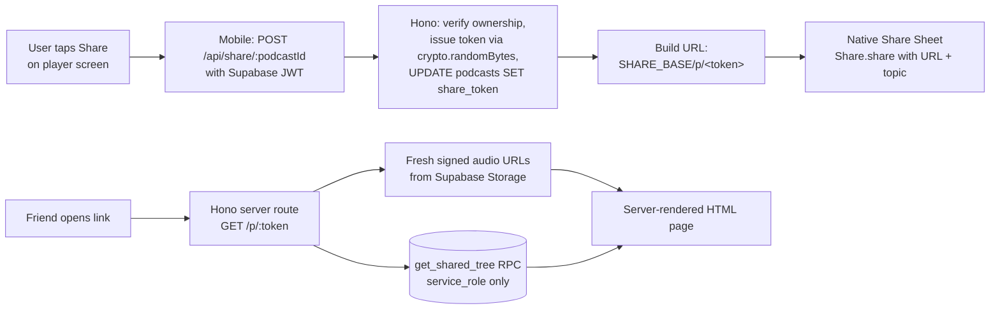

# Podcast Sharing: Public Web Page

**Goal:** Let any user (regardless of tier) share a generated podcast as a public link. Anyone with the link, no app required, can open it in a browser and listen. The audio plus chapter structure is public on a shared podcast. Research data stays private. The share page is a live view: any existing expansions and any new ones the owner adds later show up automatically.

**Scope:** Single feature. Touches DB (one column plus one function), server (issue-token endpoint, public share route), mobile (share button), no new external service. One coordinated spec.

**Status:** Brainstorm approved 2026-05-14.

---

## Why this exists

Today a podcast lives inside Katavo: the only way to hear it is to install the app and sign in as the owner. That's fine for personal consumption but kills any sharing-as-growth loop. A user can't text the link to a friend, can't paste it in a group chat, can't put it on social.

Public share links solve two things at once:
1. **Utility for the existing user.** They generated something interesting; they should be able to share it like any other audio.
2. **Soft growth lever.** The share page carries a "Made with Katavo, generate yours" footer with App/Play Store badges. Friends-of-users are the highest-converting cohort, and seeing a deep multi-chapter series is the strongest pitch for "make your own".

Constraint: the *research* behind a podcast (research_contexts, citations, sources) stays private. Sharing a podcast publishes the audio plus chapter structure only. The research is still Plus-paid value for the owner.

**No expansion lock.** The owner can keep expanding a shared podcast freely. The share page reflects the current tree state on each request, so any new chapters or sub-episodes the owner adds become visible to existing share-link holders. This makes the share link a richer growth lever over time, not a frozen snapshot.

---

## Architecture

### Data model

One column on `podcasts` and one Postgres function (migration 00022):

```sql
ALTER TABLE public.podcasts
  ADD COLUMN share_token text;

CREATE UNIQUE INDEX podcasts_share_token_unique
  ON public.podcasts (share_token)
  WHERE share_token IS NOT NULL;

CREATE OR REPLACE FUNCTION public.get_shared_tree(p_token text)
RETURNS TABLE (
  id uuid,
  parent_podcast_id uuid,
  topic text,
  cover_url text,
  chapter_markers jsonb,
  duration_seconds int,
  audio_url text,
  status text,
  is_root boolean
)
LANGUAGE sql
SECURITY DEFINER
SET search_path = public
AS $$
  WITH RECURSIVE tree AS (
    SELECT p.id, p.parent_podcast_id, p.topic, p.cover_url, p.chapter_markers,
           p.duration_seconds, p.audio_url, p.status, true AS is_root
    FROM podcasts p
    WHERE p.share_token = p_token
      AND p.deleted_at IS NULL
      AND p.status = 'complete'
    UNION ALL
    SELECT p.id, p.parent_podcast_id, p.topic, p.cover_url, p.chapter_markers,
           p.duration_seconds, p.audio_url, p.status, false AS is_root
    FROM podcasts p
    INNER JOIN tree t ON p.parent_podcast_id = t.id
    WHERE p.deleted_at IS NULL
      AND p.status = 'complete'
  )
  SELECT id, parent_podcast_id, topic, cover_url, chapter_markers,
         duration_seconds, audio_url, status, is_root
  FROM tree;
$$;

REVOKE ALL ON FUNCTION public.get_shared_tree(text) FROM public, anon, authenticated;
GRANT EXECUTE ON FUNCTION public.get_shared_tree(text) TO service_role;
```

- `share_token` NULL means the podcast is private (default).
- `share_token` SET means the podcast is public via that token.
- Unique partial index prevents collisions without forcing every row to fill the column.
- `get_shared_tree` is `SECURITY DEFINER`, callable only by the service role from the pipeline server. It returns the share-page row set in one round-trip. `is_root` flags the row matched by the token (used by the page to pick the initial player track).

The existing UPDATE policy on `podcasts` is locked to soft-delete only (migration 00007). We do not loosen it; token issuance happens server-side using the service-role client, never through the user's JWT.

Token format: 10 chars base64url-encoded (7 random bytes, ~7.2 × 10^16 combinations). Generated server-side via Node `crypto.randomBytes(7).toString("base64url")`.

### Data flow



The owner can keep expanding the shared podcast after sharing. There is no lock on expansion submission, on the mobile UI, or in the server. The share page always reflects the current tree state.

---

## Surface 1: mobile share button

New NavRow below the existing Research NavRow on the player screen. Same editorial pattern: eyebrow, title, subtitle, chevron.

| State | Eyebrow | Title | Subtitle | Tap action |
|---|---|---|---|---|
| Not yet shared (`share_token` IS NULL) | "Share" | "Share this episode" | "Audio and chapters become public" | Call issue-token endpoint, then invoke native share sheet |
| Already shared (`share_token` set) | "Share" | "Copy link" | "Audio and chapters are public" | Invoke native share sheet with the existing URL |

When `podcastStatus !== "complete"`, the row hides entirely (same pattern as ResearchNavRow). The subtitle line tells the user exactly what becomes public before the share sheet opens; the wording is concrete so the user can decide without a second confirmation modal.

### Issue-token endpoint (server-side)

New authed route on the pipeline server: `POST /api/share/:podcastId`. The mobile client sends the user's Supabase JWT in the `Authorization` header. The route:

1. Verifies the JWT and resolves `user_id`.
2. Loads the podcast by `id` and asserts `user_id = caller AND deleted_at IS NULL AND status = 'complete'`.
3. If `share_token` is already set, returns `{ token: <existing> }` (idempotent).
4. Otherwise generates a token via `crypto.randomBytes(7).toString("base64url")`, runs `UPDATE podcasts SET share_token = $1 WHERE id = $2 AND share_token IS NULL`. If 0 rows updated (race lost), re-reads and returns whichever token won.
5. Returns `{ token: string }`.

Authentication uses the existing `verifySupabaseJwt` helper that protects `POST /api/podcasts`. Token generation runs with the service-role Supabase client, which bypasses the soft-delete-only UPDATE policy on podcasts. No client crypto, no expo-crypto, no Buffer polyfill.

### Mobile share invocation

```ts
import { Share } from "react-native";
import { supabase } from "../lib/supabase";

const API_URL = process.env.EXPO_PUBLIC_API_URL!;
const SHARE_BASE = process.env.EXPO_PUBLIC_SHARE_BASE_URL ?? API_URL;

async function shareEpisode(podcastId: string, topic: string, existingToken: string | null) {
  let token = existingToken;
  if (!token) {
    const { data: { session } } = await supabase.auth.getSession();
    const res = await fetch(`${API_URL}/api/share/${podcastId}`, {
      method: "POST",
      headers: { Authorization: `Bearer ${session?.access_token ?? ""}` },
    });
    if (!res.ok) throw new Error(`Share failed: ${res.status}`);
    ({ token } = await res.json());
  }
  const shareUrl = `${SHARE_BASE}/p/${token}`;
  await Share.share({
    url: shareUrl,
    message: `${topic}\n\n${shareUrl}`,
    title: topic,
  });
  return token;
}
```

The mobile app already reads `EXPO_PUBLIC_API_URL` for the pipeline base (see `mobile/src/services/podcast.ts` and `useDeepDive.ts`). The share base defaults to that same URL when `EXPO_PUBLIC_SHARE_BASE_URL` isn't set, which is the common case today since the share page is hosted on the same Hono server. Once a custom domain like `katavo.co` ships, `EXPO_PUBLIC_SHARE_BASE_URL` overrides it.

Both `url` and `message` are populated. iOS uses `url`, Android uses `message`. Topic in the message gives recipients context before they tap. After the share sheet returns, the caller writes the new token back into the local `Podcast` row so the NavRow flips to the "Copy link" state without a refetch.

---

## Surface 2: server-rendered share page

New public route in the Hono pipeline server: `GET /p/:token`.

### Route behavior

1. Call the `get_shared_tree(p_token)` RPC via the service-role Supabase client. If the result set is empty, render a 404 page (HTML).
2. The RPC returns the matched podcast (flagged `is_root`) plus every still-live descendant in one round-trip. Tree depth is bounded by chapter-expansion depth (currently 1, capped at 2 in the immediate roadmap), so the result set is small.
3. For each podcast in the tree, generate a fresh signed URL for `audio_url` and (if present) `cover_url` via `storage.from(bucket).createSignedUrl(path, ttl)`. Both buckets are private (migration 00004), so the signed URL is what makes them playable from an unauthenticated browser. Re-signing on each render is cheap (a single Storage API call per row), keeps URLs fresh, and avoids storing long-lived URLs in HTML.
4. Render the HTML page with all data inlined.

The route is `GET /p/:token`, served from `pipeline/src/routes/sharePage.ts`, and explicitly does NOT query `research_contexts`, `citations`, or `qa_sessions`. A test asserts this (see Tests below).

The pipeline uses the existing service-role client (`process.env.SUPABASE_SERVICE_ROLE_KEY`). Calling `supabase.rpc("get_shared_tree", { p_token })` returns the row set typed off the regenerated Supabase types.

### Page structure

Single HTML template string. No JS framework. ~150 lines including styles.

```
<!doctype html>
<html lang="en">
  <head>
    <meta charset="utf-8" />
    <meta name="viewport" content="width=device-width, initial-scale=1" />
    <title>{topic} · Katavo</title>

    <!-- Open Graph -->
    <meta property="og:title" content="{topic}" />
    <meta property="og:type" content="website" />
    <meta property="og:image" content="{signed cover URL or default-og.png}" />
    <meta property="og:url" content="{absolute share URL}" />
    <meta property="og:description" content="Listen to this Katavo episode." />
    <meta property="og:audio" content="{signed audio URL}" />
    <meta property="og:audio:type" content="audio/mpeg" />

    <!-- Twitter Card -->
    <meta name="twitter:card" content="summary_large_image" />
    <meta name="twitter:title" content="{topic}" />
    <meta name="twitter:image" content="{cover_url or default-og.png}" />

    <style>{inline CSS, paper-light editorial palette}</style>
  </head>
  <body>
    <header>
      <span class="brand">Katavo</span>
    </header>

    <main>
      {cover image if cover_url present}

      <h1 class="topic">{topic}</h1>
      <p class="meta">{duration} min · {chapter count} chapters</p>

      <audio id="player" controls preload="metadata">
        <source src="{signed audio URL}" type="audio/mpeg" />
      </audio>

      <section class="chapters">
        <h2 class="eyebrow">Chapters</h2>
        <ol>
          <li><button data-seek="{timestamp}">{timestamp formatted} {title}</button></li>
          ...
        </ol>
      </section>

      {if descendants exist:}
      <section class="series">
        <h2 class="eyebrow">More from this series</h2>
        <ul>
          <li><button data-episode="{index}">{topic} · {duration} min</button></li>
          ...
        </ul>
      </section>
      {/if}
    </main>

    <footer>
      <p>Made with Katavo · Generate your own</p>
      <div class="store-badges">
        <a href="{App Store URL}"></a>
        <a href="{Play Store URL}"></a>
      </div>
    </footer>

    <script>
      // Inlined vanilla JS, ~50 lines. Behavior contract:
      // 1. Chapter taps call audio.currentTime = data-seek and audio.play().
      // 2. Episode taps:
      //    a. Pause current audio.
      //    b. Update <source>.src to the new episode's signed URL.
      //    c. Call audio.load(). This is required on iOS Safari after a source
      //       swap, otherwise the element keeps the old buffer and seek breaks.
      //    d. Replace chapter list HTML from a window.__EPISODES__ blob
      //       inlined in the page (id -> {topic, chapters, audioUrl}).
      //    e. Update the document title and topic heading.
      //    f. window.scrollTo(0, 0).
      //    g. Do NOT autoplay. iOS Safari blocks it without a fresh gesture,
      //       and even if allowed it's surprising behavior. User taps play.
      // 3. No history.pushState; we keep the URL stable on the shared token.
    </script>
  </body>
</html>
```

### Styles

Match the mobile app's editorial paper-light vibe via CSS custom properties matching the mobile token values:

```css
:root {
  --paper: #FBF8F1;
  --ink: #1A1B1F;
  --ink-secondary: #84858C;
  --hairline: #E8E2D2;
  --accent: #2D5040;
}
```

Type pairing: IBM Plex Serif for the topic, IBM Plex Sans for everything else. Loaded via Google Fonts in `<head>`.

### Mobile audio session handling on iOS

iOS Safari requires a user gesture before audio plays. The first tap on the `<audio>` element starts playback as normal. The chapter-seek and episode-swap JS work after the initial tap. No special handling needed for the v1 page.

### Caching

The route response is **not cached** at the CDN/edge layer:
- Signed audio URLs expire. We re-sign on each render with a 1-hour TTL (`createSignedUrl(path, 3600)`); the audio element holds onto the URL for the listening session, which is well under an hour for v1.
- Cover URLs use the same re-sign-on-render approach, with the same TTL.
- Render is fast (one RPC call, N signed-URL calls where N is small, then template render; under 100ms in practice).

Cache headers: `Cache-Control: no-store`. Acceptable for v1 traffic levels. If Railway eventually proxies through a CDN, we need an explicit override there to honor `no-store` since per-request signed URLs cannot be CDN-cached.

---

## URL structure

- Public share URL today: `https://podcasts-production-3b07.up.railway.app/p/<token>` (the existing Railway URL the mobile app already calls).
- Once a custom domain like `katavo.co` is pointed at Railway, the share host becomes `https://katavo.co/p/<token>`. The share token doesn't change. Custom domain is ops work, tracked separately.

The mobile app reads the share base from env (see the share invocation snippet above). When the custom domain lands, set `EXPO_PUBLIC_SHARE_BASE_URL` in EAS and cut a new build. `EXPO_PUBLIC_*` vars are baked at build time, so this does need a new build.

---

## Edge cases

| Case | Behavior |
|---|---|
| Token doesn't exist | 404 HTML page with a back-to-Katavo link |
| Podcast was soft-deleted (`deleted_at` is set) | 404 (filter on `deleted_at IS NULL`) |
| Podcast was hard-deleted via cascade | 404 (row is gone) |
| Audio URL signing fails | Render the page without the audio source; show "Audio temporarily unavailable" inline |
| Cover URL signing fails | Render without cover image; topic + chapters still load |
| Podcast status is anything other than `complete` | 404 (filter on `status = 'complete'` inside the RPC). The Share NavRow also hides on non-complete podcasts, so the owner can't reach the share action until the podcast is ready |
| Owner soft-deletes a shared podcast | Cascade trigger from migration 00021 also soft-deletes descendants; share link 404s. Restoring the parent un-soft-deletes the tree; the same link works again |
| Owner re-shares after deleting the row entirely | Hard delete is destructive; row is gone, token is gone. New row, new token if re-generated |
| Owner expands a shared podcast after sharing | New descendants appear on the share page on the next request. No special handling needed; the live-tree query picks them up |
| Bot crawler fetches a share URL | Public route serves it. Robots.txt isn't strictly needed since URLs are unguessable, but we add `<meta name="robots" content="noindex,nofollow">` to keep them out of search engines opportunistically |
| User taps Share on an in-flight podcast | NavRow hidden, see above. Defense-in-depth: the issue-token endpoint also rejects non-complete podcasts with 409 |
| Issue-token endpoint called for a podcast the caller doesn't own | 403. The route asserts `user_id = caller` before any UPDATE |

---

## File structure

### New

| Path | Purpose |
|---|---|
| `supabase/migrations/00022_share_token.sql` | Add `share_token` column, partial unique index, and `get_shared_tree(text)` RPC (SECURITY DEFINER, service_role only) |
| `pipeline/src/routes/sharePage.ts` | Hono route `GET /p/:token`. Calls the RPC, signs URLs, renders the HTML template |
| `pipeline/src/routes/sharePage.test.ts` | Integration tests (skipped when `envReady` is false): valid token returns 200 with HTML, unknown token returns 404, soft-deleted returns 404, descendants included, route works for a podcast owned by a different user, route never queries `research_contexts`/`citations`/`qa_sessions` |
| `pipeline/src/routes/issueShareToken.ts` | Hono route `POST /api/share/:podcastId`. Authed via existing Supabase JWT helper. Verifies ownership, issues token via `crypto.randomBytes`, returns `{ token }` |
| `pipeline/src/routes/issueShareToken.test.ts` | Integration tests: happy path returns token, idempotent on second call, 403 for non-owner, 409 for in-flight podcast, 401 without JWT |
| `pipeline/public/og-default.png` | 1200x630 default OG image for podcasts without cover art |
| `pipeline/public/badges/app-store.svg` | Apple App Store badge |
| `pipeline/public/badges/play-store.svg` | Google Play Store badge |
| `mobile/src/components/ShareNavRow.tsx` | NavRow under Research in the player. Handles issue-token API call and share-sheet invocation |

### Modified

| Path | What changes |
|---|---|
| `pipeline/src/server.ts` | Mount `GET /p/:token`, `POST /api/share/:podcastId`, and `GET /og/*` static file serving |
| `mobile/app/player/[id]/index.tsx` | Mount `<ShareNavRow />` below `<ResearchNavRow />` inside the chapter ScrollView |
| `mobile/src/hooks/usePodcasts.ts` | Add `share_token` to the select and `shareToken: string \| null` to the `Podcast` type; expose an `updateShareToken(id, token)` helper that patches the cached row after a successful issue-token call |
| `mobile/src/types/database.ts` | Add `share_token: string \| null` to podcasts Row/Insert/Update and the `get_shared_tree` function signature (regenerated via `supabase gen types typescript`) |

### Unchanged

- Pipeline generation. No prompt changes, no new audio processing.
- Research access (Plus-only feature). Stays gated, never appears on the share page.
- Coach-mark, expansion-prompts cron, audio producer. None of these intersect with sharing.

---

## Operational notes

- **Custom domain.** Once Katavo points a custom domain at Railway (e.g. `katavo.co`), update `EXPO_PUBLIC_SHARE_BASE_URL` in EAS and cut a new build. `EXPO_PUBLIC_*` vars are baked at build time, so a new build is required. Existing share tokens keep working since the route path doesn't change.
- **Default OG image.** Generic default OG image (1200x630 PNG) for podcasts without cover art. Lives at `pipeline/public/og-default.png` and served via Hono static file middleware.
- **Store badge assets.** Official Apple/Google store badges (SVG) shipped with the server, at `pipeline/public/badges/app-store.svg` and `play-store.svg`.
- **Migration number.** 00022 is next at the time of writing (00021 was the cascade soft-delete migration). Verify before applying.
- **CDN.** Railway does not currently proxy through a CDN. If we add one, set an explicit `no-store` override there since signed URLs in the body cannot be CDN-cached.

---

## Tests

### `pipeline/src/routes/issueShareToken.test.ts` (integration, gated by `envReady`)

- 200 with `{ token }` for the podcast owner; token matches `^[A-Za-z0-9_-]{9,10}$`.
- Calling the endpoint twice for the same podcast returns the same token (idempotent).
- 403 when the caller is not the owner.
- 409 when the podcast is not in `status = 'complete'`.
- 401 when no `Authorization` header is present.
- After a successful call, the podcasts row has `share_token` set.

### `pipeline/src/routes/sharePage.test.ts` (integration, gated by `envReady`)

- 200 with HTML body for a valid token.
- 404 for an unknown token.
- 404 for a soft-deleted podcast.
- 404 for an in-flight (status != complete) podcast.
- Renders a `<source>` element with a signed Supabase URL.
- Renders a "More from this series" section when the parent has descendants.
- OG meta tags include topic and (when available) signed cover URL.
- **Cross-user**: Route works for a podcast whose `user_id` is not the test runner's auth context. Catches anon-key mis-wires.
- **No research leak**: Mock the Supabase client to assert that no query touches `research_contexts`, `citations`, or `qa_sessions` for the duration of the route call.

### Mobile

The mobile harness still has no test framework. ShareNavRow has no unit test for v1; manual smoke (per Phase exit criteria) covers it.

---

## Risks

| Risk | Mitigation |
|---|---|
| Token collision via simultaneous double-tap | Unique partial index enforces failure. The issue-token endpoint is idempotent: if `share_token` is already set, the existing token is returned without re-issuing. |
| User pastes share link in a public space where they don't want the topic visible | NavRow subtitle says "Audio and chapters become public" before the share sheet opens. Topic is in the page title and OG tags by design. |
| Signed audio URL exhausted mid-listen | 1-hour TTL is much longer than a single listening session. If a recipient pauses for hours and resumes, the URL may need a refresh; the page reload handles it. |
| Search engine indexes share URLs | URLs are unguessable; `<meta robots noindex>` is belt-and-braces. |
| Owner wants to unshare but the model doesn't support it | Out of scope for v1. We graduate to revoke later if demand surfaces. |
| Cover URLs leak via OG previews | The user shared the link knowing it's public; covered by the NavRow subtitle. |

---

## Out of scope

- **Unshare / revoke.** One-way for v1. Graduate to toggleable or revocable based on demand.
- **Share counters / analytics.** No "listened by 12 people" badge. Adds a `listens` table and access-tracking middleware. Not v1.
- **Embedded player widget.** No `<iframe>` embed for blogs / Medium. Could come later with a `/embed/<token>` variant.
- **OG image generation from topic** (Vercel-style dynamic OG images with the topic rendered into a PNG). Would be nice but adds a rendering pipeline. v2.
- **Custom share URLs.** The user picks a slug. Adds collision handling + moderation. v2.
- **Public discoverability / feeds.** No "public podcasts directory". Tokens stay unguessable.
- **Comments / reactions on the share page.** No social layer.
- **Listen progress saving for the link recipient** (they'd need cookies or a login). Out of scope.
- **Custom domain ops.** Pointing `katavo.co` at Railway and updating EAS env. Tracked separately.

---

## Phase exit criteria

Before declaring this feature done:

- `npx tsc --noEmit` in pipeline and mobile: both clean.
- Migration 00022 applied to remote Supabase; `get_shared_tree` callable via service role and not callable via anon.
- Default OG image and store badges committed to `pipeline/public/`.
- Manual smoke on all four states (parent only, parent + 1 expansion, soft-deleted shared, in-flight) per the test plan above.
- Owner expands a previously-shared podcast; the new chapter appears on the share page on reload.
- iMessage paste of a share link previews with topic and cover.
- Tapping the link on a device WITHOUT the Katavo app installed opens the share page successfully and plays audio.
- Episode swap on the share page works on iOS Safari (the `audio.load()` after source swap).

## Reverting

Single mobile + pipeline + DB PR. Revert path:
1. `git revert <merge-commit-range>`
2. Drop column on a follow-up migration if rolling back fully (`ALTER TABLE podcasts DROP COLUMN share_token`).
3. Redeploy Railway + cut new EAS build.

Existing share links 404 cleanly once the route is removed.

## What ships

- Any user (Free, Plus, Pro) can share any completed podcast via a public link.
- The link opens in any browser; no app required.
- The share page reflects the current tree state, so chapters and expansions the owner adds later appear automatically.
- Research stays private. The share route never queries research tables.
- Token issuance is server-side and idempotent. No client crypto.
- No new external infrastructure. Hono pipeline server hosts both the issue-token endpoint and the public share page on Railway.
