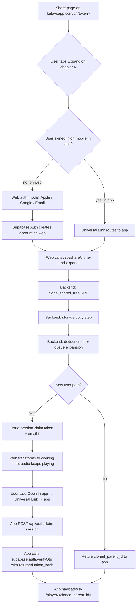
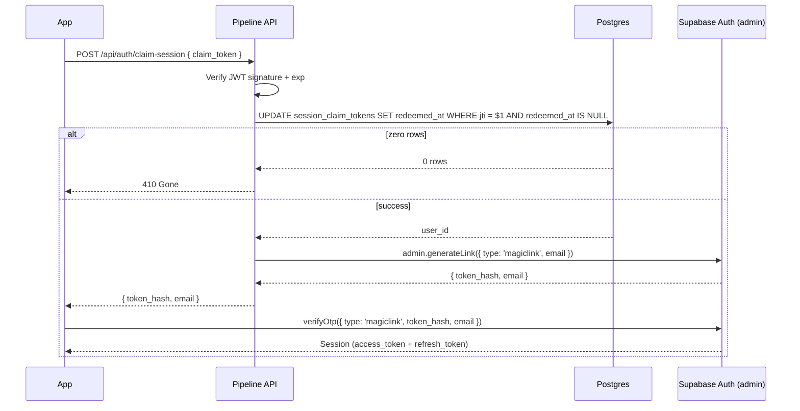

# Shared Podcast Expansion — Design

When User A shares a podcast, User B can open it in a web view and listen. Today "Expand in app" is a dead-end CTA that just tells them to install the app. This spec turns it into the central acquisition flow: tapping Expand kicks off a full clone of User A's tree into User B's library — parent, all existing expansions, plus the chapter expansion User B asked for — for one credit, with no onboarding, in the same voice as the original.

Two user paths converge on the same backend operation. Existing users on mobile flow through Universal Links straight to the cloned tree. New users sign in on the web share page (Apple/Google/email magic link), watch the cooking state while User A's audio keeps playing, then install the app and get handed a session via a single-use claim token. The app's onboarding gates (voice picker, welcome) are bypassed for these users.

The design is cheap to build because the chapter-expansion pipeline already exists (v15/v16/v17). We're not adding a parallel pipeline — we're cloning data into the target user's account and feeding it into the existing one. No re-research, no re-generation for the cloned parent or existing expansions. Audio, transcript, chapter markers, and research contexts are duplicated at the DB and Storage layer.

## Conceptual model

Two paths, one converging backend operation.



The unit of work is **clone-and-expand**: given `(share_token, chapter_index, target_user_id)`, the backend duplicates the parent and all descendants into the target user's account, queues the new chapter expansion, and returns the cloned parent's id. The pipeline that runs the expansion is the existing chapter-expansion pipeline — voice propagation, research context anchoring, audio production, all unchanged from v15/v16/v17.

## Web share page

The share page (`pipeline/src/routes/sharePage.ts` + `shareTemplate.ts`) gains three states. Audio playback continues uninterrupted across transitions. The page is the same URL throughout; only the content rendered into the layout changes.

**State A — anonymous (today's behavior).** User loads `/p/<share_token>`. Hero, audio player, chapter list, series, footer. Each unexpanded chapter shows "Expand in app." Tapping it opens the existing modal — but the modal body changes from "download the app" to a sign-in panel: Apple, Google, "continue with email." Single line of copy: "Sign in to make your own version." The actual auth runs through Supabase's JS client (`@supabase/supabase-js`), same providers the mobile app uses.

The chapter_index needs to survive the OAuth redirect round-trip (Apple/Google redirects bounce the user away from the share page and back). We stash it on the Supabase `signInWithOAuth` call as a `redirectTo` query param: `https://katavoapp.com/p/<share_token>?chapter=<n>`. On return, the share page reads the `chapter` param from the URL and resumes the clone-and-expand call. Same for the email magic-link flow.

**State B — signed in, clone+expand in flight.** After auth succeeds, web POSTs to `/api/share/clone-and-expand` with the share_token, chapter_index, and the new Supabase JWT. Backend runs the clone + queues the expansion + issues the claim token. Web transforms:
- Sticky bar appears at the top: "Your version is cooking — chapter N expansion in progress" + indeterminate progress indicator
- The audio player keeps playing User A's original (no interruption)
- The chapter list rerenders: the chapter the user just expanded shows a spinner in place of "Expand in app"
- A primary CTA at the bottom: "Open in app to listen" wrapped in the Universal Link `https://katavoapp.com/expand/<share_token>/<chapter_index>?claim=<jwt>&p=<cloned_parent_id>`
- App Store + Play Store badges below the CTA, also wrapped in the Universal Link
- Supabase Realtime subscription on the new expansion's podcast row drives the spinner state

**State C — expansion complete.** Realtime fires when `status='complete'`. Sticky bar flips to "Your version is ready." Open in app CTA gains an extra line: "Tap to start listening." On mobile with the app installed, the Universal Link opens directly to the player. Otherwise, App Store badges remain the fallback.

```mermaid
sequenceDiagram
  participant U as User B (web)
  participant W as Share page
  participant S as Supabase Auth
  participant API as Pipeline API
  participant DB as Postgres
  participant ST as Storage
  participant P as Pipeline (job manager)

  U->>W: Loads /p/&lt;share_token&gt;
  W-->>U: State A: audio playing + chapters
  U->>W: Tap Expand on chapter N
  W-->>U: Auth modal (Apple/Google/Email)
  U->>S: Sign in with Apple
  S-->>W: Session (JWT)
  W->>API: POST /api/share/clone-and-expand
  API->>DB: clone_shared_tree RPC
  DB-->>API: cloned_parent_id, descendant_ids, descendant_source_chapters
  API->>ST: Copy audio/cover/transcript blobs (existence-check first)
  Note over API,DB: BEGIN txn
  API->>DB: UPDATE subscriptions SET credits = credits - 1 WHERE credits > 0
  API->>DB: INSERT expansion row (status=queued, parent + voice)
  Note over API,DB: COMMIT
  API->>P: Enqueue expansion job (post-commit)
  API->>DB: INSERT session_claim_tokens row (only if fresh signup)
  API-->>W: { cloned_parent_id, expansion_id, claim_token? }
  W-->>U: State B: cooking bar + spinner on chapter N
  Note over W,U: Audio keeps playing
  P->>DB: status=complete (eventually)
  DB-->>W: Realtime push
  W-->>U: State C: ready + Open in app CTA
```

We do not trust client-side state for any of this. Chapter index, share token, and auth are all re-validated server-side. The web view is a thin renderer.

The existing-user-on-mobile path is simpler — no web auth, no claim token, just deep link → API call → player:

```mermaid
sequenceDiagram
  participant U as Existing User
  participant App as Mobile app
  participant API as Pipeline API
  participant DB as Postgres
  participant P as Pipeline

  U->>App: Taps share link in iMessage
  Note over App: Universal Link routes to /expand/[share_token]/[chapter_index]
  App->>App: Read existing Supabase session
  App->>API: POST /api/share/clone-and-expand (with JWT)
  API->>DB: clone_shared_tree RPC
  API->>API: Storage copy step
  API->>DB: INSERT expansion row + deduct credit (txn)
  API->>P: Enqueue expansion
  API-->>App: { cloned_parent_id, expansion_podcast_id }
  App->>App: navigate(/player/&lt;cloned_parent_id&gt;)
  App-->>U: Player with spinner on chapter N
```

For the launch we always show the auth modal on the share page, regardless of whether the user happens to have a katavoapp.com cookie. Returning users sign in fast via Apple/Google one-tap; the cost of always showing the modal is one extra tap.

## Backend: clone RPC, endpoints, pipeline integration

Three pieces, all wired to the existing pipeline and credit system.

### 1. The clone RPC

`public.clone_shared_tree(p_share_token text, p_target_user_id uuid)` — SECURITY DEFINER, callable from service_role only.

```sql
CREATE OR REPLACE FUNCTION public.clone_shared_tree(
  p_share_token text,
  p_target_user_id uuid
)
RETURNS TABLE (cloned_parent_id uuid, cloned_descendant_ids uuid[])
LANGUAGE plpgsql
SECURITY DEFINER
SET search_path = public
AS $$
DECLARE
  -- existing row check for idempotency
  v_existing_parent uuid;
  v_id_map jsonb := '{}'::jsonb;
  v_source_row record;
  v_new_id uuid;
  v_new_parent uuid;
  v_descendants uuid[] := ARRAY[]::uuid[];
BEGIN
  -- Idempotency: if this user already cloned this token, return that tree
  SELECT id INTO v_existing_parent
  FROM podcasts
  WHERE user_id = p_target_user_id
    AND cloned_from_share_token = p_share_token
    AND parent_podcast_id IS NULL
  LIMIT 1;

  IF v_existing_parent IS NOT NULL THEN
    SELECT array_agg(id) INTO v_descendants
    FROM podcasts
    WHERE user_id = p_target_user_id
      AND cloned_from_share_token = p_share_token
      AND parent_podcast_id IS NOT NULL;
    RETURN QUERY SELECT v_existing_parent, COALESCE(v_descendants, ARRAY[]::uuid[]);
    RETURN;
  END IF;

  -- Fetch source tree (root + descendants); fail if token revoked
  -- (... INSERT rows for root then each descendant, building id map ...)
  -- (... INSERT research_contexts rows for each ...)
  -- (... return cloned_parent_id + cloned_descendant_ids ...)
END;
$$;

REVOKE ALL ON FUNCTION public.clone_shared_tree(text, uuid) FROM public, anon, authenticated;
GRANT EXECUTE ON FUNCTION public.clone_shared_tree(text, uuid) TO service_role;
```

The full SQL goes in the implementation plan. The key invariants:
- The RPC runs in a single transaction. Either the whole tree is cloned or nothing is.
- The unique partial index `podcasts_clone_idempotency` enforces "one root clone per (user, source token)" at the DB level. If a concurrent call races in, one INSERT wins and the other catches the unique violation, returning the existing parent.
- Audio/cover/transcript URLs are carried over verbatim from the source rows initially. They get rewritten by the app-code storage copy step.
- Voice column is copied. The cloned parent's voice is what the new expansion will use.
- `cloned_from_share_token` is stamped on every cloned row so we can run idempotency lookups and analytics.

### 2. The clone-and-expand endpoint

`POST /api/share/clone-and-expand` — authed via Supabase JWT.

Request body:
```ts
{ share_token: string, chapter_index: number }
```

Sequence:
1. Validate share_token is live and chapter_index is in range. Capture `request_started_at = now()` here — used by step 7's fresh-signup gate so a slow request doesn't disqualify a genuinely-fresh user.
2. Call `clone_shared_tree(share_token, user_id)` → returns `cloned_parent_id`, `cloned_descendant_ids[]`, and `descendant_source_chapters` (the source_chapter_title of each cloned descendant — used in step 4 below). Idempotent — instant on retry, ~2-3s on first clone due to the DB row inserts.
3. Run the storage copy step (app code, detailed in the Storage strategy section below). Three storage operations per cloned podcast (audio + cover + transcript). For a tree with one parent + four descendants, that's 15 sequential operations — expect 5–10s on a fresh clone.
4. Resolve the chapter title from `chapter_index`: read `cloned_parent.chapter_markers`, which is a JSONB array `[{ timestampSeconds: number, title: string }, ...]` (existing v15+ schema, 0-indexed). The title at `chapter_markers[chapter_index].title` is `source_chapter_title`. Check if it's already in `descendant_source_chapters`. If yes, return that existing expansion's id and skip the rest — no credit deducted. The same `source_chapter_title` value is used for the INSERT in step 5, which is what makes the `podcasts_one_expansion_per_chapter` unique index actually enforce same-chapter dedup.
5. In a single DB transaction: `UPDATE subscriptions SET credits = credits - 1 WHERE user_id = $1 AND credits > 0 RETURNING credits`. If zero rows returned, abort the transaction and return 402. The Postgres row lock acquired by the UPDATE serializes concurrent decrements, so two parallel calls can't both pass when only one credit remains. (This is a different shape from the explicit version-column CAS in `submit-podcast` — it's a row-locked predicate decrement, simpler and sufficient for our concurrency model. We deliberately diverge from submit-podcast's CAS here because we have no version column on subscriptions specific to credits.) Then INSERT the new expansion podcast row: `status='queued'`, `parent_podcast_id=cloned_parent_id`, `source_chapter_title=<resolved title from step 4>`, `voice=<cloned parent's voice>`. If INSERT hits the `podcasts_one_expansion_per_chapter` unique constraint, the transaction rolls back (credit decrement undone) and the endpoint returns the existing expansion id.
6. After the transaction commits, push the job onto the in-memory job manager — same path as `submit-podcast`. Crash between commit and push leaves an orphan `status='queued'` row; covered by a startup recovery sweep that re-enqueues queued rows on boot (existing v7 pattern). If push fails synchronously, mark the row `status='failed'` so the existing DB trigger refunds the credit.
7. If `auth.users.created_at >= request_started_at - 5 minutes`, this is a fresh signup. Apply profile mutations via service_role:
   - `profile.onboarding_completed_at = now()` (bypasses the v9 onboarding gate)
   - `profile.voice = <cloned parent's voice>` (sets the user's default voice — see Voice default callout in the Database section)
   Then issue a session-claim token. The 5-minute window is measured against request entry, not request end, so a slow clone-and-expand call doesn't disqualify a genuinely-fresh user. If `created_at` is older, the user is returning — no profile mutations, no claim token.
8. Return:
```ts
{ cloned_parent_id: string, expansion_podcast_id: string, claim_token?: string }
```
When `claim_token` is absent in the response, web omits the `?claim=` query param from the Universal Link CTA. The existing-user mobile cell of the truth table handles that case cleanly.

The migration adds two unique partial indexes that together prevent both root-clone and same-chapter races — covered in the Database section.

### 3. Pipeline integration — zero changes

The chapter-expansion pipeline already reads `parent_podcast_id` and uses the parent's research_context to anchor deep research. Because the clone RPC duplicates research_contexts, the cloned parent has its own context. Voice propagates through (v18). Credit refund on failure works (DB trigger). Realtime updates fire normally.

This is what makes the design cheap: we're not building a parallel pipeline. We're feeding cloned data into the existing one.

## Session-claim token

The bridge from web sign-in to in-app session, without re-authentication in the app.

### Token shape

Signed JWT, signed with `SESSION_CLAIM_JWT_SECRET` (new env var on Railway).

```
{
  sub:   <target_user_id>,        // Supabase auth.users.id
  jti:   <random uuid>,           // single-use nonce
  iat:   <issued_at>,
  exp:   iat + 90d,
  scope: "share_claim"
}
```

Opaque to clients. Only the backend signs and verifies.

### Single-use enforcement

Table `session_claim_tokens` (migration 00024 — schema below). Insert on issue. Atomic update on redeem:

```sql
UPDATE session_claim_tokens
   SET redeemed_at = now()
 WHERE jti = $1 AND redeemed_at IS NULL
RETURNING user_id;
```

Zero rows → token already used or never existed → 410 Gone.

### Issue path

`/api/share/clone-and-expand` issues the token at the end of its handler, but only when `auth.users.created_at` for the authenticated user is within 5 minutes of `now()` — i.e., they just signed up via web. This is server-derived. We never accept a client flag for whether to issue a claim token.

The issued token returns to web in the response and gets embedded into the Universal Link's `?claim=` param. It's also fired off via email as a backup, using Resend (new dependency — Resend account, API key, domain DKIM/SPF/DMARC for `katavoapp.com`). Same token value, two delivery channels; single-use semantics still hold because both paths lead to the same atomic update.

Email is best-effort: if Resend fails, we log and don't surface to web — the in-page CTA still works. If Resend setup blocks the launch timeline, email delivery is the candidate to defer to v2 (the in-page CTA covers the happy path; users who bounce from the share page before tapping it land in the orphan-account error case either way).

### Claim path

`POST /api/auth/claim-session` (unauthed). Body: `{ claim_token: string }`.

The Supabase admin call (`admin.generateLink` with `type: 'magiclink'`) requires the target email to exist as a confirmed user — which it does, because web sign-in already provisioned the auth.users row. The call mints a one-time `token_hash` that the app exchanges via `verifyOtp`. One caveat: `generateLink` invalidates any prior magic links for the same user. In practice this is fine because we only generate magic links through this endpoint; if we ever add an "email me a sign-in link" feature elsewhere, we'd need to coordinate.



We never store Supabase refresh tokens server-side. Session minting happens through Supabase's standard magic-link flow, triggered admin-side at claim time.

Profile mutations (`onboarding_completed_at`, `voice`) are NOT done here — they happen earlier in `/api/share/clone-and-expand` step 7, gated on the same fresh-signup signal. This way both the new-user-on-web path (claim runs) and the cold-install-then-app-sign-in path (claim never runs) get the same treatment. The claim endpoint only mints the session.

### Expiry and revocation

90-day TTL. If the token expires before claim, the user can sign in to the app the normal way (Apple/Google/email) and lands in a fresh account — their cloned tree orphans. An account-merge flow is out of scope for launch; surface as support-driven recovery if it ever happens.

Revocation: service_role can directly update `redeemed_at` on the row. No separate revocation table.

## Mobile app

The mobile app is the lightest piece. Most of the user-facing UI for cloned trees already exists (player, chapter expansions, in-flight spinner). We're wiring the entry point and skipping the onboarding gates.

### Deep link handler

New Expo Router route: `mobile/app/expand/[share_token]/[chapter_index].tsx`. A centered-spinner screen with copy "Setting up your podcast…" — its real job is sequencing API calls then redirecting.

Universal Link shape:
```
https://katavoapp.com/expand/<share_token>/<chapter_index>?claim=<jwt>&p=<cloned_parent_id>
```

`claim` and `p` are both optional. The handler runs three checks in order — current auth state, claim presence, then claim-vs-current-user identity — before deciding what to do:

**Step 1: Resolve current app session.** Read the Supabase session from local storage. Decode its `sub` to get `current_user_id`, or null if no session.

**Step 2: Decode the claim (signature-verified server-side at redemption; client-side here just for the `sub`).** If `claim` param is absent, `claim_user_id = null`.

**Step 3: Decide based on the cells of the matrix.**

| `current_user_id` | `claim` param | Behavior |
|---|---|---|
| null | absent | Cold install with no claim. Route to sign-in screen, then continue clone-and-expand after sign-in. Save the share_token + chapter_index in app state across the auth navigation so we resume on the right entry. |
| null | present | New-user path — primary case. Redeem claim via `/api/auth/claim-session` → `verifyOtp` → if `p` is present, navigate to `/player/<p>`; otherwise call clone-and-expand (idempotent) and navigate. |
| present, matches `claim.sub` | present | Same user as the claim. Skip redemption (token is already theirs from another device or earlier visit). Navigate based on `p` or call clone-and-expand. |
| present, does NOT match `claim.sub` | present | Session mismatch. Show a confirm sheet: "This link is for a different account. Sign in as them, or keep your current session?" If they confirm switching, sign out the current session, redeem, navigate. If redemption returns 410 (already used elsewhere) after sign-out, route to the sign-in screen with share_token + chapter_index preserved in app state so they can recover into either account by signing in normally. If they keep current, ignore claim, fall through to the "current_user_id present, claim absent" cell. |
| present | absent | Existing user, deep link from share. Call clone-and-expand with the current JWT → navigate. |

Errors at any point:
- 410 from claim-session → "This link has already been used" + sign-in button
- Network failure → "Something went wrong" + retry button
- 401 from clone-and-expand (cold install case after sign-in failure) → bounce back to sign-in screen

### Domain association files

Served by Hono on the pipeline server. New file `pipeline/src/routes/wellKnown.ts` mounts two routes that return static JSON with `Content-Type: application/json` and `Cache-Control: public, max-age=3600`.

**`/.well-known/apple-app-site-association`** (no `.json` extension, served with JSON content-type):

```json
{
  "applinks": {
    "details": [
      {
        "appIDs": ["<APPLE_TEAM_ID>.co.katavo.app"],
        "components": [
          { "/": "/expand/*" }
        ]
      }
    ]
  }
}
```

`APPLE_TEAM_ID` and the bundle id come from existing app config; we'll pull them from `mobile/app.config.ts` and the Apple developer account at implementation time. The path components claim only `/expand/*` — share pages (`/p/*`) deliberately stay on the web, since the share page itself is web-only.

**`/.well-known/assetlinks.json`**:

```json
[
  {
    "relation": ["delegate_permission/common.handle_all_urls"],
    "target": {
      "namespace": "android_app",
      "package_name": "co.katavo.app",
      "sha256_cert_fingerprints": ["<SHA256_FINGERPRINT>"]
    }
  }
]
```

`SHA256_FINGERPRINT` comes from the Android signing keystore (production + development variants both listed at implementation time).

Both files are public, no auth, no rate limit. They're polled by Apple's CDN and Android's verification service on app install.

### App config updates

In `mobile/app.config.ts`:
- iOS: add `applinks:katavoapp.com` to `ios.associatedDomains`.
- Android: add an intent filter for HTTPS + host=katavoapp.com + pathPattern=`/expand/.*` to `android.intentFilters`.

The first real-device validation step needs a fresh EAS development build for the AASA association to take effect.

### Onboarding skip

The v9 root-layout onboarding gate already checks `profile.onboarding_completed_at`. The `/api/auth/claim-session` endpoint sets that column to `now()` (and `profile.voice` to the cloned parent's voice) before returning. So when the app navigates after claim, the gate sees "complete" and routes to tabs/library normally. No new gate logic.

### Push permission prompt

The one onboarding step we *don't* skip — the cooking flow only works if the user gets a push when the expansion completes. After the deep-link handler navigates to the player, the player screen checks `profile.push_prompted_at IS NULL`. If null, it shows a one-time bottom-sheet asking for push permission. Copy: "We'll ping you the moment your podcast is ready." Existing `usePushNotifications` hook handles the actual permission request. We set `push_prompted_at = now()` the moment the sheet is dismissed *or* resolved either way — so it never reappears, regardless of whether the user granted or denied. Existing users (who already passed v9 onboarding) have `push_prompted_at` backfilled in migration 00025 so they don't see the sheet.

### Cooking-state display in player

Already built (v15/v16). The player route reads the cloned parent + descendants from the DB. The new expansion is a descendant with `status='queued'` or `'processing'`. The existing chapter list shows a spinner on that chapter. Realtime subscription updates it. When `status='complete'`, the user gets a push, the chapter row flips from spinner to "Listen."

### No changes to

Voice picker, onboarding screens, generate flow, account screen. These remain as-is for users who didn't come through a share link.

## Database changes

Three migrations on top of the existing 00022 (share_token + get_shared_tree).

### Migration 00023 — `cloned_from_share_token` + same-chapter race guard + clone RPC

```sql
ALTER TABLE public.podcasts
  ADD COLUMN cloned_from_share_token text;

-- Idempotency: one root clone per (user, source token).
CREATE UNIQUE INDEX podcasts_clone_idempotency
  ON public.podcasts (user_id, cloned_from_share_token)
  WHERE cloned_from_share_token IS NOT NULL AND parent_podcast_id IS NULL;

-- Same-chapter race guard: prevent two concurrent expansions of the
-- same chapter on the same parent (cloned OR original).
--
-- IMPORTANT: this index applies to existing (non-cloned) parent podcasts
-- too. Before applying the migration, run the pre-migration audit query
-- to confirm no historical duplicates exist:
--
--   SELECT parent_podcast_id, source_chapter_title, COUNT(*)
--   FROM public.podcasts
--   WHERE parent_podcast_id IS NOT NULL
--     AND source_chapter_title IS NOT NULL
--     AND deleted_at IS NULL
--   GROUP BY 1, 2 HAVING COUNT(*) > 1;
--
-- Expected: zero rows. If non-zero, resolve manually (soft-delete the
-- duplicates) before applying. The existing v15+ code path doesn't
-- create same-chapter dupes by construction, so this should be clean.
CREATE UNIQUE INDEX podcasts_one_expansion_per_chapter
  ON public.podcasts (parent_podcast_id, source_chapter_title)
  WHERE parent_podcast_id IS NOT NULL
    AND source_chapter_title IS NOT NULL
    AND deleted_at IS NULL;

CREATE OR REPLACE FUNCTION public.clone_shared_tree(
  p_share_token text,
  p_target_user_id uuid
) RETURNS TABLE (
  cloned_parent_id uuid,
  cloned_descendant_ids uuid[],
  descendant_source_chapters text[]
)
LANGUAGE plpgsql SECURITY DEFINER SET search_path = public AS $$
-- Pseudocode (full SQL goes in the implementation plan):
--
-- 1. Idempotency check: SELECT id FROM podcasts
--    WHERE user_id = p_target_user_id
--      AND cloned_from_share_token = p_share_token
--      AND parent_podcast_id IS NULL;
--    If found, also SELECT id, source_chapter_title
--    FROM podcasts WHERE user_id = p_target_user_id
--    AND cloned_from_share_token = p_share_token
--    AND parent_podcast_id IS NOT NULL;
--    Return that triple.
--
-- 2. Read source tree: SELECT * FROM podcasts p
--    WHERE p.share_token = p_share_token AND p.deleted_at IS NULL
--    AND p.status = 'complete'
--    UNION descendants by recursion (same logic as get_shared_tree).
--    Order by created_at ASC so parents are inserted before children.
--    If empty (token revoked), RAISE EXCEPTION 'share_revoked'.
--
-- 3. Build id_map: jsonb mapping old_id::text → new_id (gen_random_uuid()).
--
-- 4. INSERT each row into podcasts:
--      new_id = id_map->>old_id
--      user_id = p_target_user_id
--      parent_podcast_id = id_map->>old_parent (NULL for root)
--      cloned_from_share_token = p_share_token
--      All other content columns copied verbatim (topic, voice,
--      audio_url, transcript_url, cover_url, chapter_markers,
--      duration_seconds, source_chapter_title, status='complete').
--
-- 5. INSERT each research_contexts row with new podcast_id from id_map.
--
-- 6. Return cloned_parent_id (the root), cloned_descendant_ids[]
--    (all non-root), and descendant_source_chapters[]
--    (parallel array of source_chapter_title values).
$$;

REVOKE ALL ON FUNCTION public.clone_shared_tree(text, uuid) FROM public, anon, authenticated;
GRANT EXECUTE ON FUNCTION public.clone_shared_tree(text, uuid) TO service_role;
```

**RLS on cloned rows.** The existing `podcasts` policy (from v1) is `user_id = auth.uid()` on read. Cloned rows are stamped with `user_id = p_target_user_id`, so the new owner reads them via the existing policy. No new RLS work needed. Verify during implementation that the policy isn't more restrictive (e.g., requiring `cloned_from_share_token IS NULL`) — it isn't today, but worth checking.

### Migration 00024 — `session_claim_tokens`

```sql
CREATE TABLE public.session_claim_tokens (
  id          uuid primary key default gen_random_uuid(),
  jti         uuid unique not null,
  user_id     uuid not null references auth.users(id) on delete cascade,
  issued_at   timestamptz not null default now(),
  expires_at  timestamptz not null,
  redeemed_at timestamptz
);

CREATE INDEX session_claim_tokens_expires_at_idx
  ON public.session_claim_tokens (expires_at)
  WHERE redeemed_at IS NULL;

REVOKE ALL ON public.session_claim_tokens FROM anon, authenticated;
```

RLS deliberately off; service_role only. A periodic cleanup job (hourly, same setInterval pattern as v17 expansion prompts) deletes expired unredeemed rows.

### Migration 00025 — `push_prompted_at`

```sql
ALTER TABLE public.profiles
  ADD COLUMN push_prompted_at timestamptz;

-- Backfill existing users so they don't see the sheet (they already
-- went through v9 onboarding and granted/denied push there).
UPDATE public.profiles SET push_prompted_at = now()
WHERE onboarding_completed_at IS NOT NULL
  AND push_prompted_at IS NULL;
```

Set on the client when the user resolves the push permission sheet (accept or dismiss) on first cooking view. Gate logic in the player: `IF push_prompted_at IS NULL AND user is on cooking view THEN show sheet`.

### Profile mutations from clone-and-expand (fresh signups only)

When `/api/share/clone-and-expand` step 7 detects a fresh signup (`auth.users.created_at` within 5 minutes of request entry), it sets via service_role:
- `profile.onboarding_completed_at = now()` — bypasses the v9 root-layout onboarding gate.
- `profile.voice = <cloned parent's voice>` — see callout below.

This runs in clone-and-expand (not claim-session) so both the new-user-on-web path and the cold-install-then-app-sign-in path get the same treatment. The profile row exists by the time clone-and-expand runs because the existing `on_auth_user_created` trigger created it at sign-in (whether on web or in-app).

**Voice default callout.** Setting `profile.voice` to the cloned parent's voice means this user's *future* podcasts will also use that voice by default until they change it in Account. This is intentional: the user opted into this voice by tapping a share link from someone using it, and v9 requires a non-null voice on profile so the generate flow has a default. They can change it in the existing Account voice picker. If we wanted to scope the voice inheritance to the cloned tree only (not the profile default), we'd need to surface a voice picker the first time they hit "Generate a new podcast" in the app — which contradicts "skip the whole onboarding and voice selection part."

### Storage strategy

Audio + cover + transcript blobs are copied to `<target_user_id>/<new_podcast_id>/<file>` paths via Supabase Storage's copy API, in the same `/api/share/clone-and-expand` handler that runs the RPC. The new row's URL columns are updated to point at the new paths.

The copy step runs in app code (not the RPC) because Postgres can't call the Storage HTTP API. For each cloned podcast:

1. Check whether destination already exists at the deterministic path (Supabase Storage `list` or a HEAD request).
2. If absent: call Supabase Storage `copy` (which errors on existing destination).
3. If present: skip — assume prior partial completion succeeded for this file.
4. After all three files (audio, cover, transcript) are confirmed at the new path, UPDATE the cloned row's URL columns.

This makes retry safe: a partial copy from a prior failed attempt leaves files at the deterministic paths; the next call sees them and skips. The UPDATE of the URL columns is the commit point — if it never runs, the row points at User A's storage until a retry completes.

**Convergent recovery.** If the storage step crashes after the RPC succeeded but before the URL columns are updated, the cloned row has audio_url pointing at User A's path. The mobile player can still resolve a signed URL against that path (it works as long as User A hasn't deleted their podcast). On any subsequent clone-and-expand call for the same user+share_token, idempotency returns the existing tree and we re-run the storage step. If User A deletes their podcast in the gap, the mobile player surfaces "Audio unavailable" on those rows — covered in error handling.

**Assumption: copy is server-side atomic.** Supabase Storage's `copy` API runs server-side, so a partial object can't exist from this code path (the source either copies fully or not at all). If we ever switch to client-streamed copies, the existence-check optimization breaks — re-verify content hash or use timestamp-based invalidation.

## Error handling and edge cases

Grouped by origin, with the user-facing recovery for each.

**Auth/claim errors.**
- *Claim token already used* (410) → "This link has already been used" + sign-in CTA.
- *Claim token expired* (410) → same UX. Tree orphans until a v2 merge flow exists.
- *Invalid signature* (401) → same UX as already-used.
- *Web OAuth callback failure* → "Sign in failed, try again" + retry button. Audio keeps playing.

**Share token errors.**
- *Revoked between web load and clone* → 410 from RPC, web shows "This podcast is no longer shared" + App Store badges.
- *Never existed* → 404 from share page route. Existing behavior.
- *Chapter index out of range* → 400.

**Pipeline failures on the new expansion.** Existing DB trigger refunds the credit. Cloned tree stays in the user's library. Failed expansion row gets a retry button on its chapter (v15/v16 UX). Retry doesn't consume another credit.

**Storage copy partial failures.** Cloned rows exist with URLs pointing to User A's storage. The mobile player still works because URLs are valid. On next interaction, idempotency check re-runs the copy. Worst case (User A deletes before copy completes): "Audio unavailable" state in player, logged for support.

**Credit exhaustion.** Clone happens, then credit check returns 402 before queuing. Web shows: "You're out of credits — your library has the parent and existing expansions ready. Upgrade to make this expansion." Clone is kept; expansion isn't queued.

**Realtime drop.** Web falls back to 15s polling. Three failed polls → "Tap to refresh" affordance.

**Concurrent clone attempts.** First call wins on the unique partial index for the root clone. Second call sees existing tree via the idempotency check, returns the same cloned_parent_id, then proceeds to step 4. If both calls target the *same* chapter_index, the new `podcasts_one_expansion_per_chapter` partial unique index makes the second INSERT conflict — the endpoint catches the conflict, returns the existing expansion id, and skips credit deduction (the transactional ordering described in the Backend section rolls back the credit if the INSERT fails). If different chapter_indexes, both expansions queue independently with separate credit deductions. Both spinners show in the player.

**User A deletes mid-clone.** Before RPC: 410. Between RPC and copy: same as copy-failure path. After copy: User B's tree is independent.

**Universal Link fallback when app not installed.** Falls through to a static HTML page at `/expand/<token>/<chapter>` that says "Install Katavo to listen — your podcast is waiting" + App Store badges. Claim token preserved in the URL. Email backup also has the link.

**Orphan account (signed up, never installed).** Account sits with library intact. Email reminders at 24h and 7d. After 90d, claim token expires; recovery requires support.

**Email delivery failure.** Best-effort. Log but don't surface — web in-page CTA still works.

**Voice missing/deprecated.** Fall back to the user's profile.voice default for the new expansion only. Cloned parent's row keeps the old voice and plays its existing audio.

## Testing strategy

**Pipeline server (vitest).**
- `clone_shared_tree` RPC: happy path (root + 3 descendants), idempotency on second call, share_token revoked, share_token not found.
- `/api/share/clone-and-expand`: full flow with mock Supabase, credit deduction CAS, idempotency on chapter_index, 402 on zero credits, 410 on revoked share.
- Storage copy step: happy path, idempotent re-run, partial failure recovery.
- `/api/auth/claim-session`: happy path, already-used, expired, invalid signature, integration with magic-link generation.
- `wellKnown` route: AASA + assetlinks JSON shape.
- Fresh-signup window: account created 1 minute ago → claim token issued + profile mutations applied. Account created 10 minutes ago → no claim token, no profile mutations. Account created 4 minutes ago but request takes 90s → claim token still issued (window measured from request entry).
- End-to-end pipeline parity: run clone-and-expand against a real shared tree and confirm the resulting expansion emits identical Langfuse traces / stages as a normal user-submitted expansion (catches silent assumptions about parent ownership).

**Mobile (typecheck + manual).**
- `app/expand/[share_token]/[chapter_index].tsx` route resolves all four cells of the URL truth table.
- Deep link receipt on physical iOS device (EAS dev build with new associated-domains).
- Deep link receipt on Android device (EAS dev build with new intent-filter).
- Push permission sheet appears once, gated by `push_prompted_at`.

**End-to-end manual.**
- New user: anonymous web → tap Expand → sign in with Apple → cooking state → install app → tap Open in app → player.
- Existing user on mobile: receive share link via iMessage → tap → app handles deep link → player.
- Expired claim token: edit the JWT exp claim → confirm 410 + sign-in fallback.
- Share token revoked mid-flight: revoke server-side between web sign-in and clone → confirm graceful 410.

## Open follow-ups (deliberately not in this plan)

- **Account merge flow** for users who orphan their cloned tree (90d expiry, late sign-in via different provider). Support-driven recovery for now.
- **Re-share of cloned trees** — User B's clone can already be shared via the existing share_token mechanism. Whether the share page should show provenance ("Originally shared by User A") is a v2 UX question.
- **Web app surface** — this design deliberately stops at the share page. We don't build `/login`, `/library`, `/account` on the web. If the share-driven conversion proves valuable, we revisit.
- **Free credit grant for new users via shared link** — currently uses the existing signup-bonus credit (one free, non-expiring). If we want to make the share path *more* generous (e.g., comp the new user a free expansion on top of their signup bonus), it's a one-line policy change in the credit deduction step.
- **Smart App Banner on the share page** — Apple's native banner that surfaces "Open in Katavo" at the top of Safari. Strictly additive, can ship later.
- **Analytics on the funnel** — share page view → Expand tap → auth modal complete → install → claim → first play. Worth instrumenting once the path is live; not part of this design.
