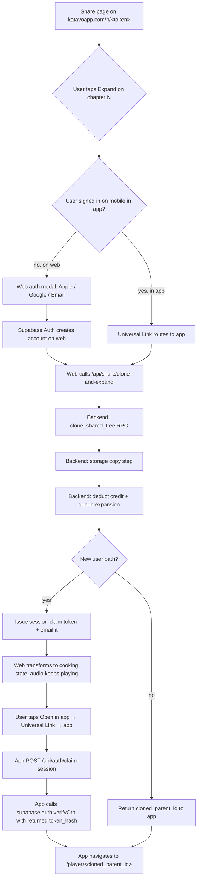
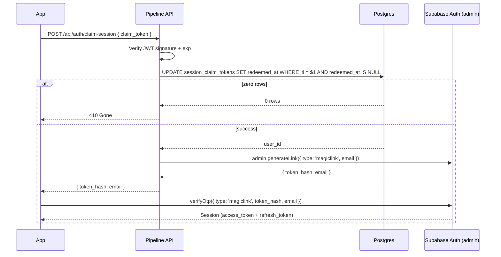

# Shared Podcast Expansion — Design

When User A shares a podcast, User B can open it in a web view and listen. Today "Expand in app" is a dead-end CTA that just tells them to install the app. This spec turns it into the central acquisition flow: tapping Expand kicks off a full clone of User A's tree into User B's library — parent, all existing expansions, plus the chapter expansion User B asked for — for one credit, with no onboarding, in the same voice as the original.

Two user paths converge on the same backend operation. Existing users on mobile flow through Universal Links straight to the cloned tree. New users sign in on the web share page (Apple/Google/email magic link), watch the cooking state while User A's audio keeps playing, then install the app and get handed a session via a single-use claim token. The app's onboarding gates (voice picker, welcome) are bypassed for these users.

The design is cheap to build because the chapter-expansion pipeline already exists (v15/v16/v17). We're not adding a parallel pipeline — we're cloning data into the target user's account and feeding it into the existing one. No re-research, no re-generation for the cloned parent or existing expansions. Audio, transcript, chapter markers, and research contexts are duplicated at the DB and Storage layer.

## Conceptual model

Two paths, one converging backend operation.



The unit of work is **clone-and-expand**: given `(share_token, chapter_index, target_user_id)`, the backend duplicates the parent and all descendants into the target user's account, queues the new chapter expansion, and returns the cloned parent's id. The pipeline that runs the expansion is the existing chapter-expansion pipeline — voice propagation, research context anchoring, audio production, all unchanged from v15/v16/v17.

## Web share page

The share page (`pipeline/src/routes/sharePage.ts` + `shareTemplate.ts`) gains three states. Audio playback continues uninterrupted across transitions. The page is the same URL throughout; only the content rendered into the layout changes.

**State A — anonymous (today's behavior).** User loads `/p/<share_token>`. Hero, audio player, chapter list, series, footer. Each unexpanded chapter shows "Expand in app." Tapping it opens the existing modal — but the modal body changes from "download the app" to a sign-in panel: Apple, Google, "continue with email." Single line of copy: "Sign in to make your own version." The actual auth runs through Supabase's JS client (`@supabase/supabase-js`), same providers the mobile app uses.

**State B — signed in, clone+expand in flight.** After auth succeeds, web POSTs to `/api/share/clone-and-expand` with the share_token, chapter_index, and the new Supabase JWT. Backend runs the clone + queues the expansion + issues the claim token. Web transforms:
- Sticky bar appears at the top: "Your version is cooking — chapter N expansion in progress" + indeterminate progress indicator
- The audio player keeps playing User A's original (no interruption)
- The chapter list rerenders: the chapter the user just expanded shows a spinner in place of "Expand in app"
- A primary CTA at the bottom: "Open in app to listen" wrapped in the Universal Link `https://katavoapp.com/expand/<share_token>/<chapter_index>?claim=<jwt>&p=<cloned_parent_id>`
- App Store + Play Store badges below the CTA, also wrapped in the Universal Link
- Supabase Realtime subscription on the new expansion's podcast row drives the spinner state

**State C — expansion complete.** Realtime fires when `status='complete'`. Sticky bar flips to "Your version is ready." Open in app CTA gains an extra line: "Tap to start listening." On mobile with the app installed, the Universal Link opens directly to the player. Otherwise, App Store badges remain the fallback.

```mermaid
sequenceDiagram
  participant U as User B (web)
  participant W as Share page
  participant S as Supabase Auth
  participant API as Pipeline API
  participant DB as Postgres
  participant ST as Storage
  participant P as Pipeline (job manager)

  U->>W: Loads /p/&lt;share_token&gt;
  W-->>U: State A: audio playing + chapters
  U->>W: Tap Expand on chapter N
  W-->>U: Auth modal (Apple/Google/Email)
  U->>S: Sign in with Apple
  S-->>W: Session (JWT)
  W->>API: POST /api/share/clone-and-expand
  API->>DB: clone_shared_tree RPC
  DB-->>API: cloned_parent_id, descendant_ids
  API->>ST: Copy audio/cover/transcript blobs
  API->>DB: INSERT new expansion row (status=queued)
  API->>P: Enqueue expansion job
  API->>DB: INSERT session_claim_tokens row
  API-->>W: { cloned_parent_id, expansion_id, claim_token }
  W-->>U: State B: cooking bar + spinner on chapter N
  Note over W,U: Audio keeps playing
  P->>DB: status=complete (eventually)
  DB-->>W: Realtime push
  W-->>U: State C: ready + Open in app CTA
```

We do not trust client-side state for any of this. Chapter index, share token, and auth are all re-validated server-side. The web view is a thin renderer.

For the launch we always show the auth modal on the share page, regardless of whether the user happens to have a katavoapp.com cookie. Returning users sign in fast via Apple/Google one-tap; the cost of always showing the modal is one extra tap.

## Backend: clone RPC, endpoints, pipeline integration

Three pieces, all wired to the existing pipeline and credit system.

### 1. The clone RPC

`public.clone_shared_tree(p_share_token text, p_target_user_id uuid)` — SECURITY DEFINER, callable from service_role only.

```sql
CREATE OR REPLACE FUNCTION public.clone_shared_tree(
  p_share_token text,
  p_target_user_id uuid
)
RETURNS TABLE (cloned_parent_id uuid, cloned_descendant_ids uuid[])
LANGUAGE plpgsql
SECURITY DEFINER
SET search_path = public
AS $$
DECLARE
  -- existing row check for idempotency
  v_existing_parent uuid;
  v_id_map jsonb := '{}'::jsonb;
  v_source_row record;
  v_new_id uuid;
  v_new_parent uuid;
  v_descendants uuid[] := ARRAY[]::uuid[];
BEGIN
  -- Idempotency: if this user already cloned this token, return that tree
  SELECT id INTO v_existing_parent
  FROM podcasts
  WHERE user_id = p_target_user_id
    AND cloned_from_share_token = p_share_token
    AND parent_podcast_id IS NULL
  LIMIT 1;

  IF v_existing_parent IS NOT NULL THEN
    SELECT array_agg(id) INTO v_descendants
    FROM podcasts
    WHERE user_id = p_target_user_id
      AND cloned_from_share_token = p_share_token
      AND parent_podcast_id IS NOT NULL;
    RETURN QUERY SELECT v_existing_parent, COALESCE(v_descendants, ARRAY[]::uuid[]);
    RETURN;
  END IF;

  -- Fetch source tree (root + descendants); fail if token revoked
  -- (... INSERT rows for root then each descendant, building id map ...)
  -- (... INSERT research_contexts rows for each ...)
  -- (... return cloned_parent_id + cloned_descendant_ids ...)
END;
$$;

REVOKE ALL ON FUNCTION public.clone_shared_tree(text, uuid) FROM public, anon, authenticated;
GRANT EXECUTE ON FUNCTION public.clone_shared_tree(text, uuid) TO service_role;
```

The full SQL goes in the implementation plan. The key invariants:
- The RPC runs in a single transaction. Either the whole tree is cloned or nothing is.
- The unique partial index `podcasts_clone_idempotency` enforces "one root clone per (user, source token)" at the DB level. If a concurrent call races in, one INSERT wins and the other catches the unique violation, returning the existing parent.
- Audio/cover/transcript URLs are carried over verbatim from the source rows initially. They get rewritten by the app-code storage copy step.
- Voice column is copied. The cloned parent's voice is what the new expansion will use.
- `cloned_from_share_token` is stamped on every cloned row so we can run idempotency lookups and analytics.

### 2. The clone-and-expand endpoint

`POST /api/share/clone-and-expand` — authed via Supabase JWT.

Request body:
```ts
{ share_token: string, chapter_index: number }
```

Sequence:
1. Validate share_token is live and chapter_index is in range.
2. Call `clone_shared_tree(share_token, user_id)` → returns `cloned_parent_id` and descendant ids. Idempotent — instant on retry, ~2-3s on first clone due to the DB row inserts.
3. Run the storage copy step (app code): for each cloned podcast, copy audio + cover + transcript blobs to `<target_user_id>/<new_podcast_id>/<file>` paths via Supabase Storage's copy API. Update the row's URL columns. Idempotent — destination paths are deterministic from the cloned ids.
4. Check that chapter_index doesn't already have an expansion in the cloned tree (it might, if User A already had one for that chapter). If yes, return that existing expansion's id and skip the rest.
5. Deduct 1 credit via the existing CAS pattern in `submit-podcast`. If insufficient credits, return 402.
6. INSERT the new expansion podcast row: `status='queued'`, `parent_podcast_id=cloned_parent_id`, `source_chapter_title=<chapter title>`, `voice=<cloned parent's voice>`.
7. Push the job onto the in-memory job manager — same path as `submit-podcast`.
8. If this is the web-sign-in path (the request comes through the web share page, distinguished by an optional `issue_claim: true` field on the body), issue a session-claim token (see next section).
9. Return:
```ts
{ cloned_parent_id: string, expansion_podcast_id: string, claim_token?: string }
```

### 3. Pipeline integration — zero changes

The chapter-expansion pipeline already reads `parent_podcast_id` and uses the parent's research_context to anchor deep research. Because the clone RPC duplicates research_contexts, the cloned parent has its own context. Voice propagates through (v18). Credit refund on failure works (DB trigger). Realtime updates fire normally.

This is what makes the design cheap: we're not building a parallel pipeline. We're feeding cloned data into the existing one.

## Session-claim token

The bridge from web sign-in to in-app session, without re-authentication in the app.

### Token shape

Signed JWT, signed with `SESSION_CLAIM_JWT_SECRET` (new env var on Railway).

```
{
  sub:   <target_user_id>,        // Supabase auth.users.id
  jti:   <random uuid>,           // single-use nonce
  iat:   <issued_at>,
  exp:   iat + 90d,
  scope: "share_claim"
}
```

Opaque to clients. Only the backend signs and verifies.

### Single-use enforcement

Table `session_claim_tokens` (migration 00024 — schema below). Insert on issue. Atomic update on redeem:

```sql
UPDATE session_claim_tokens
   SET redeemed_at = now()
 WHERE jti = $1 AND redeemed_at IS NULL
RETURNING user_id;
```

Zero rows → token already used or never existed → 410 Gone.

### Issue path

`/api/share/clone-and-expand` issues the token at the end of its handler, but only for the new-user path. The token returns to web in the response and gets embedded into the Universal Link's `?claim=` param. It's also fired off via email (Resend or similar — new dep) as a backup. Same token value, two delivery channels; single-use semantics still hold because both paths lead to the same atomic update.

### Claim path

`POST /api/auth/claim-session` (unauthed). Body: `{ claim_token: string }`.



We never store Supabase refresh tokens server-side. Session minting happens through Supabase's standard magic-link flow, triggered admin-side at claim time.

The claim handler also flips two profile columns via service_role (covered in the Database section):
- `onboarding_completed_at = now()`
- `voice = <cloned parent's voice>`

### Expiry and revocation

90-day TTL. If the token expires before claim, the user can sign in to the app the normal way (Apple/Google/email) and lands in a fresh account — their cloned tree orphans. An account-merge flow is out of scope for launch; surface as support-driven recovery if it ever happens.

Revocation: service_role can directly update `redeemed_at` on the row. No separate revocation table.

## Mobile app

The mobile app is the lightest piece. Most of the user-facing UI for cloned trees already exists (player, chapter expansions, in-flight spinner). We're wiring the entry point and skipping the onboarding gates.

### Deep link handler

New Expo Router route: `mobile/app/expand/[share_token]/[chapter_index].tsx`. A centered-spinner screen with copy "Setting up your podcast…" — its real job is sequencing API calls then redirecting.

Universal Link shape:
```
https://katavoapp.com/expand/<share_token>/<chapter_index>?claim=<jwt>&p=<cloned_parent_id>
```

`claim` and `p` are both optional. Truth table:

| `claim` | `p` | Path | Handler behavior |
|---|---|---|---|
| present | present | New-user path (clone already done on web) | Redeem claim → verifyOtp → navigate to `/player/<p>` |
| absent | absent | Existing-user path (already signed in in app) | Call `/api/share/clone-and-expand` → navigate to `/player/<cloned_parent_id>` |
| present | absent | Edge case: claim expired/lost on web, user re-enters via email | Redeem claim → verifyOtp → call `/api/share/clone-and-expand` (idempotent, returns existing) → navigate |
| absent | present | Should not happen | Treat as existing-user path; ignore `p` |

Errors:
- 410 from claim-session → "This link has already been used" + sign-in button
- Network failure → "Something went wrong" + retry button

### Domain association files

Served by Hono on the pipeline server. New file `pipeline/src/routes/wellKnown.ts` mounts:
- `/.well-known/apple-app-site-association` — AASA, declares `applinks` for `/expand/*` mapped to the Katavo app ID + Apple team ID.
- `/.well-known/assetlinks.json` — Android, declares the package + SHA256 cert fingerprint for the same paths.

Both files are public, static JSON, cached aggressively. No auth, no rate limit.

### App config updates

In `mobile/app.config.ts`:
- iOS: add `applinks:katavoapp.com` to `ios.associatedDomains`.
- Android: add an intent filter for HTTPS + host=katavoapp.com + pathPattern=`/expand/.*` to `android.intentFilters`.

The first real-device validation step needs a fresh EAS development build for the AASA association to take effect.

### Onboarding skip

The v9 root-layout onboarding gate already checks `profile.onboarding_completed_at`. The `/api/auth/claim-session` endpoint sets that column to `now()` (and `profile.voice` to the cloned parent's voice) before returning. So when the app navigates after claim, the gate sees "complete" and routes to tabs/library normally. No new gate logic.

### Push permission prompt

The one onboarding step we *don't* skip — the cooking flow only works if the user gets a push when the expansion completes. After the deep-link handler navigates to the player, the player screen shows a one-time bottom-sheet asking for push permission. Copy: "We'll ping you the moment your podcast is ready." Existing `usePushNotifications` hook handles the actual request. Gated by `profile.push_prompted_at` (new column).

### Cooking-state display in player

Already built (v15/v16). The player route reads the cloned parent + descendants from the DB. The new expansion is a descendant with `status='queued'` or `'processing'`. The existing chapter list shows a spinner on that chapter. Realtime subscription updates it. When `status='complete'`, the user gets a push, the chapter row flips from spinner to "Listen."

### No changes to

Voice picker, onboarding screens, generate flow, account screen. These remain as-is for users who didn't come through a share link.

## Database changes

Three migrations on top of the existing 00022 (share_token + get_shared_tree).

### Migration 00023 — `cloned_from_share_token` + clone RPC

```sql
ALTER TABLE public.podcasts
  ADD COLUMN cloned_from_share_token text;

CREATE UNIQUE INDEX podcasts_clone_idempotency
  ON public.podcasts (user_id, cloned_from_share_token)
  WHERE cloned_from_share_token IS NOT NULL AND parent_podcast_id IS NULL;

CREATE OR REPLACE FUNCTION public.clone_shared_tree(
  p_share_token text,
  p_target_user_id uuid
) RETURNS TABLE (cloned_parent_id uuid, cloned_descendant_ids uuid[])
  LANGUAGE plpgsql SECURITY DEFINER SET search_path = public AS $$
-- full body in the implementation plan
$$;

REVOKE ALL ON FUNCTION public.clone_shared_tree(text, uuid) FROM public, anon, authenticated;
GRANT EXECUTE ON FUNCTION public.clone_shared_tree(text, uuid) TO service_role;
```

### Migration 00024 — `session_claim_tokens`

```sql
CREATE TABLE public.session_claim_tokens (
  id          uuid primary key default gen_random_uuid(),
  jti         uuid unique not null,
  user_id     uuid not null references auth.users(id) on delete cascade,
  issued_at   timestamptz not null default now(),
  expires_at  timestamptz not null,
  redeemed_at timestamptz
);

CREATE INDEX session_claim_tokens_expires_at_idx
  ON public.session_claim_tokens (expires_at)
  WHERE redeemed_at IS NULL;

REVOKE ALL ON public.session_claim_tokens FROM anon, authenticated;
```

RLS deliberately off; service_role only. A periodic cleanup job (hourly, same setInterval pattern as v17 expansion prompts) deletes expired unredeemed rows.

### Migration 00025 — `push_prompted_at`

```sql
ALTER TABLE public.profiles
  ADD COLUMN push_prompted_at timestamptz;
```

Set when the user accepts or dismisses the push permission sheet on first cooking view.

### Profile mutations from claim-session

When `/api/auth/claim-session` runs, after verifying the token, it sets via service_role:
- `profile.onboarding_completed_at = now()`
- `profile.voice = <cloned parent's voice>`

The profile row already exists at this point because the existing `on_auth_user_created` trigger created it during web sign-in.

### Storage strategy

Audio + cover + transcript blobs are copied to `<target_user_id>/<new_podcast_id>/<file>` paths via Supabase Storage's copy API, in the same `/api/share/clone-and-expand` handler that runs the RPC. The new row's URL columns are updated to point at the new paths.

The copy step runs in app code (not the RPC) because Postgres can't call the Storage HTTP API. The copy is idempotent — destination paths are deterministic from the cloned ids, so retry is safe.

## Error handling and edge cases

Grouped by origin, with the user-facing recovery for each.

**Auth/claim errors.**
- *Claim token already used* (410) → "This link has already been used" + sign-in CTA.
- *Claim token expired* (410) → same UX. Tree orphans until a v2 merge flow exists.
- *Invalid signature* (401) → same UX as already-used.
- *Web OAuth callback failure* → "Sign in failed, try again" + retry button. Audio keeps playing.

**Share token errors.**
- *Revoked between web load and clone* → 410 from RPC, web shows "This podcast is no longer shared" + App Store badges.
- *Never existed* → 404 from share page route. Existing behavior.
- *Chapter index out of range* → 400.

**Pipeline failures on the new expansion.** Existing DB trigger refunds the credit. Cloned tree stays in the user's library. Failed expansion row gets a retry button on its chapter (v15/v16 UX). Retry doesn't consume another credit.

**Storage copy partial failures.** Cloned rows exist with URLs pointing to User A's storage. The mobile player still works because URLs are valid. On next interaction, idempotency check re-runs the copy. Worst case (User A deletes before copy completes): "Audio unavailable" state in player, logged for support.

**Credit exhaustion.** Clone happens, then credit check returns 402 before queuing. Web shows: "You're out of credits — your library has the parent and existing expansions ready. Upgrade to make this expansion." Clone is kept; expansion isn't queued.

**Realtime drop.** Web falls back to 15s polling. Three failed polls → "Tap to refresh" affordance.

**Concurrent clone attempts.** First call wins on the unique partial index. Second call sees existing tree, just queues its expansion (separate credit). Both spinners show.

**User A deletes mid-clone.** Before RPC: 410. Between RPC and copy: same as copy-failure path. After copy: User B's tree is independent.

**Universal Link fallback when app not installed.** Falls through to a static HTML page at `/expand/<token>/<chapter>` that says "Install Katavo to listen — your podcast is waiting" + App Store badges. Claim token preserved in the URL. Email backup also has the link.

**Orphan account (signed up, never installed).** Account sits with library intact. Email reminders at 24h and 7d. After 90d, claim token expires; recovery requires support.

**Email delivery failure.** Best-effort. Log but don't surface — web in-page CTA still works.

**Voice missing/deprecated.** Fall back to the user's profile.voice default for the new expansion only. Cloned parent's row keeps the old voice and plays its existing audio.

## Testing strategy

**Pipeline server (vitest).**
- `clone_shared_tree` RPC: happy path (root + 3 descendants), idempotency on second call, share_token revoked, share_token not found.
- `/api/share/clone-and-expand`: full flow with mock Supabase, credit deduction CAS, idempotency on chapter_index, 402 on zero credits, 410 on revoked share.
- Storage copy step: happy path, idempotent re-run, partial failure recovery.
- `/api/auth/claim-session`: happy path, already-used, expired, invalid signature, integration with magic-link generation.
- `wellKnown` route: AASA + assetlinks JSON shape.

**Mobile (typecheck + manual).**
- `app/expand/[share_token]/[chapter_index].tsx` route resolves all four cells of the URL truth table.
- Deep link receipt on physical iOS device (EAS dev build with new associated-domains).
- Deep link receipt on Android device (EAS dev build with new intent-filter).
- Push permission sheet appears once, gated by `push_prompted_at`.

**End-to-end manual.**
- New user: anonymous web → tap Expand → sign in with Apple → cooking state → install app → tap Open in app → player.
- Existing user on mobile: receive share link via iMessage → tap → app handles deep link → player.
- Expired claim token: edit the JWT exp claim → confirm 410 + sign-in fallback.
- Share token revoked mid-flight: revoke server-side between web sign-in and clone → confirm graceful 410.

## Open follow-ups (deliberately not in this plan)

- **Account merge flow** for users who orphan their cloned tree (90d expiry, late sign-in via different provider). Support-driven recovery for now.
- **Re-share of cloned trees** — User B's clone can already be shared via the existing share_token mechanism. Whether the share page should show provenance ("Originally shared by User A") is a v2 UX question.
- **Web app surface** — this design deliberately stops at the share page. We don't build `/login`, `/library`, `/account` on the web. If the share-driven conversion proves valuable, we revisit.
- **Free credit grant for new users via shared link** — currently uses the existing signup-bonus credit (one free, non-expiring). If we want to make the share path *more* generous (e.g., comp the new user a free expansion on top of their signup bonus), it's a one-line policy change in the credit deduction step.
- **Smart App Banner on the share page** — Apple's native banner that surfaces "Open in Katavo" at the top of Safari. Strictly additive, can ship later.
- **Analytics on the funnel** — share page view → Expand tap → auth modal complete → install → claim → first play. Worth instrumenting once the path is live; not part of this design.
