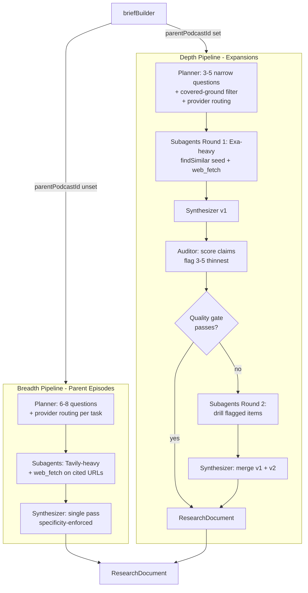
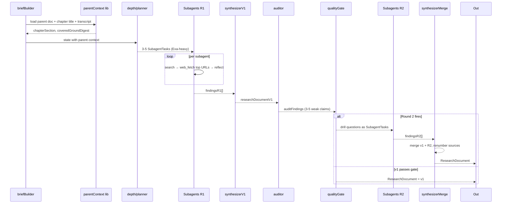

# Research Quality — Asymmetric Pipeline Design

ChatGPT Deep Research produces long, dense reports. Our research docs are much shorter, and expansions shrink further still. Today's pipeline runs a single planner → subagents → synthesizer loop with hard token caps. Subagents reason over 200-char Tavily snippets, not full articles. Expansion mode injects the entire parent research doc into the synthesizer prompt as anti-duplication context, eating 2–4K of the 16K cap before new findings are even processed.

This spec replaces that with two separate subgraphs: a breadth pipeline for parent episodes and a depth pipeline for expansions. The depth pipeline runs iterative deepening — round 1 always, round 2 gated by an LLM auditor that flags thin claims. Search routing across Tavily, Exa, and web_fetch happens upstream in the planner. Free tier gets every feature, just with tighter budgets.

## Why asymmetric

Parent episodes need breadth — distinct angles, wide coverage, the survey shape that lets a 20-minute podcast feel like a tour. Expansions need depth — the user already heard the parent's claim about Topic X and tapped expand because they want the rabbit hole, not the summary.

Today's pipeline treats them the same and adds `expansion` mode flags inside shared nodes. The flag approach makes both modes mediocre. Splitting into two subgraphs that share only utility helpers (search clients, web_fetch, parent-context builders) means we can tune breadth and depth independently and the trace is readable.

## Architecture

Two subgraphs branch at `briefBuilder` based on whether `parentPodcastId` is set.



Each subagent task carries a `searchProvider: 'tavily' | 'exa'` field set once by the planner. No runtime provider decision later. Subagent loop: search → web_fetch top-N cited URLs → reflect over full article text → cite. The fetched content threads through to synthesizer and auditor with a `kind` discriminator (`tavily-fetched | exa-fetched | tavily-snippet | exa-snippet`) so downstream nodes know what source they're working from.

## Why Tavily and Exa, not one

They're good at different things. Tavily — keyword search, cheap, optimized for fresh news and mainstream web. Returns clean scraped content tuned for LLM consumption. Exa — neural/semantic search, finds pages by meaning, strong on long-form essays, primary sources, expert writing. Has `findSimilar` (give it a great URL, get more like it).

Parent episodes lean Tavily for the cheap broad questions; a couple of Exa subagents pick up "find the canonical long-form piece." Expansions lean Exa, with `findSimilar` seeded by the strongest cited source from the parent doc. web_fetch sits on top of either provider and is the single biggest quality lever — most of today's thinness comes from synthesizing snippets, not articles.

## Components

```
pipeline/src/podcast_pipeline/
├── nodes/research/
│   ├── breadth/
│   │   ├── planner.ts          [NEW] 6-8 questions, provider-tagged per task
│   │   └── synthesizer.ts      [NEW] single-pass, specificity-enforced
│   ├── depth/
│   │   ├── planner.ts          [NEW] 3-5 questions, covered-ground aware
│   │   ├── synthesizerV1.ts    [NEW] round 1 synthesis
│   │   ├── auditor.ts          [NEW] pure-LLM claim scoring + drill questions
│   │   ├── qualityGate.ts      [NEW] pure fn, decides if round 2 fires
│   │   └── synthesizerMerge.ts [NEW] merges v1 + round 2 findings
│   ├── subagent.ts             [REFACTORED] provider-agnostic, web_fetch-enabled
│   └── prompts.ts              [REWRITTEN] specificity + narrative voice
├── tools/
│   ├── tavilySearch.ts         [KEEP] unchanged
│   ├── exaSearch.ts            [NEW] search() + findSimilar()
│   ├── webFetch.ts             [NEW] URL fetch + readability extract
│   └── claimScorer.ts          [NEW] shared between auditor and any future quality hooks
├── lib/
│   └── parentContext.ts        [REFACTORED] buildChapterSection() + buildCoveredGroundDigest()
└── graph.ts                    [REFACTORED] two subgraphs, conditional routing at briefBuilder
```

Auditor and quality gate stay separate. Auditor is the LLM-powered "find the gaps" step; quality gate is a tiny pure function that decides whether the gaps are big enough to warrant round 2. Splitting them means we can swap the auditor without touching threshold logic and the gate is exhaustively unit-testable.

`claimScorer.ts` lives in `tools/` not `depth/` — even though only depth uses it today, it's the kind of thing we'll want as a quality hook on breadth later. Reusable from the start.

## Data flow

LangGraph state shape — additions over today's state:

```ts
type State = {
  // existing
  podcastId, tier, brief,
  parentPodcastId?, sourceChapterTitle?, parentChapterTranscript?, parentResearchDoc?,

  // breadth pipeline
  subagentTasks?: SubagentTask[],
  findings?: SubagentFinding[],

  // depth pipeline
  chapterSection?: string,           // sliced parent section, not full doc
  coveredGroundDigest?: string,      // bullet list of parent claims
  subagentTasksR1?: SubagentTask[],
  findingsR1?: SubagentFinding[],
  researchDocumentV1?: ResearchDocument,
  auditFindings?: AuditedClaim[],
  subagentTasksR2?: SubagentTask[],
  findingsR2?: SubagentFinding[],

  // shared output
  researchDocument?: ResearchDocument,
}
```

Depth pipeline sequence — breadth is a strict subset (skip parentContext and everything from auditor onward):



Round 2 subagents are dispatched from the auditor's drill questions, not re-planned from scratch. The auditor already knows what's thin and why; planner involvement would just add a hop. Source renumbering happens in `synthesizerMerge` — round 1 and round 2 produce overlapping source sets and the final doc needs a single unified citation index. Auditor passes round 1 sources to round 2 subagents as `seedUrls` so primary sources stay consistent if they show up again.

## Parent context fix

Today, expansion mode `JSON.stringify`s the full parent `research_document` and inlines it into the synthesizer prompt as anti-duplication context. The full doc eats 2–4K tokens of the 16K cap before new findings are processed.

Replace with two narrower inputs built by `buildChapterSection()` and `buildCoveredGroundDigest()`:

- `chapterSection`: the parent doc's section that corresponds to the source chapter, sliced from the parent's `sections[]` by title match. Full content, no truncation. This is what the new research is *expanding from*.
- `coveredGroundDigest`: a bullet list of one-sentence claim summaries from the rest of the parent doc, capped at ~800 tokens. This is what the new research should *not duplicate*.

Synthesizer prompt receives both with clear separation. Frees ~2–3K tokens of synthesizer budget for new findings.

## Subagent loop

Subagent today is Tavily-hardcoded and synthesizes from snippets only. New shape:

```ts
type SubagentTask = {
  question: string;
  searchProvider: 'tavily' | 'exa';
  seedUrls?: string[];          // from auditor (round 2) or parent doc (round 1)
  maxSearches: number;
  maxReflections: number;
  fetchCitedUrls: boolean;      // top-3, 4K tokens per URL cap
};
```

Per iteration: dispatch search via the provider, accumulate cited claims, pick top-3 URLs by citation strength, run `webFetch` against each, then reflect. The reflection step sees both snippet results and full-article extracts; final cited sources carry the right `kind` discriminator.

`SearchResult` is a common shape both providers normalize to. Otherwise provider-specific shapes leak downstream and the inevitable third provider gets ugly.

## Auditor

Pure LLM (Sonnet 4.6). Takes `researchDocumentV1` plus the source chapter context. Returns:

```ts
type AuditedClaim = {
  originalClaim: string;         // verbatim from v1
  weakness: 'specificity' | 'sourcing' | 'depth';
  drillQuestion: string;         // becomes a round 2 SubagentTask
};
```

Prompt directs it to find 3–5 claims that are vague (no specific number/date/name), undersourced (one source or none), or shallow (one-sentence treatment of something the chapter is asking us to drill). It outputs the drill questions as actual search queries, not abstract gap descriptions.

No heuristic prefilter. Pure LLM is simpler code, fewer test edges, and Sonnet handles this well in single-pass.

## Quality gate

Pure function. Takes `tier` and `auditFindings.length`. Returns `{ fire: boolean, maxR2Subagents: number }`. Table:

| Tier | Fire threshold | Max R2 subagents |
|------|----------------|------------------|
| Free | ≥3 findings | 3 |
| Plus | ≥2 findings | 4 |
| Pro  | ≥1 finding  | 5 |

Tier policy: free gets every feature, tighter budgets. No tier ever gates out a qualitative improvement.

## Tier mapping

Same models and prompts everywhere. What changes:

- **Breadth question count**: Free 5, Plus 6, Pro 8
- **Search budget per subagent**: Free 2 searches / 1 reflection, Plus 3 / 2, Pro 5 / 2
- **Round 2 fire threshold and cap**: see quality gate table

## Error handling

Principle: degrade research quality before failing the run. Audio synthesis and script writing downstream are expensive — a short research doc is salvageable, a failed job is not.

- **Search provider failures**: subagent retries once with backoff. Second failure → record `searchFailed: true` in the finding, synthesizer treats that section as no-results rather than aborting. If both providers go down simultaneously, planner detects via a health check and falls back to single-provider mode with a logged warning.
- **web_fetch failures (404, paywall, timeout, JS-only page)**: per-URL try with hard 10s timeout. Failure is silent — skip that URL, keep the snippet, mark the source as `*-snippet` not `*-fetched`. Paywall/login-wall detection: readability extract returning <200 chars on a 200-status page is treated as snippet-only.
- **Auditor returns empty**: pass the gate, skip round 2, ship v1. This is success, not failure.
- **Auditor returns malformed JSON**: retry once with stricter prompt. Second failure → skip round 2, ship v1.
- **Round 2 timeout**: 90s wall-clock across all R2 subagents. On timeout, merge partials with v1. Full failure with zero findings → ship v1 unchanged.
- **Partial subagent failures**: if >50% of subagents in a round fail, mark the round failed and apply rules above. <50% failures just thread through with empty sections.

## Observability

Posthog (free tier features only — events, properties, no session replay or feature flags).

Per subagent: provider used, search count actual vs budget, fetch attempts vs successes, snippet vs fetched source count, latency.

Per job: which rounds ran, gate decisions, auditor input/output, final source-kind distribution (% fetched vs snippet — leading indicator of quality), total cost estimate per provider.

Source kind distribution is the metric we'll watch hardest. If we ship and see >40% snippet-only sources, web_fetch is silently failing more than expected and the quality lever isn't pulling.

## Testing

Three layers — deterministic plumbing tests, integration tests with mocked externals, manual golden-doc regression tests.

**Unit (deterministic, fast)** — `exaSearch.ts` and `tavilySearch.ts` request/response normalization and error mapping, `webFetch.ts` readability extraction + paywall detection + timeout + 4K cap, `qualityGate.ts` exhaustive table-driven, `claimScorer.ts` fixture-based, `parentContext.ts` chapter slicing + digest shape, `synthesizerMerge.ts` source renumbering + claim de-dup + schema validity.

**Integration (mocked externals, real graph wiring)** — breadth happy path, depth gate-skips-R2 path, depth gate-fires-R2 path, Tavily 500s → `searchFailed` flow, R2 90s timeout → partial merge, auditor malformed JSON → fallback to v1.

**Golden-doc regression (manual)** — 5–10 frozen briefs in `pipeline/tests/golden/research/`, mix of breadth and depth. Each is a JSON file containing the input brief and the frozen output doc. Not in CI (costs money, LLM output isn't bit-exact). Run before any prompt/model change ships; diff word count, source count, % fetched, gate fire rate, spot-check 2–3 randomly. The auditor is the highest-risk new component for "looks fine in tests, sucks in prod" — at least 3 expansion briefs in the golden set exercise it.

**Live smoke** — `bun run smoke:research <brief>` runs the real pipeline against a single brief, prints doc + telemetry. Dev iteration tool, not a CI artifact.

What we explicitly don't test: LLM output content correctness inside nodes (that's the golden-doc set's job), real HTTP against Tavily/Exa/web_fetch (vendor concern, mocked at boundary), cost (logged via telemetry, not asserted).

## What we're not doing

- Infinite-iteration deepening like ChatGPT Deep Research. Hard cap at 2 rounds. The marginal quality gain past round 2 doesn't justify the cost or latency for a podcast-length output.
- Per-question routing inside the subagent. Provider is decided upstream in the planner. Auto-routing inside the subagent would make traces unreadable.
- Heuristic prefilter for the auditor. Pure LLM is simpler.
- Model quality differentiation by tier. Volume only.
- Cost gates in tests. We log it but don't fail builds on it.

## Migration

No data migration. New code paths only. The existing `expansion` mode flag on planner and synthesizer becomes dead code once depth pipeline ships — remove in the same PR. Existing research_documents in Supabase remain valid against the unchanged `ResearchDocumentSchema`.

Rollout: feature flag gates the new pipelines per environment. Dev gets it first, then staging with golden-doc set verification, then production. The flag falls back to today's pipeline if either subgraph throws at the entry point. Once we're confident in production (one week of clean runs), remove the flag and the old code.
