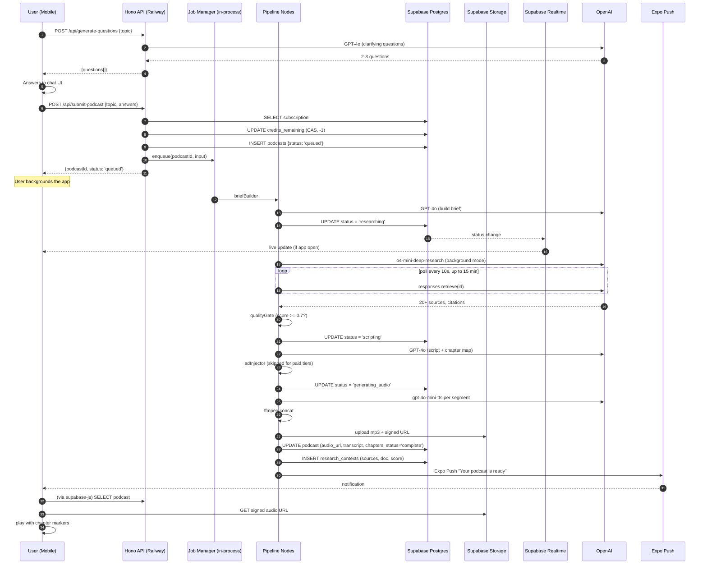
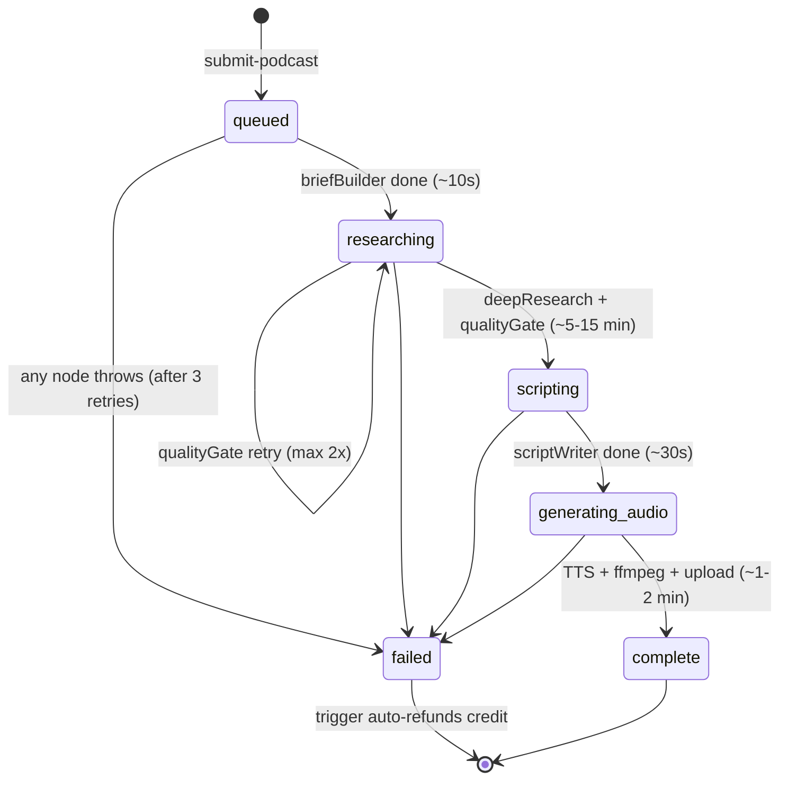
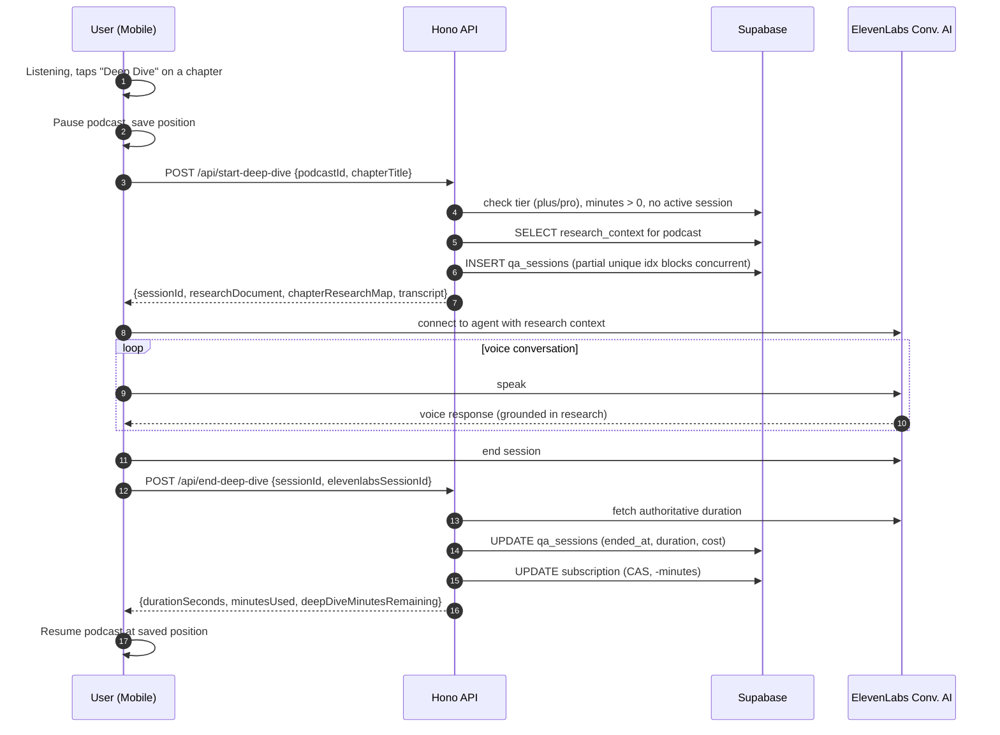

# AI Podcast App — User Flow

Three diagrams covering the full user-visible journey: generation, podcast status lifecycle, and Deep Dive (mid-playback voice Q&A).

## Generation flow

## Status state machine

## Deep Dive flow (Plus/Pro, mid-playback)

